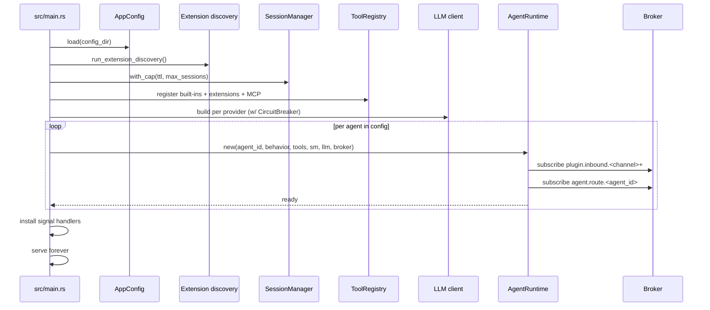
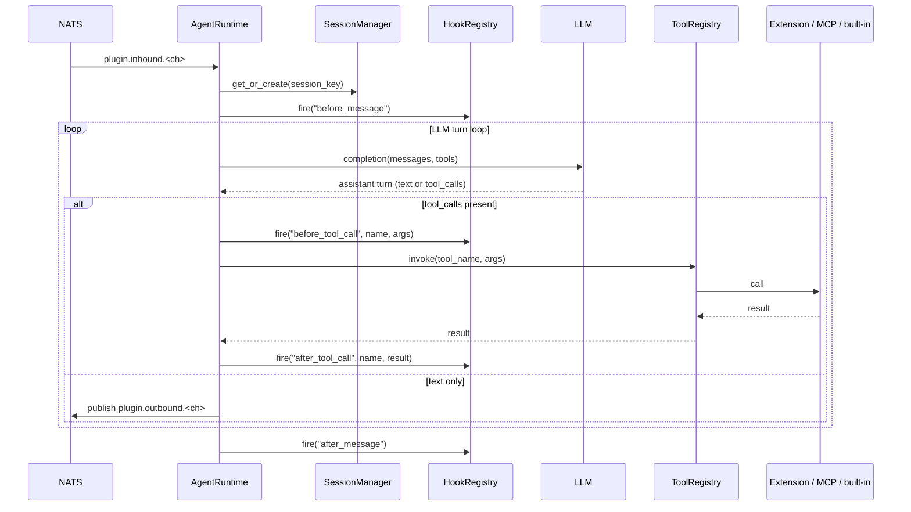
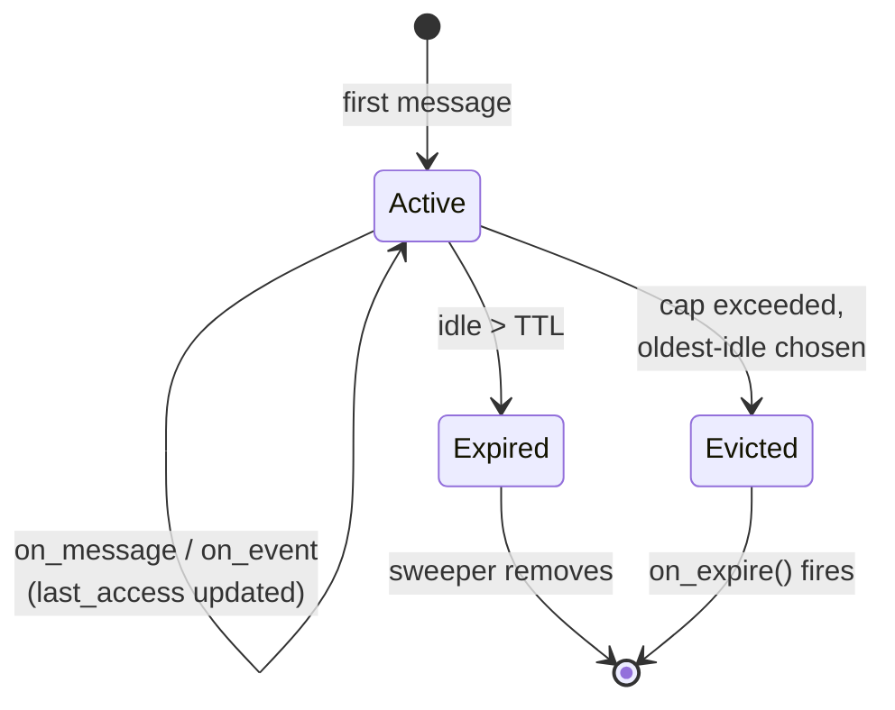
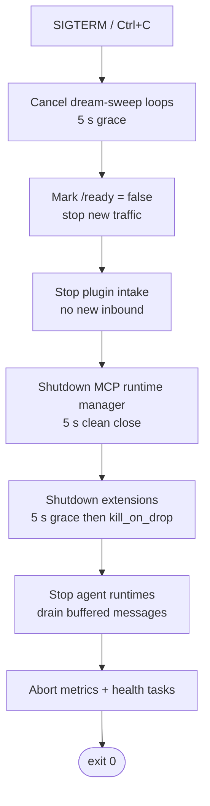

# Agent runtime

The agent runtime is the per-agent machinery that consumes inbound
events, drives the LLM loop, invokes tools, and emits outbound events.
One `AgentRuntime` is instantiated per configured agent at boot; each
runs as its own async task.

Source: `crates/core/src/agent/` (`behavior.rs`, `agent.rs`,
`runtime.rs`, `hook_registry.rs`), boot in `src/main.rs`.

## AgentBehavior trait

Every agent implements `AgentBehavior` (`crates/core/src/agent/behavior.rs`).
The trait is intentionally small — default no-ops let built-in types
(like `LlmAgentBehavior`) override only what they need.

| Method | Fires on | Default |
|--------|----------|---------|
| `on_message(ctx, msg)` | Inbound message from a plugin | no-op |
| `on_event(ctx, event)` | Any event on a subscribed topic | no-op |
| `on_heartbeat(ctx)` | Periodic tick (if heartbeat enabled) | no-op |
| `decide(ctx, msg)` | LLM-reasoning hook (stub for custom flows) | empty string |

The shipped `LlmAgentBehavior` implements the full chat-completion
loop with tool calls, streaming, rate-limited retry, and hook fan-out.

## Boot sequence



## Request/response lifecycle

A single inbound message drives the following flow inside one agent
runtime:



## SessionManager

Defined in `crates/core/src/session/manager.rs`. Tracks per-user
conversational state in memory.

- **Key:** `SessionKey` derived from `(agent_id, channel, sender_id)`;
  group chats get one session per group
- **Storage:** `DashMap<SessionKey, Session>` — lock-free concurrent map
- **TTL:** configured via `memory.short_term.session_ttl` (default 30 min);
  each access updates `last_access`
- **Cap:** soft limit `DEFAULT_MAX_SESSIONS = 10,000`; on overflow the
  oldest-idle session is evicted before insert
- **Sweeper:** background task scans every 1 s, removes expired entries
- **Callbacks:** `on_expire()` fires via `tokio::spawn` when a session
  is dropped — used by the MCP runtime to tear down per-session children



## HookRegistry

Defined in `crates/core/src/agent/hook_registry.rs`. Lets extensions
inject behavior at well-known points in the lifecycle without patching
the runtime.

- **Hook names:** arbitrary strings. In practice the runtime fires:
  `before_message`, `after_message`, `before_tool_call`,
  `after_tool_call`, `on_session_start`, `on_session_end`
- **Fan-out:** sequential by priority (lower first), insertion order
  breaks ties
- **Cap:** **128 handlers per hook name** — defensive guard against a
  buggy extension re-registering on every reload
- **Errors:** logged, treated as `Continue` — one misbehaving hook does
  not cascade into the rest
- **Override:** a hook may return `Override(new_args)` to mutate what
  the next hook (or the runtime itself) sees

## Heartbeat

```yaml
# per-agent config
heartbeat:
  enabled: true
  interval: 30s
```

- Scheduled per agent if `heartbeat.enabled: true`
- Interval parsed via `humantime` — any `humantime` duration works
- Each tick:
  1. Fires `AgentBehavior::on_heartbeat(ctx)`
  2. Publishes `agent.events.<agent_id>.heartbeat`
- Typical uses: proactive messages ("good morning"), reminders, external
  state syncs (pull Gmail, scan calendar), liveness pings

## Graceful shutdown

`src/main.rs` installs SIGTERM / Ctrl+C handlers. On signal, the process
tears down in a specific order so in-flight work finishes cleanly:



This order is enforced in `src/main.rs` around lines 1389–1458.
Extensions get the longest grace period because stdio children can be
mid-tool-call; the disk queue absorbs any events that the plugins
couldn't finish publishing.

## Why this shape

- **One tokio runtime, many tasks:** lets you run 10 agents on one
  CPU core when idle, saturates cores under load. No thread-per-agent
  bloat.
- **No shared mutable state across agents:** each agent holds its own
  registry views, its own session map. Cross-agent communication goes
  over the bus → visible, replayable, testable.
- **Hooks instead of inheritance:** extensions customize behavior
  without recompiling the core. Every insertion point is named,
  sequenced, and capped.
