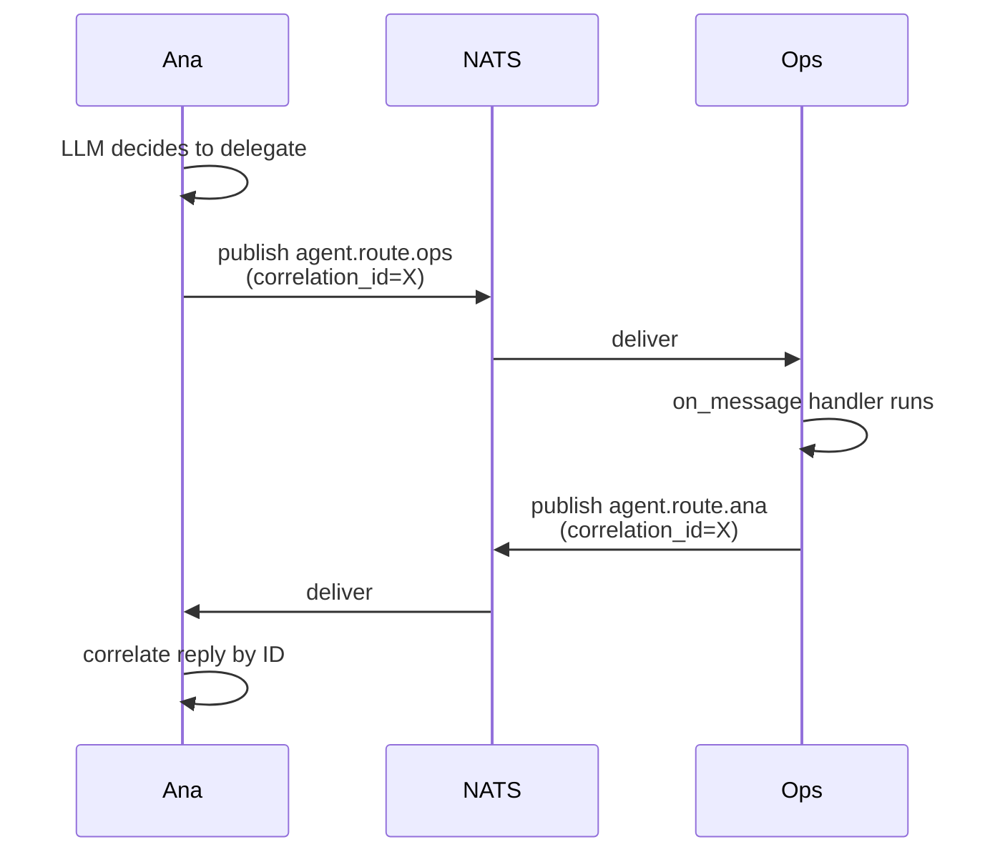
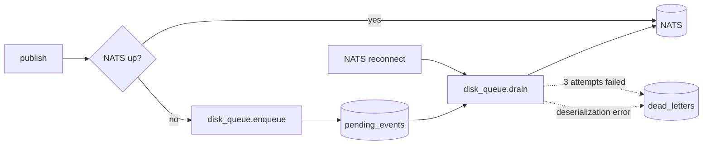

# Event bus (NATS)

Every piece of communication between plugins, agents, and the broker
layer itself flows over **NATS** (`async-nats = 0.35`). When NATS is
offline, a local `tokio::mpsc` bus takes over and a SQLite-backed disk
queue holds events until reconnection. No events are lost.

Source: `crates/broker/` (`nats.rs`, `local.rs`, `disk_queue.rs`,
`topic.rs`).

## Why NATS

- **Subject-based routing** fits the "N plugins × M agents" fan-out
  naturally (`plugin.inbound.*` wildcards)
- **Low-latency pub/sub** with no broker-side state to manage
- **Cluster-ready** without rewriting the data plane
- **Async-nats** is mature, has `JetStream` if we ever need it

The design doc discusses the alternatives (RabbitMQ, Redis streams)
that were rejected; see `proyecto/design-agent-framework.md`.

## Subject namespace

| Pattern | Direction | Example | Who publishes | Who subscribes |
|---------|-----------|---------|---------------|----------------|
| `plugin.inbound.<plugin>` | plugin → agent | `plugin.inbound.whatsapp` | Channel plugins | Agent runtimes |
| `plugin.inbound.<plugin>.<instance>` | plugin → agent | `plugin.inbound.telegram.sales_bot` | Multi-instance plugins (WA, TG) | Agent runtimes |
| `plugin.outbound.<plugin>` | agent → plugin | `plugin.outbound.whatsapp` | Agent tools (send, reply…) | Channel plugins |
| `plugin.outbound.<plugin>.<instance>` | agent → plugin | `plugin.outbound.whatsapp.ana` | Agent tools | Specific plugin instance |
| `plugin.health.<plugin>` | plugin → runtime | `plugin.health.browser` | Plugins | Health server |
| `agent.events.<agent_id>` | internal | `agent.events.ana` | Runtime internals | Dashboards, tests |
| `agent.events.<agent_id>.heartbeat` | scheduler → agent | `agent.events.kate.heartbeat` | Heartbeat scheduler | That agent |
| `agent.route.<target_id>` | agent → agent | `agent.route.ops` | Sending agent's `delegate` tool | Target agent runtime |

Multi-instance plugins append an `.<instance>` suffix so two WhatsApp
accounts (e.g. Ana's line and Kate's line) can run side by side without
subject collisions.

## Agent-to-agent routing



The sender always includes a `correlation_id` in the event envelope;
the receiver echoes it on the reply. That's how one agent can fan out
to several agents and reassemble results.

## Broker abstraction

`crates/broker` exposes a `Broker` trait implemented by two backends:

- `NatsBroker` — real NATS connection wrapped in a `CircuitBreaker`
- `LocalBroker` — in-process `tokio::mpsc` for tests and offline mode

Switching between them is driven by config. The local broker matches
NATS subject semantics (including `.` segments and `>` wildcards),
which keeps the test surface identical to production.

## Disk queue

When a publish to NATS fails — circuit breaker open, connection lost,
transient 5xx — the event is persisted to the disk queue instead of
being dropped.

| Property | Value |
|----------|-------|
| Storage | SQLite |
| Default path | `./data/` (configurable via `broker.persistence.path`) |
| Tables | `pending_events`, `dead_letters` |
| Event format | JSON serialization of `Event { id, topic, payload, enqueued_at, attempts }` |
| Drain order | FIFO by `enqueued_at` |
| Batch size | up to 100 per `drain()` call |
| Max attempts before DLQ | **3** (`DEFAULT_MAX_ATTEMPTS`) |



### Drain on reconnect

When `NatsBroker` detects reconnection, it calls `disk_queue.drain()`:

1. Read up to 100 oldest events from `pending_events`
2. Republish each to NATS
3. On success: delete row
4. On failure: increment `attempts`, leave row in place
5. Once `attempts >= 3`: move to `dead_letters`

## Dead-letter queue (DLQ)

Events that exhaust retries, or fail to deserialize at all, land in
`dead_letters`. They're not silently discarded — CLI lets you inspect
and replay them.

```bash
agent dlq list              # show all dead events
agent dlq replay <event_id> # move one back to pending_events
agent dlq purge             # drop the table (destructive!)
```

Replay moves the entry back to `pending_events`; the next drain cycle
retries it with attempts reset.

## Backpressure

Two independent mechanisms:

- **Local broker channels** are 256-capacity `tokio::mpsc` per
  subscriber. If a subscriber is slow, dropped events log a
  `slow consumer` warning but the subscription stays alive.
- **Disk queue** applies proportional sleep at >50% capacity (scaled
  from 0 ms up to `MAX_BACKPRESSURE_MS = 500 ms`). At the hard cap it
  additionally drops the oldest event and sleeps 500 ms — an
  intentional "shed load, don't block the producer forever" stance.

The disk queue's backpressure only matters when NATS is down for a
long time and the producer is faster than real time. In normal
operation the disk queue stays near-empty.

## Local fallback

When NATS is unreachable or the circuit breaker on the publish path is
Open, the runtime degrades gracefully:

- Inbound events from local plugins (e.g. a Telegram webhook fielded
  in-process) go through `LocalBroker` and reach agents immediately
- Outbound events that target a plugin hosted in the same process
  (which is every shipped plugin) also go through `LocalBroker`
- Anything that would have crossed a real NATS hop sits in the disk
  queue until reconnection

In practice, single-machine deployments keep working even with no NATS
at all — the disk queue and the local broker together are sufficient
for one process. NATS starts earning its keep the moment you scale to
multiple processes, machines, or regions.
