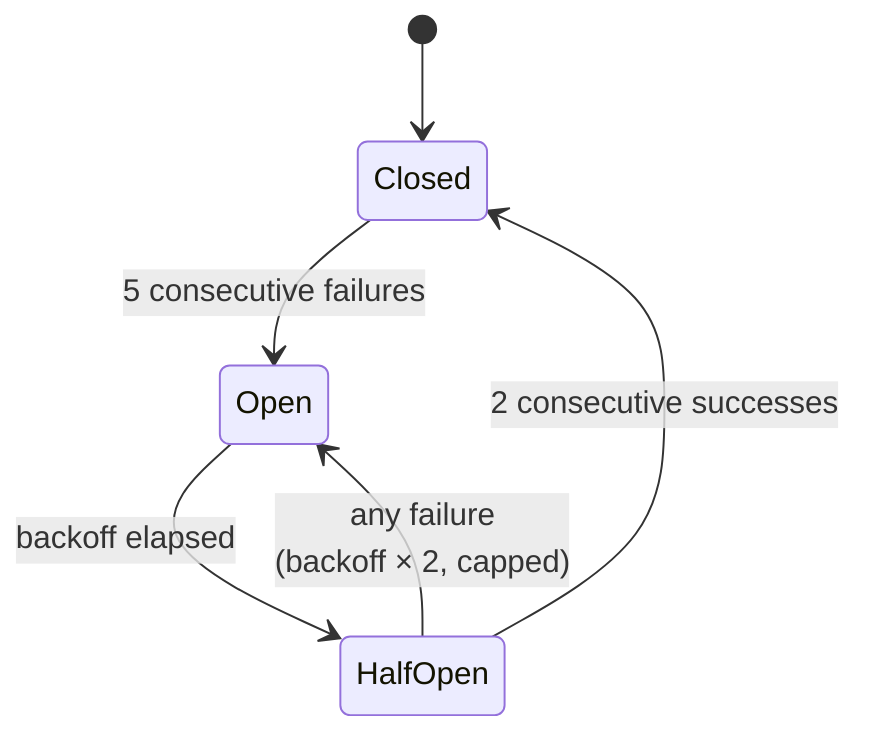
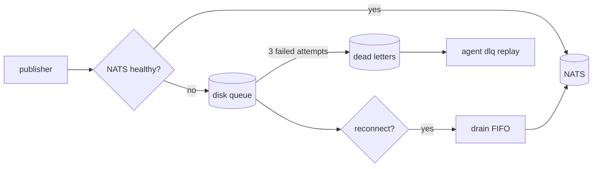
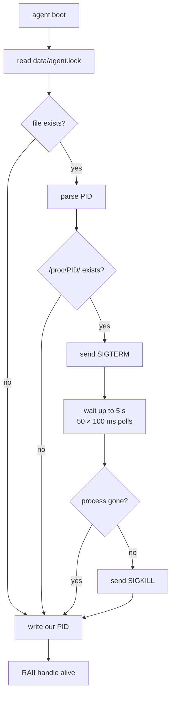

# Fault tolerance

Every external call goes through a `CircuitBreaker`. Every retryable
error has a bounded retry policy with jittered exponential backoff.
Every event survives a NATS outage. A second process cannot race the
first onto the same bus.

This page collects all of those guardrails in one place.

## CircuitBreaker

Source: `crates/resilience/src/lib.rs`.

A three-state machine wrapped around any fallible external call. Once
a dependency is failing, the breaker **fails fast** instead of piling
up calls against a dead endpoint; periodic probes let it recover
without human intervention.

### Defaults

| Field | Default | Meaning |
|-------|---------|---------|
| `failure_threshold` | 5 | consecutive failures before opening |
| `success_threshold` | 2 | consecutive successes in HalfOpen before closing |
| `initial_backoff` | 10 s | wait time on first open |
| `max_backoff` | 120 s | cap on exponential backoff |

### Where it wraps

- **LLM calls** — one circuit per provider (MiniMax, Anthropic,
  OpenAI-compat, Gemini). A provider outage doesn't cascade to others.
- **NATS publish** — one circuit over the broker. When it opens the
  disk queue absorbs writes.
- **CDP commands** — one circuit per browser session. A dead Chrome
  doesn't freeze the agent loop.
- **Extension stdio** — implicit via the `StdioRuntime` lifecycle
  (crashed child → respawn, bounded).

### Signals

`CircuitBreaker` exposes the usual methods (`allow()`, `on_success()`,
`on_failure()`) plus two explicit overrides:

- `trip()` — force Open from outside (e.g. a health check decided the
  dep is down before a call fails)
- `reset()` — force Closed (e.g. the operator just restored the dep
  and doesn't want to wait for the probe window)

## Retry policies

Retries live at a layer above the circuit breaker — they handle
transient failures (429, 5xx, network blips) that don't warrant
flipping the breaker. Every retry policy uses **jittered exponential
backoff** to avoid thundering-herd reconnection storms.

| Component | Max attempts | Backoff range |
|-----------|--------------|---------------|
| LLM 429 (rate limit) | 5 | 1 s → 60 s, jittered exponential |
| LLM 5xx (server error) | 3 | 1 s → 30 s, jittered exponential |
| NATS publish drain | 3 per event | disk queue drain cycle |
| CDP | via circuit only | backoff = circuit's open window |

These live in `crates/llm/src/retry.rs` (LLM) and
`crates/broker/src/disk_queue.rs` (NATS drain).

### Error classification

Retries only trigger on **retryable** errors. A 4xx other than 429 —
missing key, invalid model, malformed request — fails fast. The
rationale: retrying a misconfigured call wastes budget and still
fails. Fail loudly, fix the config.

## No message drop

The broker layer guarantees **at-least-once delivery for publishes that
reach the runtime**:

In the absolute worst case — NATS down forever, disk full — the disk
queue starts shedding oldest events at its hard cap, but the producer
never crashes and never silently drops.

## Single-instance lockfile

A second `agent` process pointed at the same data directory would
double-subscribe every topic, delivering every message twice. To
prevent that, boot acquires a lockfile and kicks out any stale or
racing instance.

Source: `src/main.rs::acquire_single_instance_lock`.

The `SingleInstanceLock` RAII struct stores our own PID. On drop it
only removes the lockfile if the stored PID still matches the current
one — so a takeover by a *third* process doesn't let the original
owner wipe the lock on its way out.

## Graceful shutdown

See [Agent runtime — Graceful shutdown](./agent-runtime.md#graceful-shutdown)
for the ordered teardown sequence. Key points from a fault-tolerance
angle:

- Dream-sweep loops and MCP sessions get explicit grace windows so
  in-flight work doesn't produce partial state
- Plugin intake is stopped **before** agent runtimes — the runtimes
  drain anything already in their mailboxes before exiting
- If the disk queue has unflushed events on SIGTERM, they survive to
  the next boot

## Operator guardrails

Beyond the automatic mechanisms:

- **Skill gating** — an extension declaring `requires.env = ["FOO"]`
  is skipped at discovery when `FOO` is unset, instead of being
  registered and failing on every invocation. See
  [Extensions — manifest](../extensions/manifest.md).
- **Inbound filter** — events with neither text nor media (receipts,
  typing indicators, reactions-only) are dropped before they reach the
  LLM, saving cost and avoiding noisy turns.
- **Health endpoints** — `:8080/ready` and `:8080/live` expose
  lifecycle state for k8s liveness / readiness probes.
- **Metrics** — `:9090/metrics` (Prometheus) exposes everything from
  inbound event counts to circuit breaker state; see
  [Metrics](../ops/metrics.md).
