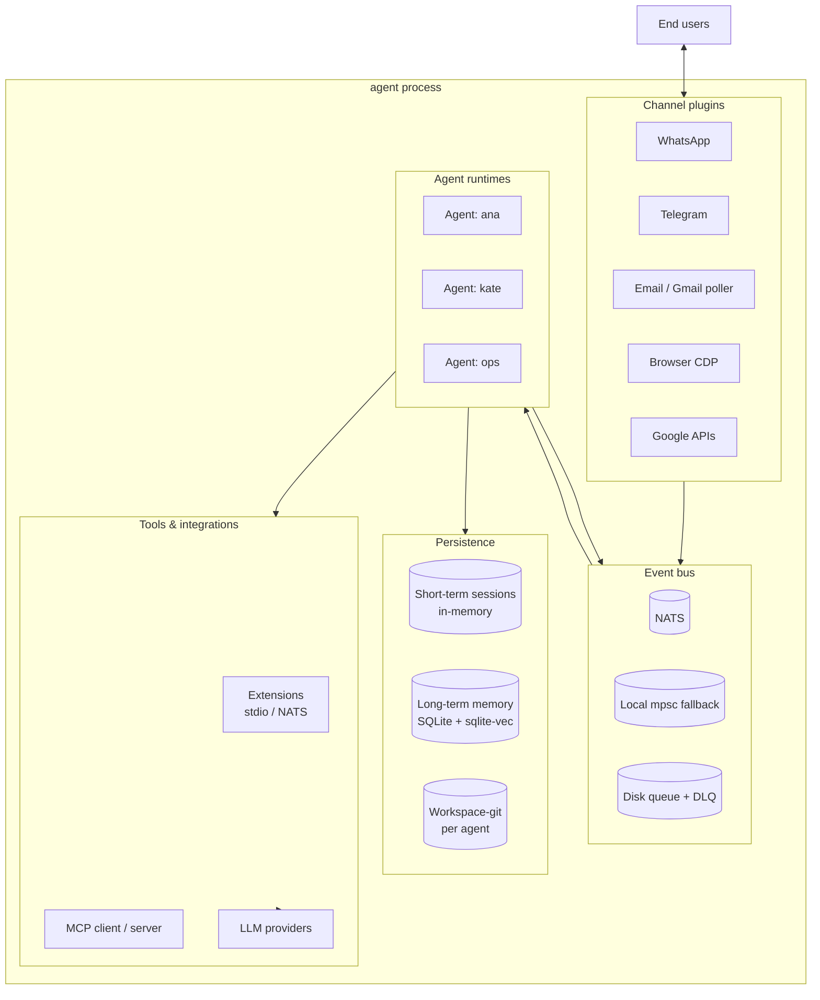
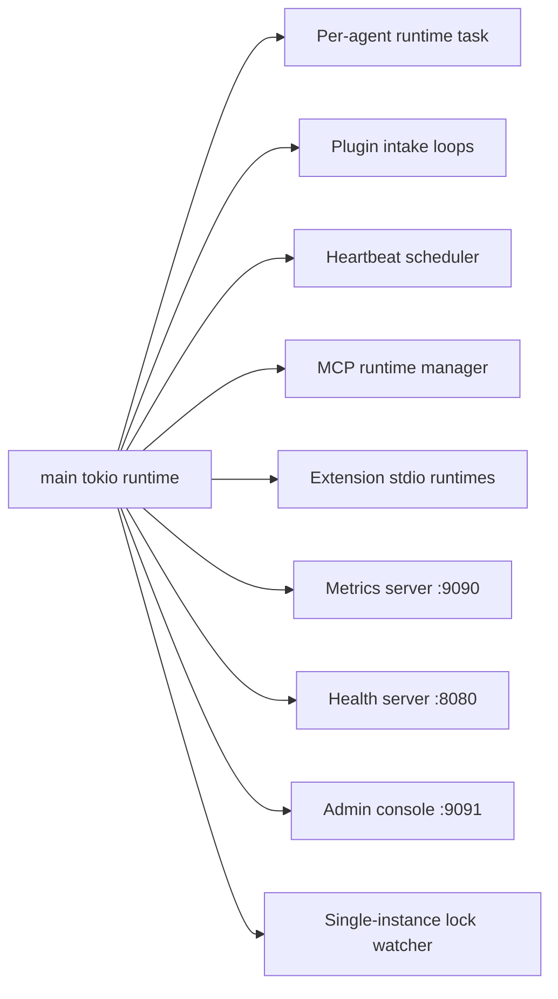

# Architecture overview

nexo-rs is a **single-process** multi-agent runtime. One binary (`agent`)
hosts every agent, every channel plugin, every extension, and the
persistence layer. Coordination between components happens over NATS
(with a local tokio-mpsc fallback when NATS is offline).

Why single-process: shared in-memory caches, zero IPC overhead between
agent and tool invocations, simpler ops. The broker and disk queue give
us the durability a multi-process layout would provide, without the
coordination cost.

## High-level layout

## Workspace crates

The `Cargo.toml` workspace defines these member crates:

| Crate | Responsibility |
|-------|----------------|
| `crates/core` | Agent runtime, trait, `SessionManager`, `HookRegistry`, heartbeat, tool registry |
| `crates/broker` | NATS client, local fallback, disk queue, DLQ, backpressure |
| `crates/llm` | LLM clients (MiniMax, Anthropic, OpenAI-compat, Gemini), retry, rate limiter |
| `crates/memory` | Short-term sessions, long-term SQLite, vector search via sqlite-vec |
| `crates/config` | YAML parsing, env-var resolution, secrets loading |
| `crates/extensions` | Manifest parser, discovery, stdio + NATS runtimes, watcher, CLI |
| `crates/mcp` | MCP client (stdio + HTTP), server mode, tool catalog, hot-reload |
| `crates/taskflow` | Durable flow state machine with wait/resume |
| `crates/resilience` | `CircuitBreaker` three-state machine |
| `crates/setup` | Interactive wizard, YAML patcher, pairing flows |
| `crates/tunnel` | Public HTTPS tunnel for pairing / webhooks |
| `crates/plugins/browser` | Chrome DevTools Protocol client |
| `crates/plugins/whatsapp` | Wrapper over `whatsapp-rs` (Signal Protocol) |
| `crates/plugins/telegram` | Bot API client |
| `crates/plugins/email` | IMAP / SMTP |
| `crates/plugins/gmail-poller` | Cron-style Gmail → broker bridge |
| `crates/plugins/google` | Gmail / Calendar / Drive / Sheets tools |

## Binaries

Defined in `Cargo.toml`:

| Binary | Entry | Purpose |
|--------|-------|---------|
| `agent` | `src/main.rs` | Main daemon; also exposes `setup`, `dlq`, `ext`, `flow`, `status` subcommands |
| `browser-test` | `src/browser_test.rs` | CDP integration smoke test |
| `integration-browser-check` | `src/integration_browser_check.rs` | End-to-end browser flow validation |
| `llm_smoke` | `src/bin/llm_smoke.rs` | LLM provider smoke test |

## Runtime topology

`agent` runs a single tokio multi-thread runtime. Work is split into
independent tasks:

Each agent runtime owns its own subscription to inbound topics, its own
session manager view, its own LLM-loop state. Agents do not share
mutable in-memory state — coordination between agents happens over the
event bus (`agent.route.<target_id>`).

## What lives where — quick mental model

- **A message arrives** → lands on `plugin.inbound.<channel>` (NATS)
- **Agent runtime consumes it** → `SessionManager` attaches or creates a
  session, `HookRegistry` fires `before_message`
- **LLM loop runs** → tools invoked through the registry, which calls
  into extensions / MCP / built-ins, each wrapped by `CircuitBreaker`
- **Tool result flows back** → `after_tool_call` hooks fire, LLM decides
  next turn
- **Agent emits reply** → publishes to `plugin.outbound.<channel>`
- **Channel plugin delivers** → physical message goes to the user

Details per subsystem:

- [Agent runtime](./agent-runtime.md)
- [Event bus (NATS)](./event-bus.md)
- [Fault tolerance](./fault-tolerance.md)
