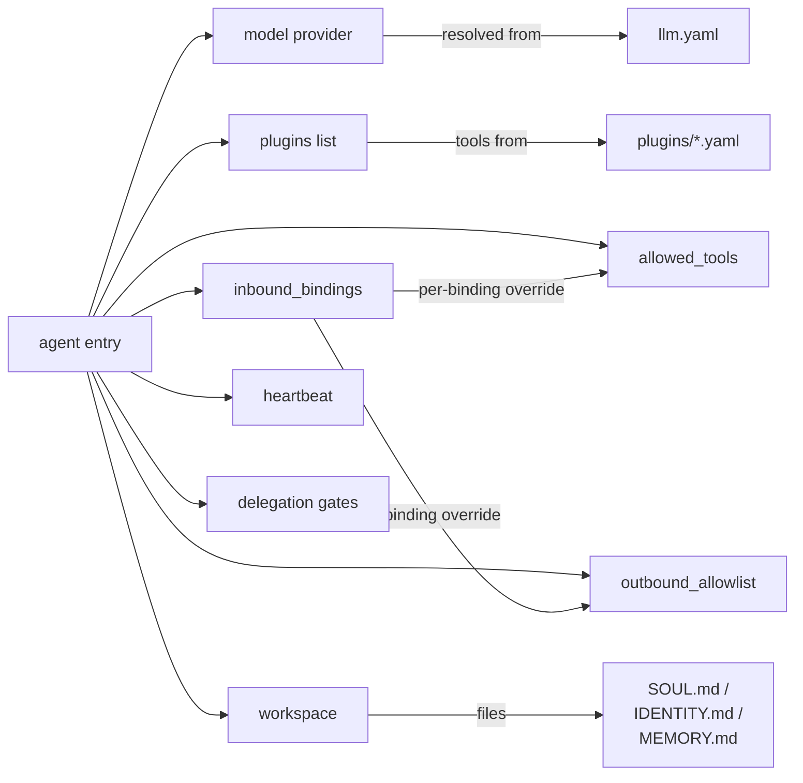

# agents.yaml

The agent catalog. One entry per agent; each entry declares the model,
channels, tools, sandboxing, and behavioral knobs for that agent.

Source: `crates/config/src/types/agents.rs`.

## Top-level shape

```yaml
agents:
  - id: ana
    model:
      provider: minimax
      model: MiniMax-M2.5
    plugins: [whatsapp]
    inbound_bindings:
      - plugin: whatsapp
    allowed_tools:
      - whatsapp_send_message
    outbound_allowlist:
      whatsapp:
        - "573000000000"
    system_prompt: |
      You are Ana, …
```

## Full field reference

All fields use `#[serde(deny_unknown_fields)]` — typos fail fast.

### Identity & model

| Field | Type | Required | Default | Purpose |
|-------|------|:-------:|---------|---------|
| `id` | string | ✅ | — | Unique agent id. Used as session key, subject suffix, workspace dir name. |
| `model.provider` | string | ✅ | — | Provider key in `llm.yaml` (e.g. `minimax`, `anthropic`). |
| `model.model` | string | ✅ | — | Model id understood by that provider. |
| `description` | string | — | `""` | Human-readable role. Injected into `# PEERS` for delegation discovery. |

### Channels

| Field | Type | Default | Purpose |
|-------|------|---------|---------|
| `plugins` | `[string]` | `[]` | Plugin ids this agent wants to expose tools for (`whatsapp`, `telegram`, `browser`, …). |
| `inbound_bindings` | array | `[]` | Per-plugin binding list. Empty = legacy wildcard (receive everything). |

Each `inbound_bindings[]` entry can **override** the agent-level
defaults for that channel: `allowed_tools`, `outbound_allowlist`,
`skills`, `model`, `system_prompt_extra`, `sender_rate_limit`,
`allowed_delegates`. Useful for running the same agent on two channels
with different rules.

### Tool sandboxing

| Field | Type | Default | Purpose |
|-------|------|---------|---------|
| `allowed_tools` | `[string]` | `[]` | **Build-time pruning** of the tool registry. Glob suffix `*` allowed. Empty = all tools registered. |
| `tool_rate_limits` | object | `null` | Per-tool rate limit patterns. Glob-matched. |
| `tool_args_validation.enabled` | bool | `true` | Toggle JSON-schema validation of tool arguments. |
| `outbound_allowlist` | object | `{}` | Per-plugin recipient allowlist (e.g. phone numbers, chat ids). Defense-in-depth for `send` tools. |

**`allowed_tools` semantics:** Tools not matching the allowlist are
**removed from the registry** before the LLM sees them — the model
never knows they exist. This is enforced at registry-build time, not
as a runtime filter, so there is no way to jailbreak past it.

### System prompt & workspace

| Field | Type | Default | Purpose |
|-------|------|---------|---------|
| `system_prompt` | string | `""` | Prepended to every LLM turn. Defines persona, rules, examples. |
| `workspace` | path | `""` | Directory with `IDENTITY.md`, `SOUL.md`, `USER.md`, `AGENTS.md`, `MEMORY.md`. Loaded at turn start. See [Soul, identity & learning](../soul/identity.md). |
| `extra_docs` | `[path]` | `[]` | Workspace-relative markdown files appended as `# RULES — <filename>`. |
| `transcripts_dir` | path | `""` | Directory for per-session JSONL transcripts. Empty = disabled. |
| `skills_dir` | path | `"./skills"` | Base directory for local skill files. |
| `skills` | `[string]` | `[]` | Local skill ids to inject into the system prompt. Resolved from `skills_dir`. |

### Heartbeat

```yaml
heartbeat:
  enabled: true
  interval: 30s
```

| Field | Type | Default | Purpose |
|-------|------|---------|---------|
| `heartbeat.enabled` | bool | `false` | Turn heartbeat on for this agent. |
| `heartbeat.interval` | humantime | `"5m"` | Interval between `on_heartbeat()` fires. |

See [Agent runtime — Heartbeat](../architecture/agent-runtime.md#heartbeat).

### Runtime knobs

```yaml
config:
  debounce_ms: 2000
  queue_cap: 32
```

| Field | Type | Default | Purpose |
|-------|------|---------|---------|
| `config.debounce_ms` | u64 | `2000` | Debounce window for burst-of-messages coalescing. |
| `config.queue_cap` | usize | `32` | Per-agent mailbox capacity. |
| `sender_rate_limit.rps` | f64 | — | Per-sender token-bucket refill rate. |
| `sender_rate_limit.burst` | u64 | — | Bucket size. |

### Agent-to-agent delegation

| Field | Type | Default | Purpose |
|-------|------|---------|---------|
| `allowed_delegates` | `[glob]` | `[]` | Peers this agent may delegate to. Empty = no restriction. |
| `accept_delegates_from` | `[glob]` | `[]` | Inverse gate: peers allowed to delegate **to** this agent. |

Routing uses `agent.route.<target_id>` over NATS with a
`correlation_id`. See [Event bus — Agent-to-agent routing](../architecture/event-bus.md#agent-to-agent-routing).

### Dreaming (memory consolidation)

```yaml
dreaming:
  enabled: false
  interval_secs: 86400
  min_score: 0.35
  min_recall_count: 3
  min_unique_queries: 2
  max_promotions_per_sweep: 20
  weights:
    frequency: 0.24
    relevance: 0.30
    recency: 0.15
    diversity: 0.15
    consolidation: 0.10
```

Defaults shown. See [Soul — Dreaming](../soul/dreaming.md).

### Workspace-git

```yaml
workspace_git:
  enabled: false
  author_name: "agent"
  author_email: "agent@localhost"
```

When enabled, the agent's `workspace` directory is a git repo that the
runtime commits to after dream sweeps, `forge_memory_checkpoint`, and
session close. Good for forensic replay.

### Google auth (per-agent OAuth)

```yaml
google_auth:
  client_id: ${GOOGLE_CLIENT_ID}
  client_secret: ${file:./secrets/google_secret.txt}
  scopes:
    - https://www.googleapis.com/auth/gmail.readonly
  token_file: ./data/workspace/ana/google_token.json
  redirect_port: 17653
```

Used by `crates/plugins/google` to run OAuth PKCE per agent.

## Relationship diagram



## Common mistakes

- **Forgetting `plugins: [...]`.** An agent without `plugins` has no
  inbound channel and no outbound tools. It is inert.
- **Setting `allowed_tools` without a wildcard.** `["memory_*"]`
  allows the full `memory_*` family; `["memory_store"]` allows only
  one. Check the glob before assuming.
- **Large `system_prompt` duplication across agents.** Use
  `inbound_bindings[].system_prompt_extra` to add per-channel
  content without duplicating the whole prompt.
- **Sharing a WhatsApp session across agents.** Each agent's
  `workspace` should contain its own `whatsapp/default` session; the
  wizard does this automatically, but pointing two agents at the same
  session dir will cause message cross-delivery.

## Next

- [Drop-in agents](./drop-in.md) — merging multiple agent files
- [llm.yaml](./llm.md) — where `model.provider` is resolved
- [Skills catalog](../skills/catalog.md) — names that go in `allowed_tools`
