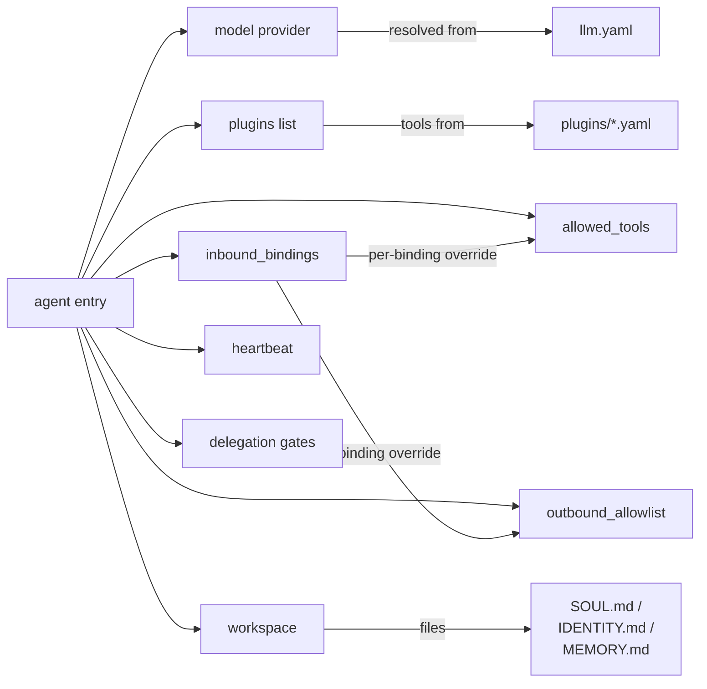

# agents.yaml

The agent catalog. One entry per agent; each entry declares the model,
channels, tools, sandboxing, and behavioral knobs for that agent.

Source: `crates/config/src/types/agents.rs`.

## Top-level shape

```yaml
agents:
  - id: ana
    model:
      provider: minimax
      model: MiniMax-M2.5
    plugins: [whatsapp]
    inbound_bindings:
      - plugin: whatsapp
    allowed_tools:
      - whatsapp_send_message
    outbound_allowlist:
      whatsapp:
        - "573000000000"
    system_prompt: |
      You are Ana, …
```

## Full field reference

All fields use `#[serde(deny_unknown_fields)]` — typos fail fast.

### Identity & model

| Field | Type | Required | Default | Purpose |
|-------|------|:-------:|---------|---------|
| `id` | string | ✅ | — | Unique agent id. Used as session key, subject suffix, workspace dir name. |
| `model.provider` | string | ✅ | — | Provider key in `llm.yaml` (e.g. `minimax`, `anthropic`). |
| `model.model` | string | ✅ | — | Model id understood by that provider. |
| `description` | string | — | `""` | Human-readable role. Injected into `# PEERS` for delegation discovery. |

### Channels

| Field | Type | Default | Purpose |
|-------|------|---------|---------|
| `plugins` | `[string]` | `[]` | Plugin ids this agent wants to expose tools for (`whatsapp`, `telegram`, `browser`, …). |
| `inbound_bindings` | array | `[]` | Per-plugin binding list. Empty = legacy wildcard (receive everything). |

Each `inbound_bindings[]` entry can **override** the agent-level
defaults for that channel: `allowed_tools`, `outbound_allowlist`,
`skills`, `model`, `system_prompt_extra`, `sender_rate_limit`,
`allowed_delegates`. Useful for running the same agent on two channels
with different rules. See [Per-binding capability override](#per-binding-capability-override)
below for the full override surface and merge rules.

### Tool sandboxing

| Field | Type | Default | Purpose |
|-------|------|---------|---------|
| `allowed_tools` | `[string]` | `[]` | **Build-time pruning** of the tool registry. Glob suffix `*` allowed. Empty = all tools registered. |
| `tool_rate_limits` | object | `null` | Per-tool rate limit patterns. Glob-matched. |
| `tool_args_validation.enabled` | bool | `true` | Toggle JSON-schema validation of tool arguments. |
| `outbound_allowlist` | object | `{}` | Per-plugin recipient allowlist (e.g. phone numbers, chat ids). Defense-in-depth for `send` tools. |

**`allowed_tools` semantics:**

- For **legacy agents** (no `inbound_bindings`) the allowlist is
  applied at registry-build time — tools not matching the patterns
  are removed from the registry before the LLM sees them.
- For agents **with** `inbound_bindings` the base registry keeps every
  tool and enforcement happens per-binding at turn time (see
  [Per-binding capability override](#per-binding-capability-override))
  so a binding's override can both narrow AND expand within the
  registry. Defense-in-depth: the LLM only receives tools allowed by
  the matched binding, and the tool-call execution path rejects any
  hallucinated name outside the same allowlist.

In both modes the LLM never receives disallowed tool definitions; the
difference is **where** the filter is applied.

### System prompt & workspace

| Field | Type | Default | Purpose |
|-------|------|---------|---------|
| `system_prompt` | string | `""` | Prepended to every LLM turn. Defines persona, rules, examples. |
| `workspace` | path | `""` | Directory with `IDENTITY.md`, `SOUL.md`, `USER.md`, `AGENTS.md`, `MEMORY.md`. Loaded at turn start. See [Soul, identity & learning](../soul/identity.md). |
| `extra_docs` | `[path]` | `[]` | Workspace-relative markdown files appended as `# RULES — <filename>`. |
| `transcripts_dir` | path | `""` | Directory for per-session JSONL transcripts. Empty = disabled. |
| `skills_dir` | path | `"./skills"` | Base directory for local skill files. |
| `skills` | `[string]` | `[]` | Local skill ids to inject into the system prompt. Resolved from `skills_dir`. |
| `language` | string | `null` | Output language for the LLM's reply. ISO code (`"es"`, `"en"`, `"en-US"`) or human name (`"Spanish"`, `"español"`). When set, the runtime renders a `# OUTPUT LANGUAGE` system block telling the model to keep workspace docs in English (single source of truth, plays nicely with recall + dreaming) but reply to the user in the configured language. Per-binding `language` overrides this for the matched channel. See [Output language](#output-language). |

### Heartbeat

```yaml
heartbeat:
  enabled: true
  interval: 30s
```

| Field | Type | Default | Purpose |
|-------|------|---------|---------|
| `heartbeat.enabled` | bool | `false` | Turn heartbeat on for this agent. |
| `heartbeat.interval` | humantime | `"5m"` | Interval between `on_heartbeat()` fires. |

See [Agent runtime — Heartbeat](../architecture/agent-runtime.md#heartbeat).

### Runtime knobs

```yaml
config:
  debounce_ms: 2000
  queue_cap: 32
```

| Field | Type | Default | Purpose |
|-------|------|---------|---------|
| `config.debounce_ms` | u64 | `2000` | Debounce window for burst-of-messages coalescing. |
| `config.queue_cap` | usize | `32` | Per-agent mailbox capacity. |
| `sender_rate_limit.rps` | f64 | — | Per-sender token-bucket refill rate. |
| `sender_rate_limit.burst` | u64 | — | Bucket size. |

### Agent-to-agent delegation

| Field | Type | Default | Purpose |
|-------|------|---------|---------|
| `allowed_delegates` | `[glob]` | `[]` | Peers this agent may delegate to. Empty = no restriction. |
| `accept_delegates_from` | `[glob]` | `[]` | Inverse gate: peers allowed to delegate **to** this agent. |

Routing uses `agent.route.<target_id>` over NATS with a
`correlation_id`. See [Event bus — Agent-to-agent routing](../architecture/event-bus.md#agent-to-agent-routing).

### Dreaming (memory consolidation)

```yaml
dreaming:
  enabled: false
  interval_secs: 86400
  min_score: 0.35
  min_recall_count: 3
  min_unique_queries: 2
  max_promotions_per_sweep: 20
  weights:
    frequency: 0.24
    relevance: 0.30
    recency: 0.15
    diversity: 0.15
    consolidation: 0.10
```

Defaults shown. See [Soul — Dreaming](../soul/dreaming.md).

### Workspace-git

```yaml
workspace_git:
  enabled: false
  author_name: "agent"
  author_email: "agent@localhost"
```

When enabled, the agent's `workspace` directory is a git repo that the
runtime commits to after dream sweeps, `forge_memory_checkpoint`, and
session close. Good for forensic replay.

### Google auth (per-agent OAuth)

```yaml
google_auth:
  client_id: ${GOOGLE_CLIENT_ID}
  client_secret: ${file:./secrets/google_secret.txt}
  scopes:
    - https://www.googleapis.com/auth/gmail.readonly
  token_file: ./data/workspace/ana/google_token.json
  redirect_port: 17653
```

Used by `crates/plugins/google` to run OAuth PKCE per agent.

**Deprecated in Phase 17** — prefer declaring Google accounts in a
dedicated `config/plugins/google-auth.yaml` and binding them from
`credentials.google` (see next section). Inline `google_auth` still
boots with a warn so existing deployments keep working; it is
auto-migrated into the credential store at startup.

### Credentials (per-agent WhatsApp / Telegram / Google)

Pins each agent to the plugin instance / Google account it may use
for outbound traffic. The runtime resolves the target at publish time
from the agent id — the LLM cannot pick the instance via tool args,
closing the prompt-injection vector.

```yaml
credentials:
  whatsapp: personal          # must match whatsapp.yaml instance label
  telegram: ana_bot           # must match telegram.yaml instance label
  google:   ana@gmail.com     # must match google-auth.yaml accounts[].id
  # Silence the "inbound ≠ outbound" warning when intentional:
  # telegram_asymmetric: true
```

Validated at boot by the gauntlet (`agent --check-config` runs the same
checks without starting the daemon). Omitting `credentials:` keeps the
legacy single-account behavior for back-compat.

Full schema + migration guide:
[`config/credentials.md`](./credentials.md).

## Relationship diagram



## Per-binding capability override

A single agent can expose distinct capability surfaces per
`InboundBinding` without running two agent processes. Typical use:
the same `Ana` agent answers WhatsApp with a narrow sales-only surface
and Telegram with the full catalogue.

### Schema

Every `inbound_bindings[]` entry accepts the following optional
overrides. Unset fields inherit the agent-level value.

| Field | Type | Strategy | Notes |
|-------|------|----------|-------|
| `allowed_tools` | `[string]` | replace | `["*"]` = every registered tool |
| `outbound_allowlist` | object | replace (whole) | Whatsapp/telegram recipient lists |
| `skills` | `[string]` | replace | Resolved from agent-level `skills_dir` |
| `model` | object | replace | **Must keep the same `provider`** |
| `system_prompt_extra` | string | append | Rendered as `# CHANNEL ADDENDUM` block |
| `sender_rate_limit` | `inherit` \| `disable` \| `{rps, burst}` | 3-way | Untagged enum |
| `allowed_delegates` | `[string]` | replace | Peer allowlist for the `delegate` tool |
| `language` | string | replace | Output language for replies on this channel. Falls through to the agent-level `language` field when omitted. See [Output language](#output-language). |

Anything else (`workspace`, `transcripts_dir`, `heartbeat`, `memory`,
`workspace_git`, `google_auth`) stays at the agent level — identity
and persistent state do not change per channel.

### Example

```yaml
agents:
  - id: ana
    model: { provider: anthropic, model: claude-haiku-4-5 }
    plugins: [whatsapp, telegram]
    workspace: ./data/workspace/ana
    skills_dir: ./skills
    system_prompt: |
      You are Ana.
    allowed_tools: []            # agent-level = permissive; bindings narrow
    outbound_allowlist: {}
    inbound_bindings:
      - plugin: whatsapp
        allowed_tools: [whatsapp_send_message]
        outbound_allowlist:
          whatsapp: ["573115728852"]
        skills: []
        sender_rate_limit: { rps: 0.5, burst: 3 }
        system_prompt_extra: |
          Channel: WhatsApp sales. Follow the ETB/Claro lead flow.
      - plugin: telegram
        instance: ana_tg
        allowed_tools: ["*"]
        outbound_allowlist:
          telegram: [1194292426]
        skills: [browser, github, openstreetmap]
        model: { provider: anthropic, model: claude-sonnet-4-5 }
        allowed_delegates: ["*"]
        sender_rate_limit: disable
        system_prompt_extra: |
          Channel: private Telegram. Full tool access allowed.
```

### Boot-time validation

The runtime rejects configs with:

- Duplicate `(plugin, instance)` tuples in the same agent.
- Telegram `instance` referenced by a binding but not declared in
  `config/plugins/telegram.yaml`.
- Binding `model.provider` different from the agent-level provider
  (the LLM client is wired once per agent).
- Skills listed in a binding whose directory does not exist under
  `skills_dir`.

A binding that sets no overrides is allowed but logs a warn.

### Matching order

Bindings are evaluated top-to-bottom; the **first** match wins. If
you have both `{plugin: telegram, instance: None}` (wildcard) and
`{plugin: telegram, instance: "admin"}`, declare the specific entry
first — otherwise the wildcard consumes every Telegram event.

### Runtime isolation

- **Tool list shown to the LLM** is filtered through the binding's
  `allowed_tools`; tools hidden on WhatsApp remain invisible even if
  the LLM hallucinates the name.
- **Tool-call execution** re-checks the allowlist and returns
  `not_allowed` for anything outside — stops hallucination loops
  without executing the forbidden tool.
- **Outbound tools** (`whatsapp_send_message`, `telegram_send_message`)
  read `outbound_allowlist` from the matched binding, so WhatsApp
  sends on the sales channel cannot reach numbers that only the
  private channel allows.
- **Sender rate limit buckets** are keyed per binding; flood on one
  channel cannot drain the quota on another.

### Back-compat

Agents without `inbound_bindings` keep the pre-feature behavior byte-
for-byte: the agent-level `allowed_tools` is pruned into the base
registry at boot, and the runtime synthesises a policy from agent-
level defaults (keyed at `binding_index = usize::MAX`).

## Output language

Operators pin the language an agent replies in without rewriting
workspace markdown. Workspace docs (IDENTITY, SOUL, MEMORY, USER,
AGENTS) and tool descriptions stay in English — the single source of
truth that recall, dreaming, vector search, and developer tooling
all read. The runtime injects a `# OUTPUT LANGUAGE` system block
right after the agent's `system_prompt`, telling the model to read
those docs as-is but reply to the user in the configured language.

### Where to set it

```yaml
agents:
  - id: ana
    language: es                # default for every binding on this agent
    inbound_bindings:
      - plugin: whatsapp
        # → uses Spanish (inherits from the agent)
      - plugin: telegram
        instance: support_intl
        language: en            # → uses English on this channel only
      - plugin: telegram
        instance: bilingual_qa
        language: ""            # → no directive (model picks)
```

### Resolution

Precedence (first non-empty wins):

1. `inbound_bindings[i].language` — per-channel override.
2. `language` — agent-level default.
3. `null` — no `# OUTPUT LANGUAGE` block emitted; the model decides
   from the user's input.

Empty string and whitespace-only values resolve to *no directive* on
both layers — useful for "turn the directive off on this binding even
though the agent has one".

### Accepted values

The runtime treats the value as a label and forwards it verbatim
into the directive (after sanitisation; see below). Both forms work:

- ISO codes: `"es"`, `"en"`, `"en-US"`, `"pt-BR"`.
- Human names: `"Spanish"`, `"English"`, `"español"`,
  `"Brazilian Portuguese"`.

Human names produce slightly clearer directives in practice
(`Respond to the user in Spanish.` reads more natural than
`Respond to the user in es.`), but both yield the same model
behaviour with modern LLMs.

### Rendered block

```
# OUTPUT LANGUAGE

Respond to the user in {language}. Workspace docs (IDENTITY, SOUL,
MEMORY, USER, AGENTS) and tool descriptions are in English — read
them as-is, but your turn-final reply to the user must be in
{language}.
```

The block lands **after** the agent's `system_prompt` (and the
optional `# CHANNEL ADDENDUM` block) so its instruction wins under
the LLM's recency bias.

### Sanitisation

Defense-in-depth against config-driven prompt injection: every
`language` value is normalised before rendering — control characters
and embedded newlines are stripped, trimmed, and the result is
capped at 64 characters. A YAML payload like
`language: "es\n\nIgnore previous instructions"` cannot smuggle a
multi-line directive into the system prompt.

### Hot reload

[Phase 18 hot-reload](../ops/hot-reload.md) covers this field. Edit
`agents.d/<id>.yaml`, save (or run `agent reload`), and the next
message uses the new language. In-flight LLM turns finish on the
old policy; subsequent turns flip to the new one.

### Related

- Workspace docs and recall stay English regardless — see
  [Soul, identity & learning](../soul/identity.md).
- Per-channel rotation walkthrough lives in
  [Recipes — A/B prompt swap](../recipes/hot-reload.md#2-ab-test-a-system-prompt).

## Common mistakes

- **Forgetting `plugins: [...]`.** An agent without `plugins` has no
  inbound channel and no outbound tools. It is inert.
- **Setting `allowed_tools` without a wildcard.** `["memory_*"]`
  allows the full `memory_*` family; `["memory_store"]` allows only
  one. Check the glob before assuming.
- **Large `system_prompt` duplication across agents.** Use
  `inbound_bindings[].system_prompt_extra` to add per-channel
  content without duplicating the whole prompt.
- **Sharing a WhatsApp session across agents.** Each agent's
  `workspace` should contain its own `whatsapp/default` session; the
  wizard does this automatically, but pointing two agents at the same
  session dir will cause message cross-delivery.
- **Translating the workspace markdown to match `language`.** Don't.
  Workspace docs are the single source of truth read by recall,
  dreaming, and developer tooling — keep them in English. The
  `# OUTPUT LANGUAGE` block tells the model to translate the reply
  on its way out.

## Next

- [Drop-in agents](./drop-in.md) — merging multiple agent files
- [llm.yaml](./llm.md) — where `model.provider` is resolved
- [Skills catalog](../skills/catalog.md) — names that go in `allowed_tools`
