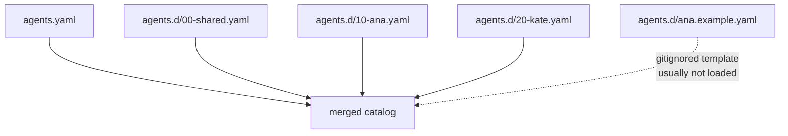

# Drop-in agents

`config/agents.d/*.yaml` is a merge-directory for agent definitions
that should not live in `agents.yaml` — typically anything with
business content (sales prompts, pricing tables, internal phone
numbers, customer-facing identities).

Source: `crates/config/src/lib.rs` (merge logic).

## Why it exists

- Keep `agents.yaml` **public-safe** and checked into git
- Keep sensitive content **gitignored** and loaded at runtime
- Compose layered configs (`00-dev.yaml`, `10-prod.yaml`) without
  editing a single monolithic file
- Ship `.example.yaml` templates so the shape stays discoverable

`.gitignore` rules include:

```
config/agents.d/*.yaml
!config/agents.d/*.example.yaml
```

The `.example.yaml` files are committed and serve as templates; the
real `.yaml` files are not.

## Merge order

Files are loaded in **lexicographic filename order** and their `agents`
arrays are concatenated to the base `agents.yaml`:



Every file must have the top-level `agents: [...]` shape:

```yaml
# config/agents.d/10-ana.yaml
agents:
  - id: ana
    model:
      provider: minimax
      model: MiniMax-M2.5
    plugins: [whatsapp]
    inbound_bindings:
      - plugin: whatsapp
    system_prompt: |
      …private content…
```

## Agent id collisions

Two files cannot define the same `agent.id`. On collision the loader
fails fast with a clear message. If you want to override an agent,
either:

- Replace the entry (rename or remove the original)
- Use `inbound_bindings[]` per-binding overrides inside a single entry

## Common patterns

### Public vs. private split

```
config/agents.yaml                  # committed, only support/ops agents
config/agents.d/ana.yaml            # gitignored, full sales prompt
config/agents.d/kate.yaml           # gitignored, personal assistant
config/agents.d/ana.example.yaml    # committed, empty template
```

### Environment layering

```
config/agents.d/00-common.yaml      # shared defaults
config/agents.d/10-dev.yaml         # dev-only overrides (loaded only on dev box)
```

Swap the `10-*.yaml` file per environment. Docker compose can mount
the right one from a secret volume.

## Validation

- `#[serde(deny_unknown_fields)]` still applies to every file
- `validate_agents()` runs after the merge — checks duplicate ids,
  missing plugin references, invalid skill directories
- Errors name the file **and** the offending agent id
