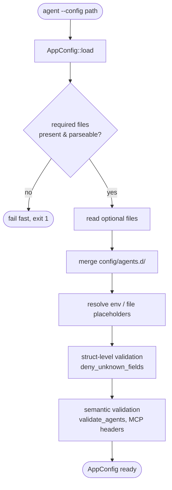

# Configuration layout

nexo-rs loads configuration from a single directory (passed via
`--config <path>`, default `./config`). The runtime reads a small set
of required YAML files and a handful of optional ones.

Source: `crates/config/src/lib.rs::AppConfig::load`.

## Directory tree

```
config/
├── agents.yaml              # required — base agent catalog
├── agents.d/                # optional — drop-in agents, merged in alpha order
│   ├── ana.example.yaml     # template (committed)
│   └── *.yaml               # real definitions (gitignored)
├── broker.yaml              # required — NATS / local broker + disk queue
├── llm.yaml                 # required — LLM providers
├── memory.yaml              # required — short-term + long-term + vector
├── extensions.yaml          # optional — extension search paths, toggles
├── mcp.yaml                 # optional — MCP servers the agent consumes
├── mcp_server.yaml          # optional — expose this agent as an MCP server
├── tool_policy.yaml         # optional — per-tool / per-agent policy
├── plugins/
│   ├── whatsapp.yaml
│   ├── telegram.yaml
│   ├── email.yaml
│   ├── browser.yaml
│   ├── google.yaml
│   └── gmail-poller.yaml
└── docker/                  # optional — overrides for containerized runs
    ├── agents.yaml
    ├── llm.yaml
    └── …
```

## Required vs optional

The loader fails startup if any required file is missing or malformed.
Optional files return `None` when absent and unlock related features
only if present.

| File | Kind |
|------|------|
| `agents.yaml` | required |
| `broker.yaml` | required |
| `llm.yaml` | required |
| `memory.yaml` | required |
| `extensions.yaml` | optional |
| `mcp.yaml` | optional |
| `mcp_server.yaml` | optional |
| `tool_policy.yaml` | optional |
| `plugins/*.yaml` | optional (only needed for plugins you enable) |

## Drop-in agents

Files under `config/agents.d/*.yaml` are merged into the base
`agents.yaml` in **lexicographic filename order**. Each file has the
same top-level shape (`agents: [...]`); entries append to the base
list.

Common patterns:

- `00-dev.yaml` / `10-prod.yaml` — control override order by numeric
  prefix
- Keep `agents.yaml` public-safe and drop sensitive business content
  (sales prompts, pricing, phone numbers) into gitignored
  `config/agents.d/ana.yaml`
- Ship `config/agents.d/<name>.example.yaml` as a template so the shape
  stays discoverable

Details in [Drop-in agents](./drop-in.md).

## Docker layout

`config/docker/` mirrors the main layout and is consumed when the
compose file mounts it at `/app/config/docker`:

```yaml
# docker-compose.yml
command: ["agent", "--config", "/app/config/docker"]
```

Secrets inside Docker containers live at `/run/secrets/<name>` — the
compose definitions use `${file:/run/secrets/...}` references. See
[LLM config — auth](./llm.md#auth-modes) for the full secret
resolution rules.

## Env vars and secrets in YAML

YAML values can reference env vars and files:

| Syntax | Meaning |
|--------|---------|
| `${VAR}` | read env var, **fail** if unset or empty |
| `${VAR:-fallback}` | env var if set and non-empty, else `fallback` |
| `${VAR-fallback}` | env var if set (even empty), else `fallback` |
| `${file:./secrets/x}` | read file contents, trimmed of whitespace |

**Path-traversal rules** for `${file:...}`:

- Relative paths are rooted at the current working directory
- `..` segments are rejected outright
- Absolute paths must sit under one of these whitelisted roots:
  - `/run/secrets/` (Docker secrets)
  - `/var/run/secrets/` (Kubernetes projected volumes)
  - `./secrets/` (project-local)
  - the directory pointed at by `$CONFIG_SECRETS_DIR` (operator-defined)

Everything else is refused at parse time with an explicit error naming
the invalid path and the allowed roots.

## Validation

All config structs deserialize with `#[serde(deny_unknown_fields)]`, so
typos fail fast:

```
unknown field `modl`, expected `model`
at line 4, column 5 in config/agents.yaml
```

Missing required fields produce the same kind of message:

```
missing field `model`
at line 5, column 3 in config/agents.yaml
```

Env / file resolution errors identify the placeholder and the file:

```
env var MINIMAX_API_KEY not set (referenced in llm.yaml)
```

```
${file:../etc/passwd}: `..` not allowed in file reference (in broker.yaml)
```

## Boot sequence



## Next

- [agents.yaml](./agents.md) — full agent schema
- [llm.yaml](./llm.md) — LLM provider schema + auth modes
- [broker.yaml](./broker.md) — NATS + disk queue
- [memory.yaml](./memory.md) — short/long/vector
- [Drop-in agents](./drop-in.md) — merge order and patterns
