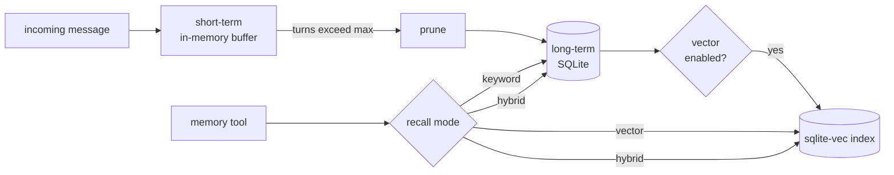

# memory.yaml

Short-term sessions, long-term SQLite storage, and optional vector
search.

Source: `crates/config/src/types/memory.rs`.

## Shape

```yaml
short_term:
  max_history_turns: 50
  session_ttl: 24h
  max_sessions: 10000

long_term:
  backend: sqlite
  sqlite:
    path: ./data/memory.db

vector:
  enabled: false
  backend: sqlite-vec
  default_recall_mode: hybrid
  embedding:
    provider: http
    base_url: https://api.openai.com/v1
    model: text-embedding-3-small
    api_key: ${OPENAI_API_KEY}
    dimensions: 1536
    timeout_secs: 30
```

## Short-term

Per-session conversation buffer held in memory by
[`SessionManager`](../architecture/agent-runtime.md#sessionmanager).

| Field | Default | Purpose |
|-------|---------|---------|
| `max_history_turns` | `50` | Turns kept before oldest are pruned into long-term memory. |
| `session_ttl` | `24h` | How long a session lives idle before eviction. humantime syntax. |
| `max_sessions` | `10000` | Soft cap. On overflow the oldest-idle session is evicted (fires `on_expire`). `0` = unbounded. |

## Long-term

Persisted memory, durable across restarts.

| Field | Options | Default | Purpose |
|-------|---------|---------|---------|
| `backend` | `sqlite` \| `redis` | `sqlite` | Storage engine. |
| `sqlite.path` | path | `./data/memory.db` | SQLite file (with `sqlite-vec` extension loaded when vector enabled). |
| `redis.url` | url | — | Redis connection string (when `backend: redis`). |

## Vector

Opt-in semantic memory.

| Field | Default | Purpose |
|-------|---------|---------|
| `enabled` | `false` | Opt-in. |
| `backend` | `sqlite-vec` | Zero-extra-infrastructure vector index. |
| `default_recall_mode` | `hybrid` | Used when the `memory` tool call omits `mode`. Options: `keyword`, `vector`, `hybrid`. |
| `embedding.provider` | `http` | Where to fetch embeddings. `http` = any OpenAI-compatible embeddings server. |
| `embedding.base_url` | — | Embeddings endpoint. |
| `embedding.model` | — | Model id, e.g. `text-embedding-3-small`, `nomic-embed-text`. |
| `embedding.api_key` | — | Key for the embeddings server. Supports `${ENV_VAR}` / `${file:…}`. |
| `embedding.dimensions` | — | Must match the model output (1536 for OpenAI 3-small; 768 for nomic). Mismatch aborts startup. |
| `embedding.timeout_secs` | `30` | Embeddings request timeout. |

## Memory layers



## Per-agent isolation

Each agent's memory DB lives under its `workspace` when
`workspace_git` is enabled — keeps memories forensically reviewable and
prevents one agent from reading another's history.

See also:

- [Memory — long-term](../memory/long-term.md)
- [Memory — vector search](../memory/vector.md)
- [Soul, identity & learning](../soul/identity.md)
