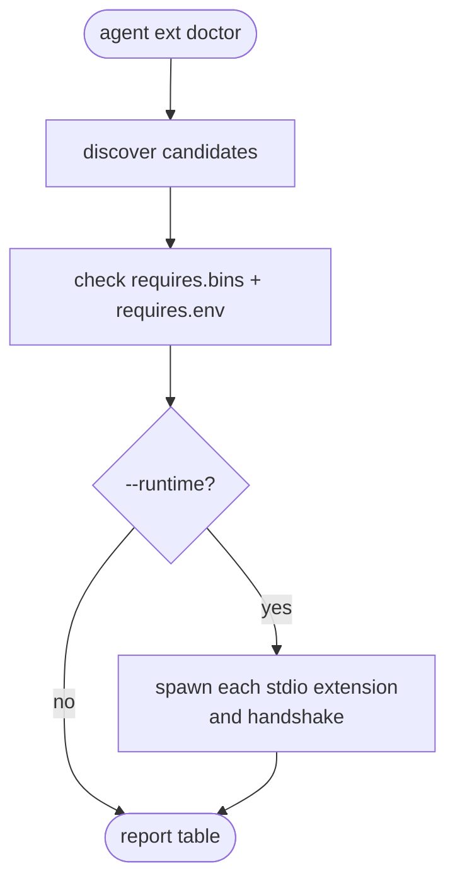

# CLI (`agent ext`)

Operator-facing commands for discovering, installing, validating, and
toggling extensions. Every subcommand accepts `--json` for scripting.

Source: `crates/extensions/src/cli/`.

## Subcommands

```
agent ext list                           [--json]
agent ext info <id>                      [--json]
agent ext enable <id>
agent ext disable <id>
agent ext validate <path>
agent ext doctor                         [--runtime] [--json]
agent ext install <path>                 [--update] [--enable] [--dry-run] [--link] [--json]
agent ext uninstall <id> --yes           [--json]
```

### `list` — discovered extensions

Walks the configured `search_paths`, prints each candidate, its
transport, and its enabled/disabled state.

### `info <id>` — manifest + status

Prints the full parsed manifest, the runtime state if the agent is
currently running, and any diagnostics attached to the candidate.

### `enable` / `disable` — toggle in `extensions.yaml`

Rewrites the `disabled` list in `config/extensions.yaml`:

```yaml
extensions:
  disabled: [weather]
```

No runtime side effect; operator must restart the agent to apply.

### `validate <path>` — manifest check without registering

Parses and validates a `plugin.toml` at `<path>`. Good for CI checks
on an extension's manifest before shipping.

### `doctor` — preflight checks

Runs the same `Requires::missing()` logic as discovery, plus
transport-specific checks:



`--runtime` actually spawns each stdio extension and runs the
handshake — useful to catch a broken binary before production
boot.

### `install <path>` — copy or symlink

Adds an extension to the active `search_paths`:

```bash
agent ext install ./extensions/weather
agent ext install /abs/path/to/my-ext --link --enable
```

- `--update` replaces an existing extension with the same id
- `--enable` adds it to `extensions.yaml` enabled (default: disabled
  until you `enable`)
- `--dry-run` prints what would happen without writing
- `--link` creates a symlink instead of copying — requires an
  **absolute** source path. Good for dev loops.

### `uninstall <id> --yes`

Removes the extension's directory from the active search path (or the
symlink, in `--link` installs). `--yes` is mandatory — no accidental
destruction.

## Exit codes

| Code | Meaning |
|------|---------|
| 0 | Success |
| 1 | Extension not found / `--update` target missing |
| 2 | Invalid manifest / invalid source / `--link` needs absolute path |
| 3 | Config write failed |
| 4 | Invalid id (reserved or empty) |
| 5 | Target exists (use `--update`) |
| 6 | Id collision across roots |
| 7 | `uninstall` missing `--yes` confirmation |
| 8 | Copy / atomic swap failed |
| 9 | Runtime check(s) failed (`doctor --runtime`) |

Non-zero codes are stable for scripting.

## JSON mode

Every subcommand that produces human output also supports `--json`
for machine consumption. Fields are stable per code-phase; schema is
not officially frozen yet — pin to a specific agent version in CI.

## Common ops flows

### Ship an extension to staging

```bash
agent ext validate ./my-ext/plugin.toml
agent ext install ./my-ext --link --enable
agent ext doctor --runtime
```

### Disable a flapping extension without redeploying

```bash
agent ext disable weather   # writes to extensions.yaml
systemctl reload agent       # or restart, depending on deployment
```

### CI gate

```bash
# .github/workflows/extension.yml
- run: cargo build --release
- run: agent ext validate ./plugin.toml
```
