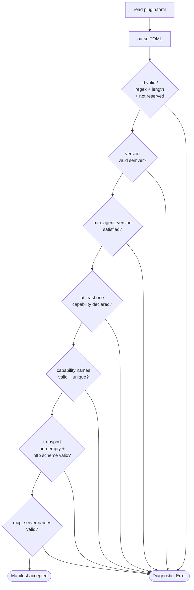

# Manifest (`plugin.toml`)

Every extension ships a `plugin.toml` at its root. It declares
identity, transport, capabilities, runtime requirements, and any
bundled MCP servers. The runtime parses and validates the manifest
before spawning anything.

Source: `crates/extensions/src/manifest.rs`.

## Minimal example

```toml
[plugin]
id = "weather"
version = "0.1.0"
name = "Weather"
description = "Fetch weather by city name."
min_agent_version = "0.1.0"
priority = 0

[capabilities]
tools = ["get_weather"]
hooks = []

[transport]
type = "stdio"
command = "./weather"
args = []

[requires]
bins = ["curl"]
env = ["WEATHER_API_KEY"]

[context]
passthrough = false

[meta]
author = "you"
license = "MIT OR Apache-2.0"
```

## Sections

### `[plugin]`

| Field | Required | Purpose |
|-------|:-------:|---------|
| `id` | ✅ | Unique id. Regex `^[a-z][a-z0-9_-]*$`, ≤ 64 chars. Must not be a **reserved** id (see below). |
| `version` | ✅ | Semver. |
| `name` | — | Human-readable label. |
| `description` | — | ≤ 512 UTF-8 chars. |
| `min_agent_version` | — | Semver. Checked against the running agent version at load time. |
| `priority` | — | `i32`, default `0`. Lower fires first in hook chains. |

**Reserved ids:** `agent`, `browser`, `core`, `email`, `heartbeat`,
`memory`, `telegram`, `whatsapp`. The host may register more via
`register_reserved_ids()`.

### `[capabilities]`

```toml
[capabilities]
tools = ["get_weather", "get_forecast"]
hooks = ["before_message", "after_tool_call"]
channels = []
providers = []
```

At least one capability list must be non-empty. Names match
`^[a-z][a-z0-9_]*$`, ≤ 64 chars, no duplicates.

### `[transport]`

One of three forms:

```toml
# stdio — spawn a child process
[transport]
type = "stdio"
command = "./my-extension"
args = ["--verbose"]
```

```toml
# nats — talk over a NATS subject prefix
[transport]
type = "nats"
subject_prefix = "ext.myext"
```

```toml
# http — call over HTTP
[transport]
type = "http"
url = "https://localhost:8080"
```

Validation: `command`, `subject_prefix`, `url` non-empty; `url` must
be `http(s)://`.

### `[requires]`

```toml
[requires]
bins = ["ffmpeg", "imagemagick"]
env  = ["OPENAI_API_KEY"]
```

Declarative preconditions used for **gating**: when the runtime
discovers the extension, it calls `Requires::missing()`. If any
`bins` is not on `$PATH` or any `env` is unset, the extension is
**skipped** (warn, not fail) and its tools are not registered.

See [Stdio runtime — Gating](./stdio.md#gating).

### `[context]`

```toml
[context]
passthrough = true
```

When `true`, every tool call sent to this extension has
`_meta = { agent_id, session_id }` injected into the JSON args. Lets
the extension tell calls apart per-agent without the runtime having
to encode the split into every tool signature.

### `[mcp_servers]` (phase 12.7)

Inline MCP server declarations bundled with the extension:

```toml
[mcp_servers.gmail]
type = "stdio"
command = "./gmail-mcp"
args = []

[mcp_servers.calendar]
type = "streamable_http"
url = "https://mcp.example.com/calendar"
```

Each server name must match `^[a-z][a-z0-9_-]*$`, ≤ 32 chars. Alternatively, drop a sidecar `.mcp.json` next to `plugin.toml` if the
manifest has no `[mcp_servers]` section.

## Validation at a glance



Any failure produces a `DiagnosticLevel::Error` in the discovery
report — the candidate is dropped but scanning continues so an
operator sees every broken manifest at once.

## Agent-version gating

```toml
[plugin]
min_agent_version = "0.2.0"
```

On load the runtime compares against the agent build version. A
mismatch logs a diagnostic and drops the candidate. Useful for
shipping a manifest that relies on a newer host API without
crash-looping older deployments. The host can override the reported
version for tests via `set_agent_version()`.

## Next

- [Discovery](./stdio.md) and [NATS runtime](./nats.md) — how the
  manifest drives spawn
- [CLI](./cli.md) — `agent ext validate <path>` checks a manifest
  without touching the registry
- [Templates](./templates.md) — prebuilt skeletons to copy
