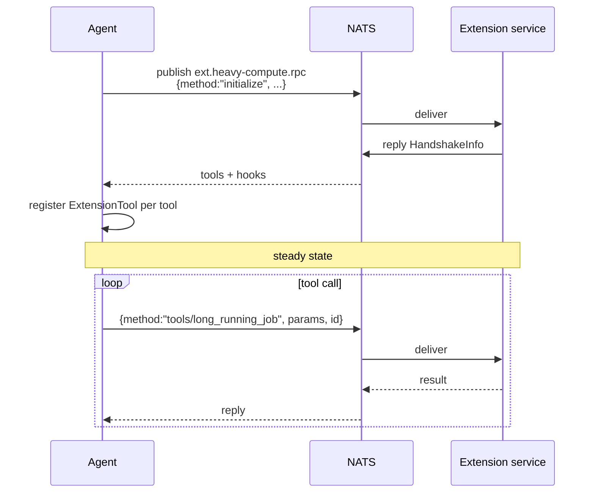

# NATS runtime

For extensions that run out-of-process and manage their own lifecycle
— a long-lived service on another machine, a container in an
orchestrator, an operator-maintained daemon. The agent talks to them
over NATS RPC instead of stdin/stdout.

Source: `crates/extensions/src/runtime/nats.rs`.

## When to pick NATS over stdio

| Use stdio | Use NATS |
|-----------|----------|
| Extension is a binary you ship with the agent | Extension is a separate service you operate |
| Lifecycle is tied to the agent | Lifecycle is independent (k8s, systemd) |
| Fast local startup; co-resident on same host | Might be remote or shared between hosts |
| Dev-loop: install once and forget | Sensitive deployment — deploy independently of the agent |

Stdio is the default. Reach for NATS when the extension's failure
domain must be separated from the agent's.

## Manifest

```toml
[plugin]
id = "heavy-compute"
version = "0.3.0"

[capabilities]
tools = ["long_running_job"]

[transport]
type = "nats"
subject_prefix = "ext.heavy-compute"
```

## Wire shape

Single request/reply subject:

```
{subject_prefix}.{extension_id}.rpc
```



The JSON-RPC shape is identical to stdio — only the transport
changes. Extensions don't need to know which form the host chose.

## Liveness

Instead of supervising a child process, the NATS runtime uses
**heartbeats**:

| Field | Default | Purpose |
|-------|---------|---------|
| `heartbeat_interval` | `15 s` | Expected beacon cadence from the extension. |
| `heartbeat_grace_factor` | `3` | Mark failed after `grace_factor × interval` silence. |

A failed extension logs a warn and is marked unavailable. Tools stay
registered in the registry but calls error out immediately. When the
extension starts beaconing again, it's automatically marked available.

## Circuit breaker

Same pattern as stdio: one `CircuitBreaker` per extension,
`ext:nats:{id}`, wrapping every RPC. Prevents a flapping extension
from piling up outstanding calls against it.

## Deployment recipes

### Docker compose side service

```yaml
services:
  agent:
    image: nexo-rs:latest
    depends_on: [nats, heavy-compute]
  nats:
    image: nats:2.10-alpine
  heavy-compute:
    image: my-ext:0.3.0
    command: ["--nats-url", "nats://nats:4222",
              "--subject-prefix", "ext.heavy-compute"]
```

### Kubernetes

Run the extension as its own `Deployment` with its own resource
limits, rollouts, and observability. Share the NATS cluster via a
`Service`. Scale extensions independently of agents.

## Gotchas

- **`subject_prefix` collisions.** Two extensions with the same
  prefix will step on each other. Enforce uniqueness in your ops
  convention.
- **Latency.** NATS over LAN is sub-millisecond, but any network hop
  is orders of magnitude slower than stdio's pipe. Don't pick NATS
  for a 1 kHz tool call pattern.
- **Auth on the broker.** NATS auth applies to extensions too — if
  you turn on NKey mTLS, every extension service must be enrolled.
