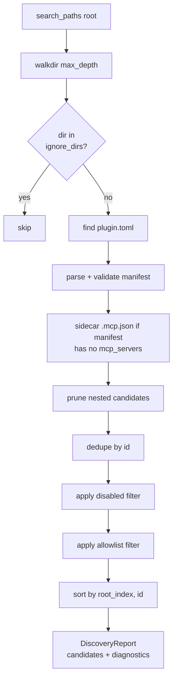
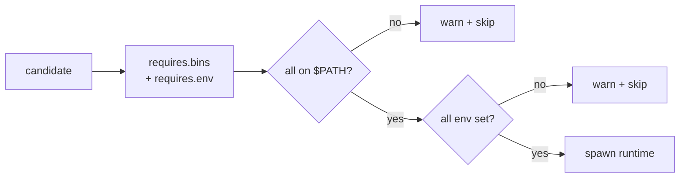
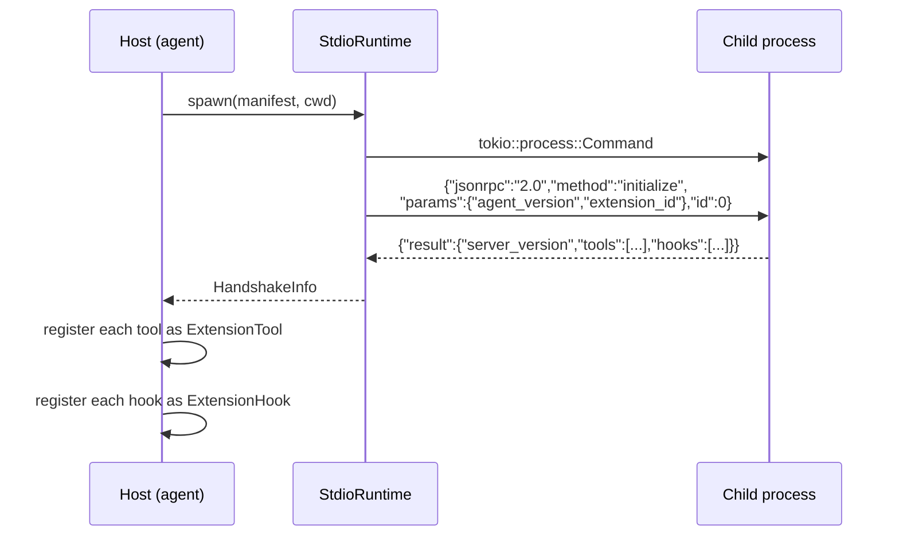
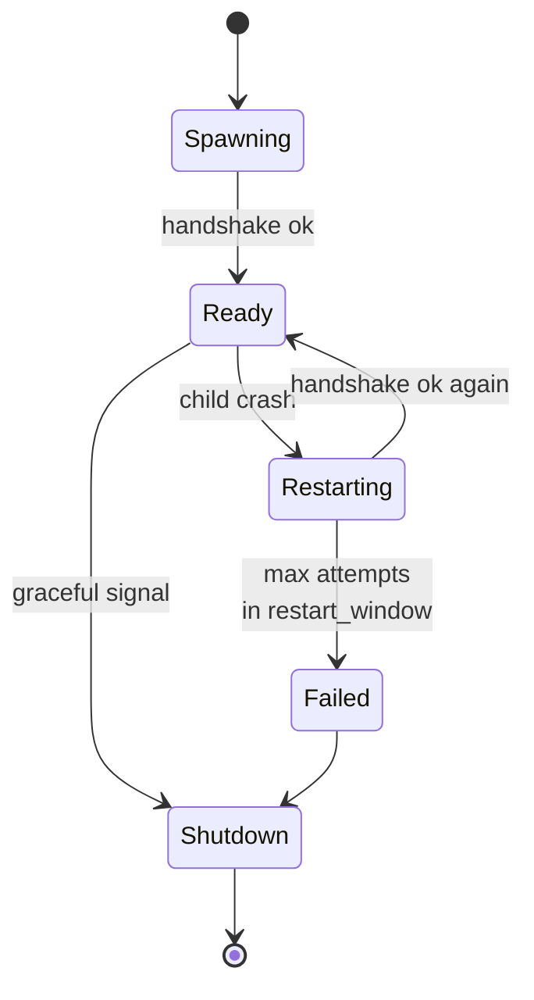

# Stdio runtime + Discovery

The stdio runtime is the default way extensions run: a child process
speaking line-delimited JSON-RPC over stdin/stdout. This page covers
how the runtime **discovers**, **spawns**, **supervises**, and
**registers tools from** a stdio extension.

Source: `crates/extensions/src/discovery.rs`,
`crates/extensions/src/runtime/stdio.rs`.

## Discovery

```yaml
# config/extensions.yaml
extensions:
  enabled: true
  search_paths: [./extensions]
  ignore_dirs: [node_modules, .git, target]
  disabled: []
  allowlist: []            # empty = all allowed
  max_depth: 4
  follow_links: false
  watch:
    enabled: false
    debounce_ms: 500
```

`ExtensionDiscovery` walks each search path, looking for
`plugin.toml` files:



Prune-nested removes any candidate whose `root_dir` is a strict
descendant of another — avoids registering an extension twice if it
happens to live inside another extension's tree. Algorithm is
`O(N × depth)`.

`follow_links = false` is the default (monorepo-safe). When enabled,
symlink escapes out of the root raise `DiagnosticLevel::Error`.

## Gating

Before spawn, `Requires::missing()` runs:



A skipped extension does **not** register any tools. The warn log
names exactly which bin or env var was missing.

## Spawn model



- Child is spawned with the extension's directory as `cwd`
- `stdin` + `stdout` is the RPC channel (line-delimited JSON)
- `stderr` is routed to the agent's `tracing` output
- Handshake timeout: default 10 s

### Tool descriptors

```json
{
  "name": "get_weather",
  "description": "Look up weather by city.",
  "input_schema": { "type": "object", "properties": { "city": { "type": "string" } }, "required": ["city"] }
}
```

The host wraps each descriptor in an `ExtensionTool`:

- Registered name: `ext_{plugin_id}_{tool_name}` (truncated with hash
  suffix if it exceeds 64 chars)
- Description prefixed with `[ext:{id}]` so the LLM knows the origin
- `input_schema` copied to the registered tool

### Context passthrough

If the manifest sets `context.passthrough = true`, every `call()`
injects:

```json
{ "_meta": { "agent_id": "...", "session_id": "..." }, ...user_args }
```

The extension can decide how to split state per agent or session.

### Env injection

The host passes through most env vars to the child, but **blocks
secret-like names** via substring/suffix rules:

- Suffixes: `_TOKEN`, `_KEY`, `_SECRET`, `_PASSWORD`, `_CREDENTIAL`,
  `_PAT`, `_AUTH`, `_APIKEY`, `_BEARER`, `_SESSION`
- Substrings: `PASSWORD`, `SECRET`, `CREDENTIAL`, `PRIVATE_KEY`

Extensions that need a secret should read it from a file path the
host passes by argument, or have the secret baked into their own
`requires.env` entry (which the operator whitelists consciously).

## Supervision



Supervisor policy:

- Max restart attempts within a sliding `restart_window`
- Exponential backoff `base_backoff` → `max_backoff`
- Each transport is wrapped in a `CircuitBreaker` named
  `ext:stdio:{id}` so hung children don't freeze the agent loop

Graceful shutdown sends an empty message, waits `shutdown_grace`
(default 3 s), then kills the child.

## Watcher (phase 11.2 follow-up)

With `extensions.watch.enabled: true` the runtime watches
`search_paths` for changes to any `plugin.toml`. Change-set is
debounced (`debounce_ms`) and compared by SHA-256 of the file to
squash spurious writes.

On change the runtime **logs** — it does **not** auto-reload. The
operator restarts the agent to pick up the new manifest. Hot reload
is a future phase.

## Gotchas

- **Blocked env vars surprise extensions.** If an extension expected
  `OPENAI_API_KEY` to come through and it wasn't declared in
  `requires.env`, the name-based block may silently strip it. Declare
  the env you need — that whitelists it.
- **`follow_links: true` + symlinked monorepo layouts** can cause
  discovery to traverse out of the search root. Keep `follow_links:
  false` unless you know the layout is bounded.
- **Children crashing during handshake.** You get a single
  `DiagnosticLevel::Error` per candidate, not a retry loop. Fix the
  binary, restart the host.
