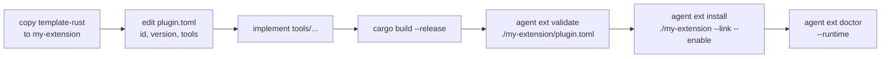

# Templates

The repo ships two extension templates as starting points. Copy one,
rename it, fill in the tools, done.

Location: `extensions/template-rust/` and `extensions/template-python/`.

## What's shared

Both templates follow the same wire protocol and directory shape:

```
<your-ext>/
├── plugin.toml        # manifest (see ./manifest.md)
├── README.md          # what the extension does
├── <binary or script> # stdio-RPC entry point
└── ...                # build files specific to the language
```

The agent talks to both in the same JSON-RPC 2.0 shape:

- **`initialize`** — handshake; returns `{server_version, tools, hooks}`
- **`tools/<name>`** — tool invocation; returns the tool's result
- **`hooks/<name>`** — hook invocation (when any hook is declared)

Line-delimited JSON over stdin/stdout. stderr is forwarded to the
agent's tracing output — that's your debug log.

## Rust template (`extensions/template-rust/`)

Standalone Cargo project **outside** the agent workspace — its own
`Cargo.toml`, own `Cargo.lock`, own `target/`. Keeps your extension's
deps independent of the agent's.

```
template-rust/
├── Cargo.toml
├── Cargo.lock
├── plugin.toml
├── README.md
├── src/
│   └── main.rs        # JSON-RPC loop
└── target/            # (gitignore)
```

`src/main.rs` implements:

```rust
// pseudocode
loop {
    let line = read_line_from_stdin();
    let req: JsonRpcRequest = parse(line);
    let result = match req.method.as_str() {
        "initialize" => handshake_info(),
        "tools/ping" => ping(req.params),
        "tools/add"  => add(req.params),
        "hooks/before_message" => pass(),
        _ => method_not_found(),
    };
    write_line_to_stdout(json!({ "jsonrpc": "2.0", "id": req.id, "result": result }));
}
```

Build with `cargo build --release`; the release binary at
`./target/release/template-rust` is what `plugin.toml::transport.command`
points at.

## Python template (`extensions/template-python/`)

```
template-python/
├── plugin.toml
├── main.py       # #!/usr/bin/env python3
└── README.md
```

stdlib only (no pip install). Same JSON-RPC loop over stdin/stdout.
Logs to stderr via `print(..., file=sys.stderr)`.

Good for quick extensions where starting a Python interpreter per
tool call is acceptable (batch workloads, cron-ish tasks,
one-off scripting).

## Promoting a template to your own extension



## Conventions in the shipped templates

- `plugin.toml` declares the minimum required capabilities — no
  phantom hooks or tools
- `requires.bins` / `requires.env` left empty; add your own
- `[context] passthrough = false` — opt in explicitly when you need
  per-agent / per-session state
- License left blank — pick one and add it to `[meta]`

## Gotchas

- **Rust template builds in its own workspace.** Don't `cargo add`
  from the repo root — that edits the agent workspace, not the
  extension.
- **Python template spawns a new interpreter per extension, not per
  tool call.** Stdin/stdout stay open for the life of the process.
  Don't `exit` after one tool call.
- **JSON-RPC ids must echo back.** If your handler drops the `id`
  field, the agent can't correlate the reply.
