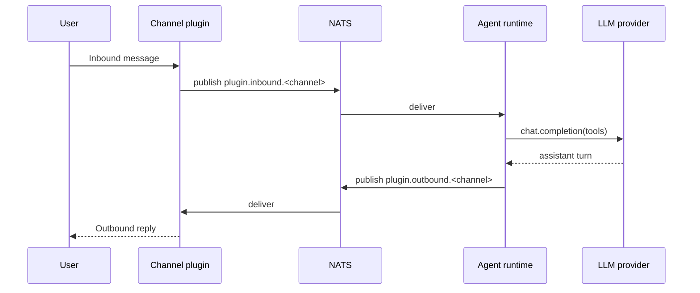

# Quick start

Minimum viable agent running in five minutes. Covers: NATS, one agent,
one channel, one LLM key.

## 1. Start NATS

```bash
docker run -d --name nexo-nats -p 4222:4222 nats:2.10-alpine
```

## 2. Build the binary

```bash
git clone git@github.com:lordmacu/nexo-rs.git
cd nexo-rs
cargo build --release
```

## 3. Provide an LLM key

Pick one provider to get started. MiniMax M2.5 is the primary:

```bash
export MINIMAX_API_KEY=your-key
export MINIMAX_GROUP_ID=your-group-id
```

Or Anthropic:

```bash
export ANTHROPIC_API_KEY=sk-ant-...
```

The shipped `config/llm.yaml` reads both via `${ENV_VAR}`.

## 4. Run the setup wizard

```bash
./target/release/agent setup
```

The wizard walks you through:

- Choosing a default LLM provider
- Pairing any channels you want (WhatsApp QR, Telegram bot token, Google
  OAuth)
- Writing secrets into `./secrets/` (gitignored)

See [Setup wizard](./setup-wizard.md) for the full step-by-step.

## 5. Run the agent

```bash
./target/release/agent --config ./config
```

First boot emits a startup summary listing:

- which plugins loaded
- which extensions were discovered / skipped (and why)
- which LLM providers are wired
- the NATS connection state

If anything is missing, the log line tells you exactly what to fix.

## 6. Talk to it

If you paired Telegram, send a message to the bot. If you paired
WhatsApp, send a message to the paired number. The agent replies via
the same channel.

## What you just ran



## Next

- [Setup wizard](./setup-wizard.md) — every wizard step in detail
- [Configuration layout](../config/layout.md)
- [Architecture overview](../architecture/overview.md)
