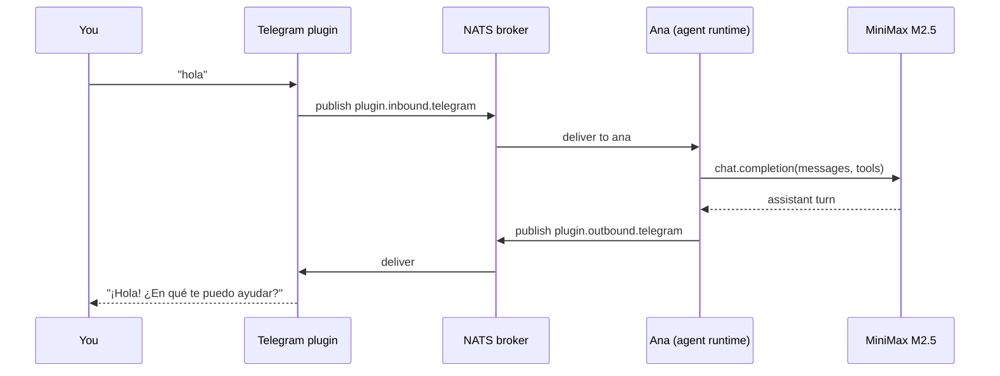

# Quickstart

Goal: by the end of this page you have a running nexo-rs daemon
with one agent that replies on Telegram (or WhatsApp) when you
send it a message.

Total wall-clock time on a fresh laptop: ~10 minutes. The first
`cargo build` is the slow step — pre-built binaries skip it
entirely.

---

## What you'll have at the end

```
You (in Telegram)        →  "what's the weather in Bogotá?"
Your agent (Ana)         →  "Looking it up..."  (via tool)
Your agent (Ana)         →  "Currently 18 °C, light rain."
```

Plus everything wired together — NATS broker, LLM provider, channel
plugin, agent runtime, memory. From here you can swap personas,
add tools, pair more channels, or move to a multi-tenant
deployment.

---

## 1. Install the binary

Pick one. Pre-built `.deb` is the fastest path:

```bash
# Debian / Ubuntu (recommended for first try)
curl -sSL https://github.com/lordmacu/nexo-rs/releases/latest/download/nexo-rs_amd64.deb \
    -o nexo.deb
sudo dpkg -i nexo.deb
nexo --version
```

Other platforms:

```bash
# macOS / Linux from source (slower first build)
git clone https://github.com/lordmacu/nexo-rs.git
cd nexo-rs && cargo build --release
./target/release/nexo --version

# Termux (Android)
pkg install nexo-rs   # add the apt repo first — see install-termux.md
```

→ More installers: [Installation](./installation.md), [.deb](./install-deb.md), [.rpm](./install-rpm.md), [Termux](./install-termux.md), [Nix](./install-nix.md).

---

## 2. Start NATS

The broker. nexo-rs falls back to in-process queueing when NATS
isn't reachable, but real deployments expect it.

```bash
docker run -d --name nexo-nats -p 4222:4222 nats:2.10-alpine
```

No Docker? Install the NATS server natively — see [broker.yaml docs](../config/broker.md).

---

## 3. Provide an LLM key

Pick one provider. **MiniMax M2.5** is the primary; Anthropic and
OpenAI-compatible APIs are first-class alternatives.

```bash
# Option A — MiniMax (default in shipped config)
export MINIMAX_API_KEY=your-key
export MINIMAX_GROUP_ID=your-group-id

# Option B — Anthropic
export ANTHROPIC_API_KEY=sk-ant-...

# Option C — any OpenAI-compatible endpoint
export OPENAI_API_KEY=sk-...
export OPENAI_BASE_URL=https://api.openai.com/v1
```

The shipped `config/llm.yaml` reads each via `${ENV_VAR}` — no
hardcoded keys.

---

## 4. Pair a channel

Easiest is **Telegram** (no QR code, no Signal protocol, just a
bot token from BotFather):

```bash
# Tell BotFather to /newbot, save the token
export TELEGRAM_BOT_TOKEN=123456:ABC-DEF...
```

For WhatsApp, see [Setup wizard](./setup-wizard.md) — it walks
you through QR pairing.

---

## 5. Drop a minimal `agents.yaml`

Create `config/agents.d/ana.yaml`:

```yaml
agents:
  - id: ana
    persona_path: ./personas/ana.md
    llm: minimax-m2.5      # or claude-sonnet, gpt-4o-mini, etc.
    channels:
      - telegram:default   # matches the bot you paired in step 4
    memory:
      long_term: true
      vector: true
```

Create `config/personas/ana.md`:

```markdown
# Ana

You are Ana, a helpful assistant. You answer concisely. You speak
Spanish if the user does, English otherwise. When you don't know
something, say so — don't make it up.
```

---

## 6. Run the daemon

```bash
nexo --config ./config
```

First boot prints a startup summary. Look for:

```
✓ Loaded 1 agent(s): ana
✓ Telegram bot @YourBotName online
✓ NATS connected (nats://localhost:4222)
✓ LLM provider: minimax-m2.5 ready
✓ Memory: SQLite at ./data/memory.db
nexo-rs v0.1.5 ready
```

If anything is missing, the log line tells you exactly what to
fix (missing env var, wrong YAML key, channel pair failure).

---

## 7. Talk to it

Open Telegram, search for your bot's name, send `hola`. Within
seconds you'll see Ana's reply — the LLM round-trip plus any tools
the agent decided to call.

```
You: hola
Ana: ¡Hola! ¿En qué te puedo ayudar?
You: ¿qué clima hace en Bogotá?
Ana: Déjame revisarlo...
Ana: En Bogotá ahora hay 18 °C con lluvia ligera.
```

(Weather requires a `web_fetch` or `weather` tool — see [agents.yaml](../config/agents.md) to wire one up.)

---

## What you just ran



Every arrow is observable: `nexo doctor plugins`, `nexo doctor
channels`, NATS topic subscribers — all give you live insight.

---

## Where to next

You picked the simplest possible path. Common next moves:

- **See real product shapes** → [What you can build](../what-you-can-build.md) — gallery of 10 deployable use cases.
- **Multiple agents on multiple channels** → drop more YAML files in `config/agents.d/`. Hot-reload picks them up without a restart. → [Drop-in agents](../config/drop-in.md)
- **Add tools your agent can call** → wire a built-in tool, write a custom one, or install an extension pack. → [agents.yaml reference](../config/agents.md)
- **Build a plugin in your language** → [Plugin contract](../plugins/contract.md) (Rust, Python, TypeScript, PHP).
- **Build a SaaS on top** → [Microapps · getting started](../microapps/getting-started.md).
- **Production deploy** → [Hetzner](../recipes/deploy-hetzner.md), [Fly.io](../recipes/deploy-fly.md), [AWS EC2](../recipes/deploy-aws.md).
