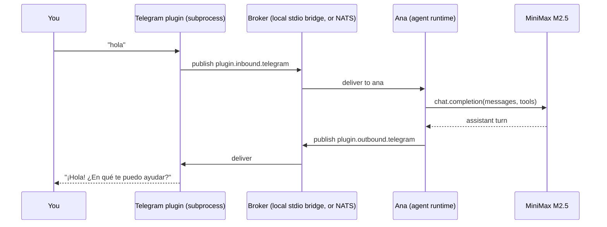

# Quickstart

Goal: by the end of this page you have a running nexo-rs daemon
with one agent that replies on Telegram (or WhatsApp) when you
send it a message.

Total wall-clock time on a fresh laptop: ~10 minutes. The first
`cargo build` is the slow step — pre-built binaries skip it
entirely.

> **In a hurry?** Phase 92-95 added a much shorter path:
> `nexo` alone now boots a working daemon with zero YAMLs +
> zero external broker. See [zero-config quickstart](./zero-config.md)
> for the 30-second version. This page covers the classical
> full-control walkthrough.

---

## What you'll have at the end

```
You (in Telegram)        →  "what's the weather in Bogotá?"
Your agent (Ana)         →  "Looking it up..."  (via tool)
Your agent (Ana)         →  "Currently 18 °C, light rain."
```

Plus everything wired together — the broker (local stdio bridge by
default, or NATS), an LLM provider, a channel plugin, the agent
runtime, memory. From here you can swap personas, add tools, pair
more channels, or move to a multi-tenant deployment.

---

## 1. Install the binary

Pick one — the one-liner is the fastest, no Rust toolchain needed:

```bash
# Pre-built binary (Linux x86_64/aarch64, macOS Intel/Apple Silicon).
# Detects your platform, verifies sha256, drops `nexo` on PATH.
curl -fsSL https://lordmacu.github.io/nexo-rs/install.sh | bash
nexo --version
```

Other paths:

```bash
# From crates.io (needs a Rust toolchain)
cargo install nexo-rs

# Debian/Ubuntu (.deb), Fedora/RHEL (.rpm), Termux (aarch64 .deb) —
# grab the file for your arch from the latest release, e.g.:
#   https://github.com/lordmacu/nexo-rs/releases/latest
sudo apt install ./nexo-rs_0.1.6_amd64.deb        # Debian/Ubuntu
sudo dnf install ./nexo-rs-0.1.6-1.x86_64.rpm     # Fedora/RHEL
pkg install ./nexo-rs_0.1.6_aarch64.deb           # Termux

# Docker
docker pull ghcr.io/lordmacu/nexo-rs:latest

# From source (track main)
git clone https://github.com/lordmacu/nexo-rs.git
cd nexo-rs && cargo build --release && ./target/release/nexo --version
```

→ More installers: [Installation](./installation.md), [.deb](./install-deb.md), [.rpm](./install-rpm.md), [Termux](./install-termux.md), [Nix](./install-nix.md).

---

## 2. Start NATS (optional)

**Phase 92 onwards, NATS is optional.** Subprocess plugins
bridge through the daemon's stdio JSON-RPC channel when
`broker.yaml type: local`, so single-host dev deployments
don't need an external broker server at all. Skip this step
unless you're building a multi-host cluster.

For multi-host / prod-like setups, start NATS:

```bash
docker run -d --name nexo-nats -p 4222:4222 nats:2.10-alpine
# OR native install — see broker-shapes architecture doc
```

Then later, after the daemon is running:

```bash
nexo set-broker nats --url nats://localhost:4222
```

→ [Broker shapes](../architecture/broker-shapes.md) explains
when to pick which.

---

## 3. Provide an LLM key

Pick one provider. **MiniMax M2.5** is the primary; Anthropic and
OpenAI-compatible APIs are first-class alternatives.

```bash
# Option A — MiniMax (default in shipped config)
export MINIMAX_API_KEY=your-key
export MINIMAX_GROUP_ID=your-group-id

# Option B — Anthropic
export ANTHROPIC_API_KEY=sk-ant-...

# Option C — any OpenAI-compatible endpoint
export OPENAI_API_KEY=sk-...
export OPENAI_BASE_URL=https://api.openai.com/v1
```

The shipped `config/llm.yaml` reads each via `${ENV_VAR}` — no
hardcoded keys.

---

## 4. Install the channel plugin + pair it

Channels are subprocess plugins (Phase 81.18 onward). Easiest is
**Telegram** — no QR code, no Signal protocol, just a bot token
from BotFather:

```bash
# Cargo install drops the binary in ~/.cargo/bin/ — the daemon's
# discovery walker scans that directory on boot, no YAML edit
# required (Phase 81.33 Stage 8 auto-detection).
cargo install nexo-plugin-telegram
nexo plugin list

# Tell BotFather to /newbot, save the token:
export TELEGRAM_BOT_TOKEN=123456:ABC-DEF...
```

For WhatsApp: `cargo install nexo-plugin-whatsapp`, then
[the setup wizard](./setup-wizard.md) walks you through QR
pairing.

For Google (Gmail / Calendar / Drive):
`cargo install nexo-plugin-google`, then run
`nexo-plugin-google --oauth-once <agent_id> --device` (or omit
`--device` to use the loopback browser flow). See the
[Google plugin docs](../plugins/google.md) for the full CLI flag
list.

For Web Search (Brave / Tavily / DuckDuckGo / Perplexity):
`cargo install nexo-plugin-web-search`, then populate
`<config_dir>/plugins/web-search.yaml::instances[].providers`
with API key file refs. See the
[Web Search plugin docs](../plugins/web-search.md). DuckDuckGo
works with no API key as the fallback provider.

Six canonical plugins live on crates.io:
`whatsapp`/`telegram`/`email`/`browser`/`google`/`web-search`.

### How the daemon finds your plugin

The discovery walker (Phase 81.33 Stage 8) probes every search
path on boot. Defaults out of the box:

| Path | Use |
|------|-----|
| `$HOME/.cargo/bin` | `cargo install nexo-plugin-X` lands here |
| `$HOME/.local/share/nexo/plugins` | XDG-style per-user install |
| `/usr/local/libexec/nexo/plugins` | system-wide install |

In each path the walker looks for two shapes:

1. **A directory** containing a `nexo-plugin.toml` manifest +
   `bin/<plugin-id>` entrypoint (classic layout — used when you
   want to ship multiple files together).
2. **A bare executable** named `nexo-plugin-<id>`. The walker
   invokes the binary with `--print-manifest` (2s timeout), parses
   stdout as TOML, and registers the plugin if validation passes.
   This is the layout `cargo install` produces.

Operators can append paths via
`config/plugins/discovery.yaml`:

```yaml
discovery:
  search_paths:
    - /opt/nexo-plugins        # site-specific install root
  # Default paths above are STILL scanned — supply
  # `search_paths: []` to opt out entirely.
  auto_detect_binaries: true   # opt out by setting to false
  disabled: []                 # plugin ids to skip
  allowlist: []                # whitelist when non-empty
```

→ Authoring your own plugin: [Plugin SDKs → Rust SDK](../plugins/rust-sdk.md)
documents the `print_manifest_if_requested(MANIFEST)` call that
makes binaries discoverable.

---

## 5. Drop a minimal `agents.yaml`

Scaffold every YAML the daemon knows (heavily commented, sane
defaults filled in):

```bash
nexo init --output ./config
# Writes 19 sample YAMLs you can edit in place.
# Or just the ones you need: nexo init --yaml broker,llm,agents
```

Then add an agent to `config/agents.yaml` (or drop it in
`config/agents.d/ana.yaml` — the runtime merges that directory in,
alphabetical, and hot-reloads it):

```yaml
agents:
  - id: ana
    model:
      provider: minimax          # minimax | anthropic | openai | gemini | deepseek
      model: MiniMax-M2.5
    plugins: [telegram]          # the plugin you installed in step 4
    inbound_bindings:
      - plugin: telegram         # which channel may trigger this agent
    system_prompt: |
      You are Ana, a helpful assistant. You answer concisely. You
      speak Spanish if the user does, English otherwise. When you
      don't know something, say so — don't make it up.
```

(YAML config uses `#[serde(deny_unknown_fields)]` — a typo'd key
fails fast at boot rather than being silently ignored. Full field
list: [agents.yaml reference](../config/agents.md).)

---

## 6. Run the daemon

```bash
nexo --config ./config
```

First boot prints a startup summary. With the defaults from
`nexo init` (broker `type: local`), look for something like:

```
✓ broker ready — kind=Local (stdio bridge, no NATS server)
✓ plugin telegram — registered remote tools (registered_count=6)
✓ Telegram bot @YourBotName online
✓ Loaded 1 agent(s): ana
✓ LLM provider: minimax-m2.5 ready
✓ Memory: SQLite at ./data/memory.db
nexo-rs v0.1.6 ready
```

(If you'd run `nexo set-broker nats …` in step 2, the first line
reads `broker ready — kind=Nats url=nats://…` instead.) If
anything is missing, the log line tells you exactly what to fix —
missing env var, wrong YAML key, channel pair failure.

---

## 7. Talk to it

Open Telegram, search for your bot's name, send `hola`. Within
seconds you'll see Ana's reply — the LLM round-trip plus any tools
the agent decided to call.

```
You: hola
Ana: ¡Hola! ¿En qué te puedo ayudar?
You: ¿qué clima hace en Bogotá?
Ana: Déjame revisarlo...
Ana: En Bogotá ahora hay 18 °C con lluvia ligera.
```

(Weather requires a `web_fetch` or `weather` tool — see [agents.yaml](../config/agents.md) to wire one up.)

---

## What you just ran


```mermaid
sequenceDiagram
    participant U as You
    participant CH as Telegram plugin (subprocess)
    participant B as Broker (local stdio bridge, or NATS)
    participant A as Ana (agent runtime)
    participant L as MiniMax M2.5

    U->>CH: "hola"
    CH->>B: publish plugin.inbound.telegram
    B->>A: deliver to ana
    A->>L: chat.completion(messages, tools)
    L-->>A: assistant turn
    A->>B: publish plugin.outbound.telegram
    B->>CH: deliver
    CH-->>U: "¡Hola! ¿En qué te puedo ayudar?"
```

Every arrow is observable: `nexo doctor plugins`, the daemon log
(`plugin.inbound.*` / `plugin.outbound.*` lines), and — in NATS
mode — topic subscribers.

---

## Where to next

You picked the simplest possible path. Common next moves:

- **See real product shapes** → [What you can build](../what-you-can-build.md) — gallery of 10 deployable use cases.
- **Multiple agents on multiple channels** → drop more YAML files in `config/agents.d/`. Hot-reload picks them up without a restart. → [Drop-in agents](../config/drop-in.md)
- **Add tools your agent can call** → wire a built-in tool, write a custom one, or install an extension pack. → [agents.yaml reference](../config/agents.md)
- **Build a plugin in your language** → [Plugin contract](../plugins/contract.md) (Rust, Python, TypeScript, PHP).
- **Build a SaaS on top** → [Microapps · getting started](../microapps/getting-started.md).
- **Production deploy** → [Hetzner](../recipes/deploy-hetzner.md), [Fly.io](../recipes/deploy-fly.md), [AWS EC2](../recipes/deploy-aws.md).
