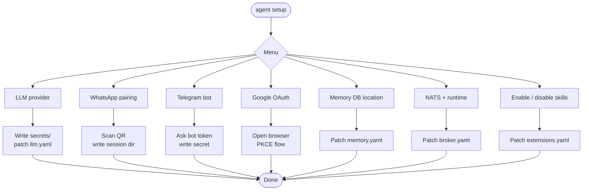

# Setup wizard

The setup wizard is the recommended way to configure nexo-rs on a fresh
install. It pairs channels, writes secrets, and patches the YAML
config files so the runtime boots with everything it needs.

```bash
./target/release/agent setup
```

Run it from the repo root (or wherever your `config/` directory lives).

## What the wizard does



Every step is optional. You can run `setup` repeatedly — each section
is idempotent.

## Steps in detail

### LLM provider

Prompts for the default provider (MiniMax, Anthropic, OpenAI-compat,
Gemini). Writes the API key to `./secrets/<provider>_api_key.txt` and
ensures `config/llm.yaml` references it via `${file:...}` or the
corresponding env var.

### WhatsApp pairing

Per-agent. Asks which agent you are pairing, creates the session dir
under `<agent workspace>/whatsapp/default`, launches the pairing loop,
and renders the QR as Unicode blocks on the terminal. Scan with
**WhatsApp → Settings → Linked Devices**. On success, the active
WhatsApp session pointer in `config/plugins/whatsapp.yaml` is updated
to that directory.

If `whatsapp.session_dir` is already set in the YAML (e.g. pointing at
a shared volume), the wizard honors it instead of deriving a per-agent
path.

### Telegram bot

Asks for the bot token from @BotFather, writes it to
`./secrets/telegram_token.txt`, patches `config/plugins/telegram.yaml`.
Optionally walks you through joining your own chat for quick testing.

### Google OAuth

Runs the PKCE flow in your browser. The wizard binds to a local
callback port, opens the consent URL, and stores the refresh token at
`./secrets/google_oauth.json`. Scopes include Gmail, Calendar, Drive
and Sheets — you can narrow them by editing the scopes list before
re-running.

### Memory DB location

Lets you pick where the SQLite long-term memory file lives. Default is
`./data/memory.db`. Per-agent isolation is on by default — each agent
gets its own DB file under its workspace.

### Infrastructure (NATS + runtime)

Asks for the NATS URL, optional user/password, and timeouts. Patches
`config/broker.yaml`.

### Skills on/off

Lets you selectively disable shipped extensions you don't plan to use
(reduces tool surface exposed to the LLM).

## Files the wizard touches

| Target | What it writes |
|--------|----------------|
| `config/llm.yaml` | Provider entries, base_url, auth mode |
| `config/plugins/whatsapp.yaml` | `session_dir`, `media_dir` |
| `config/plugins/telegram.yaml` | `token` (via `${file:...}`), allow-list |
| `config/plugins/google.yaml` | OAuth bundle path, scopes |
| `config/memory.yaml` | DB location |
| `config/broker.yaml` | NATS URL, creds |
| `config/extensions.yaml` | enabled/disabled list |
| `./secrets/*` | Plaintext secret files (gitignored) |

Every YAML patch preserves existing keys and comments via the
`yaml_patch` module — your hand edits survive.

## Re-running

Re-run `agent setup` as many times as you want. Paired channels are
detected and skipped unless you explicitly ask to re-pair. To wipe a
paired session:

```bash
./target/release/agent setup wipe whatsapp --agent ana
```

## Troubleshooting

- **WhatsApp QR expires too fast** → the QR refreshes every ~20s; the
  wizard re-renders. Scan from the phone with a stable network.
- **Google OAuth fails with `redirect_uri_mismatch`** → the wizard
  binds to `127.0.0.1:<port>`; make sure your OAuth client allows
  `http://127.0.0.1` as a redirect URI.
- **NATS unreachable** → the wizard will warn but still write config.
  The runtime's disk queue will drain once NATS comes back.
