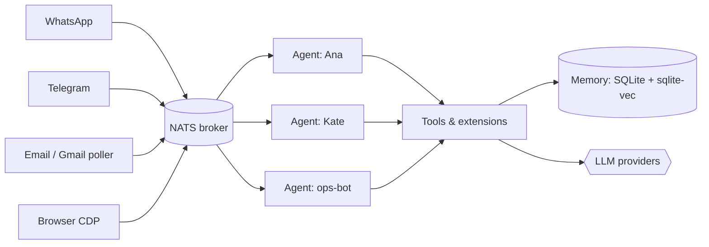

# Introduction

**nexo-rs** is a Rust framework for building **multi-agent** LLM systems
that live on real messaging channels — WhatsApp, Telegram, email —
instead of a chat webapp. Event-driven over NATS, per-agent tool
sandboxes, drop-in configuration for private vs. public agents.

**One process, many agents, many channels.** Kate handles your personal
Telegram; Ana works the WhatsApp sales line; a cron-style poller sweeps
Gmail for leads — all sharing one broker, one tool registry, and one
memory layer.

## Why it exists

Most "agent frameworks" assume **one** LLM talking to **one** user
through **one** UI. Real deployments are not shaped that way:

- Several agents with different personas, models, and skills
- Multiple channels (WA + Telegram + mail) feeding the same agents
- Business logic that is **not** LLM-driven (scheduled tasks, regex
  email triage, lead notifications) running next to the LLM loop
- Private prompts and pricing tables alongside an open-source core

nexo-rs is opinionated toward that shape.

## What's in the box

| Area | What ships |
|------|------------|
| Runtime | Multi-agent core, SessionManager, Heartbeat, CircuitBreaker |
| Broker | NATS (`async-nats = 0.35`) + disk queue + DLQ + backpressure |
| LLMs | MiniMax M2.5 (primary), Anthropic (OAuth + API), OpenAI-compat, Gemini |
| Plugins | WhatsApp, Telegram, Email, Browser (CDP), Google (Gmail/Calendar/Drive/Sheets) |
| Memory | Short-term in-memory, long-term SQLite, vector via sqlite-vec |
| Extensions | TOML manifest, stdio + NATS runtimes, CLI, 22 skills shipped |
| MCP | Client (stdio + HTTP), agent as MCP server, hot-reload |
| TaskFlow | Durable multi-step flow runtime with wait/resume |
| Soul | Identity, MEMORY.md, dreaming, workspace-git, transcripts |

## Who it is for

- **Developers who want to run real agents** — not a ChatGPT demo with
  retrieval.
- **Multi-tenant single-install** — several agents, several channels,
  isolated by config.
- **Fault-tolerance-first teams** — disk queue, DLQ, circuit breakers,
  single-instance lock, no message drop on reconnect.
- **Anyone extending with their own stack** — stdio extensions in any
  language, MCP, drop-in private agents.

## What it is **not**

- Not a chatbot, not a webapp. It has no UI of its own.
- Not a replacement for LangChain/LlamaIndex as a "primitives library".
  It is an **operational runtime**.
- Not a channel-abstraction layer. WhatsApp behaves like WhatsApp,
  Telegram like Telegram. The runtime surfaces channels, not
  uniforms them.

## Next

- [Installation](./getting-started/installation.md)
- [Quick start](./getting-started/quickstart.md)
- [Architecture overview](./architecture/overview.md)
