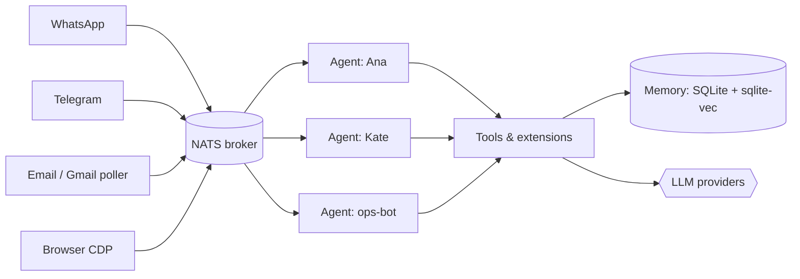

# Introduction

**nexo-rs** is a Rust framework for building **multi-agent** LLM systems
that live on real messaging channels — WhatsApp, Telegram, email —
instead of a chat webapp. Event-driven (NATS, **or a built-in local
broker — zero external infra**), per-agent tool sandboxes, drop-in
configuration for private vs. public agents.

**Coming from [OpenClaw](https://github.com/openclaw/openclaw)?**
That's the closest reference point — TypeScript, Node, single-process.
nexo-rs keeps the "agents on real channels" idea and trades JS
familiarity for: a single static binary, a fault-tolerant broker
layer (NATS *or* a local stdio bridge — no NATS server required),
per-agent capability sandboxes, durable workflows, secrets audit,
plugin SDKs in 4 languages, and Termux-first portability. See
[vs OpenClaw](./architecture/vs-openclaw.md) for the full side-by-side.

**One process, many agents, many channels.** Kate handles your personal
Telegram; Ana works the WhatsApp sales line; a cron-style poller sweeps
Gmail for leads — all sharing one broker, one tool registry, and one
memory layer.

**Boots with zero config.** `nexo` runs against documented defaults
when no config dir exists — 0 agents, local broker, admin RPCs +
health endpoint live. Add a persona, a YAML, or `nexo init`'s 19
commented sample files when you're ready. Switch broker mode at
runtime with `nexo set-broker {local,nats}`.

**Single binary, ~90 MB.** No Node, no npm, no Docker required.
The release tarball you download is ~15 MB (xz-compressed); the
`.deb` is ~18 MB, the `.rpm` ~25 MB. Runs on a fresh VPS, on Termux
without root, or as a systemd unit. Pre-built binaries ship for
Linux (x86_64 / aarch64, static musl), macOS (Intel / Apple Silicon),
and Windows; `.deb` / `.rpm` / Termux `.deb` too.


```mermaid
flowchart LR
    WA[WhatsApp] --> NATS[(NATS broker)]
    TG[Telegram] --> NATS
    MAIL[Email / Gmail poller] --> NATS
    BROWSER[Browser CDP] --> NATS
    NATS --> ANA[Agent: Ana]
    NATS --> KATE[Agent: Kate]
    NATS --> OPS[Agent: ops-bot]
    ANA --> TOOLS[Tools & extensions]
    KATE --> TOOLS
    OPS --> TOOLS
    TOOLS --> MEM[(Memory: SQLite + sqlite-vec)]
    TOOLS --> LLM{{LLM providers}}
```

## Why it exists

Most "agent frameworks" assume **one** LLM talking to **one** user
through **one** UI. Real deployments are not shaped that way:

- Several agents with different personas, models, and skills
- Multiple channels (WA + Telegram + mail) feeding the same agents
- Business logic that is **not** LLM-driven (scheduled tasks, regex
  email triage, lead notifications) running next to the LLM loop
- Private prompts and pricing tables alongside an open-source core

nexo-rs is opinionated toward that shape.

## What's in the box

| Area | What ships |
|------|------------|
| Runtime | Multi-agent core, SessionManager, Heartbeat, CircuitBreaker. Boots zero-config; `nexo init` scaffolds 19 commented sample YAMLs |
| Broker | **NATS** (`async-nats`) + disk queue + DLQ + backpressure, **or `local`** — stdio-bridge for subprocess plugins, no external server. Flip at runtime: `nexo set-broker {local,nats}` |
| LLMs | MiniMax M2.5 (primary), Anthropic (OAuth + API), OpenAI-compat, Gemini, DeepSeek |
| Plugins | WhatsApp, Telegram, Email, Browser (CDP), **Google (Gmail/Calendar/Drive/Sheets)**. Install with `nexo plugin install <owner>/<repo>` (GitHub Releases tarball) or `cargo install nexo-plugin-{whatsapp,telegram,email,browser,google}` from crates.io |
| Memory | Short-term in-memory, long-term SQLite, vector via sqlite-vec |
| Extensions | TOML manifest, stdio + NATS runtimes, CLI, 20+ skills shipped |
| MCP | Client (stdio + HTTP), agent as MCP server, hot-reload |
| TaskFlow | Durable multi-step flow runtime with wait/resume |
| Soul | Identity, MEMORY.md, dreaming, workspace-git, transcripts |
| Personas | Out-of-tree agent definitions installed via `nexo persona install <owner>/<repo>` (v2 manifest, GitHub Releases). [Cody](https://github.com/lordmacu/nexo-persona-cody) is the reference pack. |

## Who it is for

- **Developers who want to run real agents** — not a ChatGPT demo with
  retrieval.
- **Multi-tenant single-install** — several agents, several channels,
  isolated by config.
- **Fault-tolerance-first teams** — disk queue, DLQ, circuit breakers,
  single-instance lock, no message drop on reconnect.
- **Anyone extending with their own stack** — stdio extensions in any
  language, MCP, drop-in private agents.

## What it is **not**

- Not a chatbot, not a webapp. It has no UI of its own.
- Not a replacement for LangChain/LlamaIndex as a "primitives library".
  It is an **operational runtime**.
- Not a channel-abstraction layer. WhatsApp behaves like WhatsApp,
  Telegram like Telegram. The runtime surfaces channels, not
  uniforms them.

## Three minutes to a running agent

```bash
# 1. Install nexo-rs — pre-built binary, no Rust toolchain needed:
curl -fsSL https://lordmacu.github.io/nexo-rs/install.sh | bash
#    (or `cargo install nexo-rs` from crates.io, or download the
#     .deb / .rpm / Termux .deb from GitHub Releases.)

# 2. Add a channel plugin (GitHub Releases tarball OR crates.io):
nexo plugin install lordmacu/nexo-plugin-whatsapp
#    Built-ins: nexo-plugin-{whatsapp,telegram,email,browser,google}.
#    crates.io path: `cargo install nexo-plugin-google` (etc.).

# 3. Install the Cody programmer-pair persona (or any other v2 pack):
nexo persona install lordmacu/nexo-persona-cody

# 4. Boot. The daemon picks up the persona + plugins automatically.
nexo
```

`nexo` (no subcommand) runs the daemon against documented
defaults for every YAML when no config dir exists; `nexo plugin
install` drops a channel plugin under `<state_dir>/plugins/`;
`nexo persona install` lays down a ready-to-run agent + plugin
bindings under `<state_dir>/personas/`. To tune from a documented
baseline instead of the bare defaults, run `nexo init` first to
scaffold 19 commented sample YAMLs. Other install channels
(Docker, Nix, native packages, Termux): see the
[installation guide](./getting-started/installation.md).

Build your own persona pack? See
[Installing personas](./personas/install.md) for the v2 manifest
shape + GitHub Releases wire convention.

## Next

- [Zero-config quickstart (30s)](./getting-started/zero-config.md)
- [Installation](./getting-started/installation.md)
- [Quick start (10min walkthrough)](./getting-started/quickstart.md)
- [Installing personas](./personas/install.md)
- [Architecture overview](./architecture/overview.md)
- [API reference (rustdoc)](./api-reference.md) — every public type in
  the workspace
