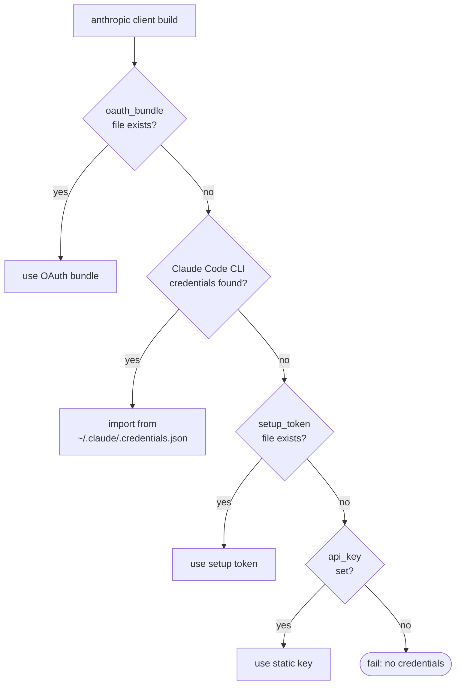

# Anthropic / Claude

Native Anthropic client with multiple authentication paths: static
API key, setup tokens, full OAuth PKCE subscription flow, or automatic
import from the local Claude Code CLI.

Source: `crates/llm/src/anthropic.rs`, `crates/llm/src/anthropic_auth.rs`.
Phase 15 added the subscription flow end-to-end.

## Configuration

```yaml
# config/llm.yaml
providers:
  anthropic:
    api_key: ${ANTHROPIC_API_KEY:-}
    base_url: https://api.anthropic.com
    rate_limit:
      requests_per_second: 2.0
    auth:
      mode: oauth_bundle
      bundle: ./secrets/anthropic_oauth.json
```

Per-agent selection:

```yaml
model:
  provider: anthropic
  model: claude-haiku-4-5
```

## Authentication modes

| `auth.mode` | Credential | Header |
|-------------|------------|--------|
| `static` | `api_key` (`sk-ant-…`) | `x-api-key: <key>` |
| `setup_token` | `sk-ant-oat01-…` (min 80 chars) | `Authorization: Bearer <key>` + `anthropic-beta: oauth-2025-04-20` |
| `oauth_bundle` | `{access, refresh, expires_at}` JSON | `Authorization: Bearer <access>` |
| `auto` | tries all of the above in order | — |

### `auto` resolution order

Used when `auth.mode: auto` or omitted:



### OAuth bundle

The wizard runs a PKCE flow in the browser and writes the bundle to
`./secrets/anthropic_oauth.json`:

```json
{
  "access_token": "...",
  "refresh_token": "...",
  "expires_at": "2026-05-01T12:00:00Z"
}
```

- **Refresh endpoint:** `https://console.anthropic.com/v1/oauth/token`
- **Refresh cadence:** 60 seconds before `expires_at`, background task
  POSTs `grant_type=refresh_token`
- **Concurrency:** all refreshes serialize behind a mutex
- **Shared OAuth client id:** `9d1c250a-e61b-44d9-88ed-5944d1962f5e`
- **Stale-token handling:** a 401 mid-flight marks the token stale so
  the next refresh fires immediately instead of waiting for the
  expiry window

### CLI credentials import

If you're already running Claude Code CLI on the same host, the client
auto-detects and imports `~/.claude/.credentials.json`. Zero config —
if it exists and is valid, it's used.

## Tool calling

Native Anthropic shape:

- Tool definitions: `{name, description, input_schema}`
- Tool invocation: `tool_use` blocks with `id`, `name`, `input`
- Tool result: `tool_result` blocks correlated via `tool_use_id`

Streaming uses native SSE; a dedicated parser in
`crates/llm/src/stream.rs` handles `message_start`, `content_block_*`,
and `message_delta` events.

## Error classification

| Response | Mapping | Behavior |
|----------|---------|----------|
| 429 | `LlmError::RateLimit { retry_after_ms }` (fallback 60s) | Retried |
| 401 / 403 | `LlmError::CredentialInvalid` with context (API vs OAuth) | Marks OAuth token stale; fails fast so the operator sees it |
| 5xx | `LlmError::ServerError` | Retried |
| Other 4xx | `LlmError::Other` | Fail fast |

## OAuth subscription request shape

Anthropic gates Opus 4.x and Sonnet 4.x behind a Claude-Code identity
claim when the request is authenticated with a Bearer token (setup
token or OAuth bundle). Without the claim, only Haiku passes — every
other model returns a 4xx that surfaces as a vague "no quota" error.

When `AnthropicAuth::is_subscription()` is true (`SetupToken` or
`OAuth` variants), the client adds:

- Header `anthropic-beta: claude-code-20250219, oauth-2025-04-20,
  fine-grained-tool-streaming-2025-05-14` (cache betas merged in on top).
- Header `anthropic-dangerous-direct-browser-access: true`.
- Header `User-Agent: claude-cli/<version>`.
- Header `x-app: cli`.
- A first system block whose text is exactly:
  `You are Claude Code, Anthropic's official CLI for Claude.`

The user's `system_prompt` (and any structured `system_blocks`) follow
the spoof block, preserving the original instructions verbatim.

`User-Agent` version: defaults to the value of
`CLAUDE_CLI_DEFAULT_VERSION` in `crates/llm/src/anthropic_auth.rs`.
Operators can override it without rebuilding by exporting:

```bash
export NEXO_CLAUDE_CLI_VERSION=2.1.99
```

The API-key path is unchanged — none of these headers or the spoof
block are added when `AnthropicAuth::ApiKey` is in use.

> Mirrors OpenClaw's `anthropic-transport-stream.ts:558-641`. Reference
> implementation lives in `research/src/agents/`.

## Supported features

- Chat completions ✅
- Tool calling ✅
- Streaming (SSE) ✅
- Multimodal (images) ✅
- Prompt caching ✅ (via Anthropic beta headers)
- Extended thinking ✅ (model-dependent)
- OAuth subscription (Pro / Max plans) ✅ — Opus / Sonnet require the
  Claude-Code request shape documented above.

## Prompt Cache Break Diagnostics (Phase 77.4)

Global detector (all providers/models) in
`crates/core/src/agent/llm_behavior.rs`:

- After each parsed response, the client compares
  `cache_read_input_tokens` against the previous turn in the same
  session.
- If cache-read drops by more than 50%, it emits a warning log:
  `llm.cache_break`.
- The log includes a `suspected_breaker` hint:
  `provider_swap`, `model_swap`, `system_prompt_mutation`, or
  `unknown`.

Anthropic-specific enrichment in `crates/llm/src/anthropic.rs`:

- Emits `anthropic.cache_break` with the same >50% drop trigger.
- The log includes a `suspected_breaker` hint based on request drift:
  `model_swap`, `system_prompt_mutation`, `beta_header_drift`, or
  `unknown`.
- First turn is baseline only (no comparison/log).

## Common mistakes

- **Setup-token string under 80 chars.** The setup-token validator
  refuses it at parse time. Make sure you pasted the full string.
- **`api_key` + `oauth_bundle` both set.** The auth mode wins. The
  static key is kept only as a fallback the auto-resolver may pick up
  if the bundle is missing.
- **Claude Code CLI credentials being used unintentionally.** If
  `auto` mode is on and you installed CLI on the host, that path wins
  before `api_key`. Set `auth.mode: static` to pin the static key.
