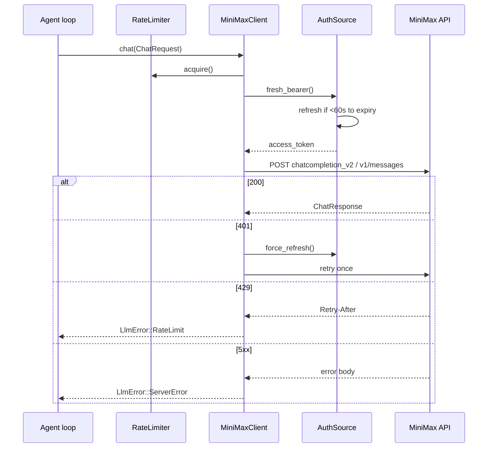

# MiniMax M2.5

MiniMax M2.5 is the **primary** LLM provider for nexo-rs. It's the
first provider implemented and the recommended default for new agents.

Source: `crates/llm/src/minimax.rs`, `crates/llm/src/minimax_auth.rs`.

## Why it's primary

- Strong tool-calling support on both the OpenAI-compat wire and the
  Anthropic Messages wire
- Token Plan auth lets you run agents on a subscription without
  per-request billing headaches
- Aggressive price/performance for multi-agent deployments

If you don't have a specific reason to pick another provider, start
with MiniMax.

## Configuration

```yaml
# config/llm.yaml
providers:
  minimax:
    api_key: ${MINIMAX_API_KEY:-}
    group_id: ${MINIMAX_GROUP_ID:-}
    base_url: https://api.minimax.io
    rate_limit:
      requests_per_second: 2.0
      quota_alert_threshold: 100000
```

Per-agent selection:

```yaml
# config/agents.d/ana.yaml
agents:
  - id: ana
    model:
      provider: minimax
      model: MiniMax-M2.5
```

## Wire formats (`api_flavor`)

MiniMax exposes two HTTP shapes. The client auto-detects from
`base_url` but can be overridden via `api_flavor`.

| `api_flavor` | Endpoint | Shape | When |
|--------------|----------|-------|------|
| `openai_compat` (default) | `{base_url}/text/chatcompletion_v2` | OpenAI chat completions | Regular API keys, most use cases |
| `anthropic_messages` | `{base_url}/v1/messages` | Anthropic Messages | Token Plan / Coding keys served at `api.minimax.io/anthropic` |

Auto-detection: if `base_url` ends in `/anthropic`, the client picks
`anthropic_messages` automatically.

## Authentication

### Static API key

Simple path: put the key in env or a secrets file.

Env var precedence (first wins):

1. `MINIMAX_CODE_PLAN_KEY`
2. `MINIMAX_CODING_API_KEY`
3. `./secrets/minimax_code_plan_key.txt`
4. `api_key` field in `llm.yaml`

### Token Plan OAuth bundle

For subscription-based access. The wizard writes a bundle to
`./secrets/minimax_token_plan.json`:

```json
{
  "access_token": "...",
  "refresh_token": "...",
  "expires_at": "2026-05-01T12:00:00Z",
  "region": "https://api.minimax.io"
}
```

**Auto-refresh:** 60 seconds before `expires_at`, a background task
POSTs to `{region}/oauth/token` with `grant_type=refresh_token` and
rewrites the bundle atomically. Concurrent refreshes are serialized
behind a mutex — you never get two refresh calls in flight.

**Mid-flight 401:** if an API call returns 401 while holding what we
thought was a valid token (clock skew, revocation), the client
force-refreshes once and retries the request. A second 401 is surfaced
as a credential error.

Shared OAuth client id for the MiniMax Portal flow:
`78257093-7e40-4613-99e0-527b14b39113`.

## Request / response flow



## Supported features

| Feature | OpenAI-compat | Anthropic-messages |
|---------|:-------------:|:------------------:|
| Chat completions | ✅ | ✅ |
| Tool calling | ✅ | ✅ |
| Streaming (SSE) | ✅ | ✅ |
| Token usage in stream | ✅ (`stream_options.include_usage`) | ✅ native |
| Multimodal (images) | ✅ | ✅ |
| JSON mode | ✅ | limited |

## Rate limiting

Per-provider token bucket. `requests_per_second: 2.0` refills one slot
every 500 ms. Acquired **before** every request.

An optional `quota_alert_threshold` emits a structured warn log when
the remaining quota (if the provider reports it) crosses the threshold.
Useful for Prometheus alerting.

## Error classification

| Response | Mapping | Behavior |
|----------|---------|----------|
| 429 | `LlmError::RateLimit { retry_after_ms }` | Retried by the LLM retry layer (up to 5 attempts) |
| 5xx | `LlmError::ServerError { status, body }` | Retried (up to 3 attempts) |
| 401 | Internal auth refresh + single retry, then `LlmError::CredentialInvalid` | Fail-fast after refresh attempt |
| Other 4xx | `LlmError::Other` | Fail fast |

See [Retry & rate limiting](./retry.md).

## Common mistakes

- **Forgetting `group_id`.** MiniMax requires a group id alongside the
  key for most endpoints. The wizard sets this; manual configs often
  miss it.
- **Pointing `base_url` at `/anthropic` with a regular API key.**
  That endpoint is for Token Plan / Coding keys only — regular keys
  will 401. Leave `base_url` at `https://api.minimax.io`.
- **Refreshing the bundle manually mid-flight.** The client already
  serializes refreshes. Editing the file while the agent runs can lead
  to an atomic write race — stop the agent, edit, restart.
