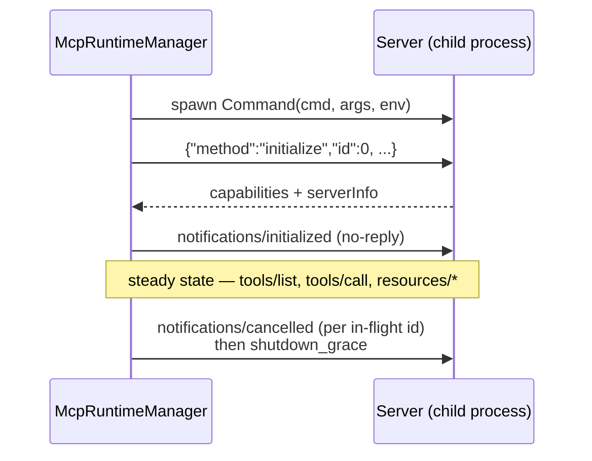
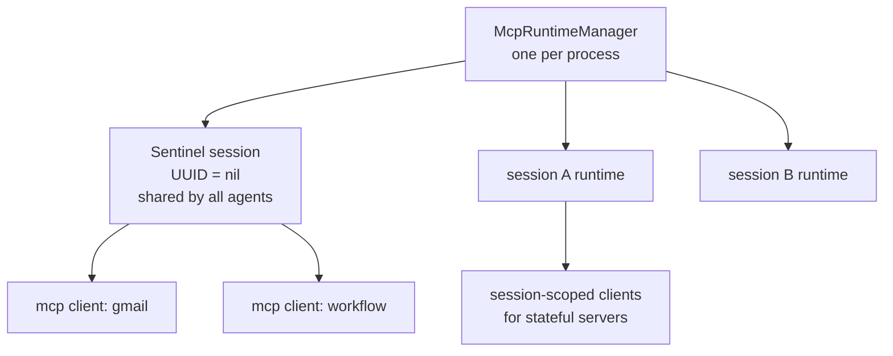
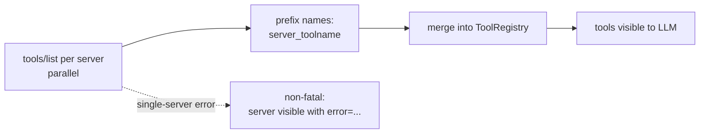
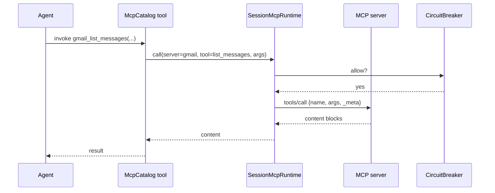
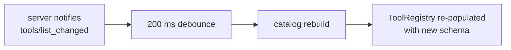

# MCP client (stdio + HTTP)

How nexo-rs consumes tools from external MCP servers. Every MCP tool
ends up in the same `ToolRegistry` that hosts built-ins and
extensions — the LLM calls them identically.

Source: `crates/mcp/src/client.rs`, `crates/mcp/src/http/client.rs`,
`crates/mcp/src/manager.rs`, `crates/mcp/src/session.rs`,
`crates/core/src/agent/mcp_catalog.rs`.

## Config

```yaml
# config/mcp.yaml
mcp:
  enabled: true
  session_ttl: 30m
  idle_reap_interval: 60s
  connect_timeout_ms: 10000
  call_timeout_ms: 30000
  shutdown_grace_ms: 3000
  servers:
    gmail:
      transport:
        type: stdio
        command: ./mcp-gmail
        args: []
      env:
        GMAIL_TOKEN: ${file:./secrets/gmail_token.json}
    workflow:
      transport:
        type: http
        url: https://mcp.example.com/workflow
        mode: auto          # streamable_http | sse | auto
        headers:
          Authorization: Bearer ${WORKFLOW_TOKEN}
  resource_cache:
    enabled: true
    ttl: 30s
    max_entries: 256
  resource_uri_allowlist: []   # empty = permissive
  strict_root_paths: false
  context:
    passthrough: true
  sampling:
    enabled: false
  watch:
    enabled: false
    debounce_ms: 200
```

## Transports

### stdio

Child process per server. Line-delimited JSON-RPC 2.0 over
stdin/stdout. stderr is routed to the agent's `tracing` output.



### HTTP — streamable vs SSE

Three modes selectable per server:

| `mode` | Behavior |
|--------|----------|
| `streamable_http` | MCP 2024-11-05 spec — modern |
| `sse` | Legacy Server-Sent Events fallback |
| `auto` (default) | Try `streamable_http`; on 404/405/415, fall back to SSE |

Each connection gets an `mcp-session-id` header. Additional headers
(auth, routing) pass through a `HeaderMap`; values are env-resolved
at config load.

## Session runtime

A single `McpRuntimeManager` lives per process. Inside, a
`SessionMcpRuntime` per **conversation session** keeps its own map of
live MCP clients:



- **Sentinel session** (UUID = `nil`) is the default shared namespace
  — all agents see the same clients, avoiding duplicate child
  processes for servers that don't need per-session isolation
- **Per-session runtimes** are spawned when a server genuinely needs
  independent state (example: a workflow engine that tracks its own
  context per user)
- **Idle reap** — every `idle_reap_interval`, the manager disposes
  sessions unused for longer than `session_ttl`, shutting their
  clients down gracefully
- **Config fingerprinting** — changes to the `servers` set produce a
  new fingerprint; runtimes are rebuilt on request; concurrent
  requests de-dupe so only one rebuild happens

## Tool catalog

`McpToolCatalog::build()` calls `tools/list` on every configured
server in parallel and merges the results:



- Names are always prefixed `{server_name}_{tool_name}` so collisions
  across servers can't happen
- Duplicates within the same server → first wins, warn log
- `input_schema` is passed through verbatim
- Server capability `resources` unlocks two meta-tools for reading
  resources

## Tool call flow



Every RPC goes through a per-server `CircuitBreaker`. If the breaker
is open, the call fails fast instead of hanging on a dead server.

### Context passthrough

When `mcp.context.passthrough: true`, `tools/call` injects:

```json
{ "_meta": { "agent_id": "ana", "session_id": "..." }, ...args }
```

Server-side code can use this to scope state per agent without the
schema leaking that concern.

## Resources

Servers advertising `resources` capability unlock:

- `resources/list` (paginated via `cursor`, max 64 pages)
- `resources/read` (optionally cached via LRU)
- `resources/templates/list` (URI templates)

Cache config:

```yaml
resource_cache:
  enabled: true
  ttl: 30s
  max_entries: 256
```

Cache invalidates on
`notifications/resources/list_changed`. Optional per-scheme allowlist
(`resource_uri_allowlist: ["file", "db"]`) rejects unknown URI
schemes before dispatch.

## Hot reload (phase 12.8)



Same flow for resources. Agents in flight at the moment of the
rebuild keep their references to the old tool definitions — next
turn uses the refreshed registry.

## Gotchas

- **One MCP child per server by default.** Turn on per-session
  isolation only for servers that genuinely need it; spawning a child
  per session multiplies resource cost.
- **`notifications/initialized` is fire-and-forget.** If the server
  insists on acknowledging it, you have a broken server.
- **SSE is a last resort.** It's in `auto` for compatibility; new
  server deployments should speak streamable HTTP.
- **Circuit breakers are per-server.** One bad server doesn't freeze
  the catalog; but a flapping one still slows the agent loop via
  backoff waits.
