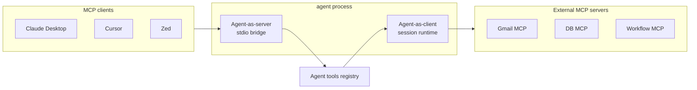
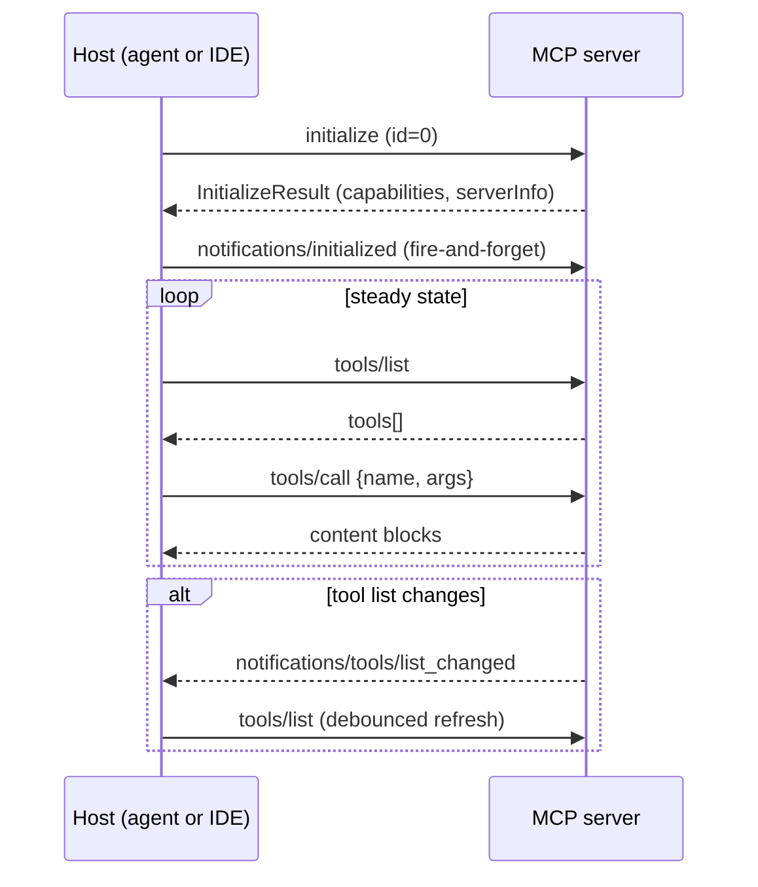

# Model Context Protocol (MCP)

nexo-rs is both an **MCP client** (consumes tools from external MCP
servers) and an **MCP server** (exposes its own tools so editors like
Claude Desktop, Cursor, Zed can use them). Same wire, different
directions.

Source: `crates/mcp/`, bridges in `crates/core/src/agent/mcp_*`.

## The two directions

- **Server side** — an MCP client (e.g. Claude Desktop) runs
  `agent mcp serve`. The agent's internal tools appear as MCP tools in
  that client.
- **Client side** — the agent spawns external MCP servers (stdio or
  HTTP) and registers their tools into its own `ToolRegistry`, so
  agents can call them exactly like built-ins or extensions.

## Phase map

| Phase | What it adds |
|-------|--------------|
| 12.1 | MCP client over stdio |
| 12.2 | MCP client over HTTP (streamable + SSE fallback) |
| 12.3 | Tool catalog — merge MCP tools with extensions and built-ins |
| 12.4 | Session runtime — per-session child spawn, sentinel-shared default |
| 12.5 | Resources — `resources/list` + `resources/read` with optional LRU cache |
| 12.6 | Agent as MCP server (stdio) |
| 12.7 | MCP servers declared by extensions |
| 12.8 | `tools/list_changed` debounced hot-reload |

All eight landed. See [PHASES.md](https://github.com/lordmacu/nexo-rs/blob/main/PHASES.md).

## Why both sides

Being a **client** lets agents tap any MCP ecosystem without needing
a custom extension per service — if the thing you want speaks MCP,
you can reach it today.

Being a **server** lets the carefully-sandboxed tool surface of
nexo-rs (`allowed_tools`, `outbound_allowlist`, etc.) be reused from
any MCP-speaking client. Your LLM-driven IDE gets access to WhatsApp
send, Gmail poll, browser CDP, and everything else — without you
wiring each one into the IDE's config.

## Wire shape (both directions)

JSON-RPC 2.0. For transports:

- **stdio** — child process, line-delimited JSON on stdin/stdout
- **streamable HTTP** — modern MCP 2024-11-05 shape
- **SSE** — legacy; used as automatic fallback

## Where to go next

- [Client (stdio + HTTP)](./client.md) — consuming external MCP
  servers from agents
- [Agent as MCP server](./server.md) — exposing the agent's tools
  over MCP
