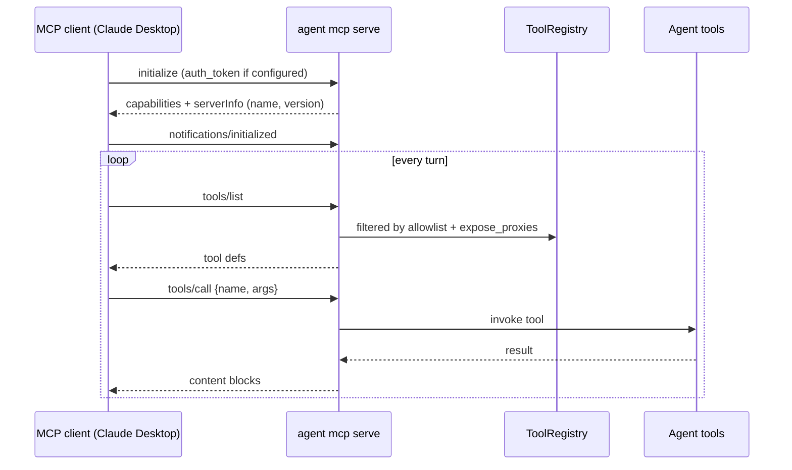
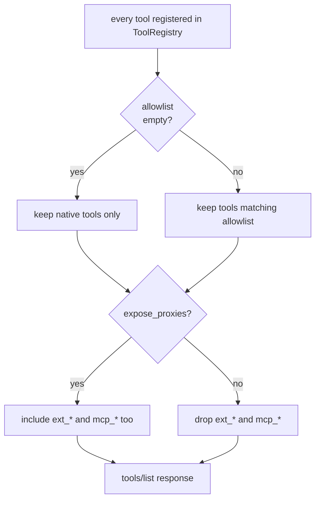

# Agent as MCP server

Expose the agent's tools over MCP so Claude Desktop, Cursor, Zed, or
any other MCP-speaking client can use them. Stdio transport; the
agent runs as a child process of the consuming client.

Source: `crates/mcp/src/server/`, `crates/core/src/agent/mcp_server_bridge.rs`.

## Config

```yaml
# config/mcp_server.yaml
enabled: true
name: agent
allowlist: []            # empty = every native tool; populated = strict allowlist
expose_proxies: false    # set true to also expose ext_* and mcp_* proxy tools
auth_token_env: ""       # optional env var holding a shared bearer token
```

| Field | Default | Purpose |
|-------|---------|---------|
| `enabled` | `false` | Must be `true` for the server subcommand to start. |
| `name` | `"agent"` | Reported as `serverInfo.name` in handshake. |
| `allowlist` | `[]` | Empty = all native tools. Populated = only these names reach the MCP client. Globs (`memory_*`) supported. |
| `expose_proxies` | `false` | Whether `ext_*` (extension) and `mcp_*` (upstream MCP) proxy tools are surfaced. |
| `auth_token_env` | `""` | If set, the `initialize` request must present this token; unauthenticated clients get rejected. |

## Running it

```bash
agent mcp serve --config ./config
```

The process reads JSON-RPC from stdin and writes responses to stdout
— exactly the shape Claude Desktop, Cursor, etc. expect.

### Claude Desktop example

`~/Library/Application Support/Claude/claude_desktop_config.json`:

```json
{
  "mcpServers": {
    "nexo": {
      "command": "/usr/local/bin/agent",
      "args": ["mcp", "serve", "--config", "/srv/nexo-rs/config"],
      "env": {
        "ANTHROPIC_API_KEY": "sk-ant-..."
      }
    }
  }
}
```

The Anthropic client spawns the agent, handshakes, and then every
agent tool shows up in the conversation's tool list.

## Wire flow



## Tool exposure rules



- **Native tools** — `memory_*`, `whatsapp_*`, `telegram_*`,
  `browser_*`, `forge_*`, etc.
- **Proxy tools** — `ext_<id>_<tool>` for extensions,
  `<server>_<tool>` for upstream MCP. Hidden by default to avoid
  proxying an external server through to another external client.

## Capabilities advertised

- `tools` — always
- `resources` — advertised only if the agent exposes any via the
  server handler (phase 12.5 puts the groundwork in, consumer features
  follow)
- `prompts` — reserved, not advertised yet
- `logging` — conditional on handler implementation

## Auth

When `auth_token_env` is set, the `initialize` request must present
the token (via a server-specific header convention or as an `_meta`
field). Clients that don't know the token get rejected before
anything else happens. Useful when the agent is launched through a
shared-host proxy rather than a local `command:` spawn.

## Security model

- **Read-only by default?** No — the server exposes whatever the
  allowlist permits. Model it explicitly:
  ```yaml
  allowlist:
    - memory_recall    # read memory
    - memory_store     # write memory  (remove for read-only)
  ```
- **Outbound channels** (`whatsapp_send_message`,
  `telegram_send_message`) will send real messages from the agent's
  configured accounts. Include them in the allowlist **only** if the
  IDE user should be able to do that.
- **`expose_proxies: true` is transitive power.** It gives the IDE
  the full tool set of every extension and upstream MCP server too.

## Gotchas

- **Allowlist globs match tool names, not prefixes.** `memory_*`
  matches `memory_recall` and `memory_store` but not `memory_history`
  (phase 10.9 tool). Write the pattern to match the real set.
- **No per-IDE-user identity.** The server has one identity = the
  agent's configured credentials. If multiple humans share the IDE,
  they share the agent's blast radius.
- **Proxies forward the agent's rate limits.** Calling
  `whatsapp_send_message` through the MCP server is the same as an
  agent calling it — counts against the same WhatsApp rate bucket.
