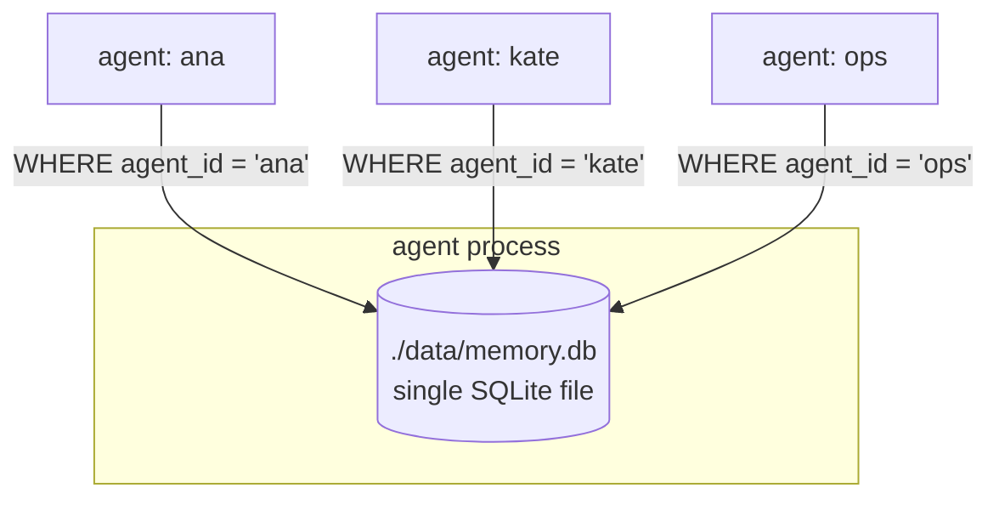

# Long-term memory (SQLite)

Durable memory shared by every agent in the process. One SQLite file,
multi-tenant via an `agent_id` column on every row. Survives restarts.

Source: `crates/memory/src/long_term.rs`.

## Storage location

```yaml
long_term:
  backend: sqlite
  sqlite:
    path: ./data/memory.db
```

**One file for all agents.** Per-agent isolation is enforced by
`WHERE agent_id = ?` on every query — not by separate DB files. An
`idx_memories_agent(agent_id, created_at DESC)` index keeps those
queries fast.

If you want per-agent file separation, override `sqlite.path` per
agent via an `inbound_bindings[]` override or a per-agent config
directory.

## Schema

The runtime creates these tables at boot if they don't exist.

### `memories` — atomic facts

```sql
CREATE TABLE memories (
  id            TEXT PRIMARY KEY,  -- UUID
  agent_id      TEXT NOT NULL,
  content       TEXT NOT NULL,
  tags          TEXT DEFAULT '[]', -- JSON array
  concept_tags  TEXT DEFAULT '[]', -- auto-derived (phase 10.7)
  created_at    INTEGER NOT NULL   -- ms since epoch
);
CREATE INDEX idx_memories_agent ON memories(agent_id, created_at DESC);
```

### `memories_fts` — full-text search (FTS5)

```sql
CREATE VIRTUAL TABLE memories_fts USING fts5(
  content,
  id        UNINDEXED,
  agent_id  UNINDEXED
);
```

Powers the `keyword` recall mode with BM25 ranking.

### `interactions` — conversation archive

```sql
CREATE TABLE interactions (
  id          TEXT PRIMARY KEY,
  session_id  TEXT NOT NULL,
  agent_id    TEXT NOT NULL,
  role        TEXT,
  content     TEXT,
  created_at  INTEGER
);
CREATE INDEX idx_interactions_session ON interactions(session_id, created_at DESC);
```

### `reminders` — phase 7 heartbeat reminders

```sql
CREATE TABLE reminders (
  id            TEXT PRIMARY KEY,
  agent_id      TEXT NOT NULL,
  session_id    TEXT NOT NULL,
  plugin        TEXT,
  recipient     TEXT,
  message       TEXT,
  due_at        INTEGER,
  claimed_at    INTEGER,
  delivered_at  INTEGER,
  created_at    INTEGER
);
CREATE INDEX idx_reminders_due
  ON reminders(agent_id, delivered_at, due_at ASC);
```

### `recall_events` — signal tracking (phase 10.5)

```sql
CREATE TABLE recall_events (
  id         INTEGER PRIMARY KEY AUTOINCREMENT,
  agent_id   TEXT,
  memory_id  TEXT,
  query      TEXT,
  score      REAL,
  ts_ms      INTEGER
);
```

Every `recall()` hit records a row. Dream sweeps read this to decide
what to promote.

### `memory_promotions` — dreaming ledger (phase 10.6)

```sql
CREATE TABLE memory_promotions (
  memory_id    TEXT PRIMARY KEY,
  agent_id     TEXT,
  promoted_at  INTEGER,
  score        REAL,
  phase        TEXT
);
```

Prevents double-promotion across sweeps.

### `vec_memories` — vector index (phase 5.4, optional)

Created on demand when `vector.enabled: true`. See
[Vector search](./vector.md).

## What gets written when

| Action | Writes to |
|--------|-----------|
| Agent calls `memory.remember(content, tags)` | `memories`, `memories_fts`, `vec_memories` (if enabled) |
| Every turn | `interactions` (used for transcripts, not promoted into `memories`) |
| Agent calls `forge_reminder(...)` | `reminders` |
| Every `recall()` hit | `recall_events` (one row per result returned) |
| Dream sweep promotes hot memory | `memory_promotions` |

## Memory tool

Single unified tool with three actions, visible to the LLM as `memory`:

| Action | Required | Optional | Returns |
|--------|----------|----------|---------|
| `remember` | `content` | `tags[]`, `context` | `{ok, id}` |
| `recall` | `query` | `limit` (default 5), `mode` (`keyword` \| `vector` \| `hybrid`) | `{ok, results: [{id, content, tags}]}` |
| `forget` | `id` | — | `{ok}` |

**Results do not include similarity scores** — only content and tags.
Scores are used internally for dreaming signal tracking but aren't
surfaced to the LLM to avoid encouraging score-gaming prompts.

Other memory-related tools:

- `forge_memory_checkpoint` — snapshot the workspace-git repo (phase 10.9)
- `memory_history` — git log + optional unified diff (phase 10.9)

## Per-agent isolation



One `LongTermMemory` instance per process, shared across agents via
`Arc`. The `MemoryTool` attached to each agent passes
`ctx.agent_id` to every query.

## Workspace-git (phase 10.9)

A separate per-agent git repo lives in the agent's `workspace`
directory (**not** inside the memory DB). When `workspace_git.enabled:
true`, the runtime commits after:

- Dream sweeps (Phase 10.6)
- `forge_memory_checkpoint` tool calls
- Session close (`on_expire`)

Good for forensic replay — you can `git log` to see the memory state
at any point. See [Soul — MEMORY.md](../soul/memory.md).

## Gotchas

- **One DB, multi-tenant.** A query missing its `agent_id` filter
  would leak across agents. All runtime code goes through the
  `LongTermMemory` API which injects it automatically.
- **Vacuum is manual.** SQLite does not auto-compact after deletes.
  Run `VACUUM;` periodically (or `PRAGMA auto_vacuum=incremental`
  from day one).
- **`recall_events` grows unboundedly.** Dream sweeps periodically
  prune, but a dreaming-disabled agent's table will grow forever. Add
  a retention job if you run without dreaming.
