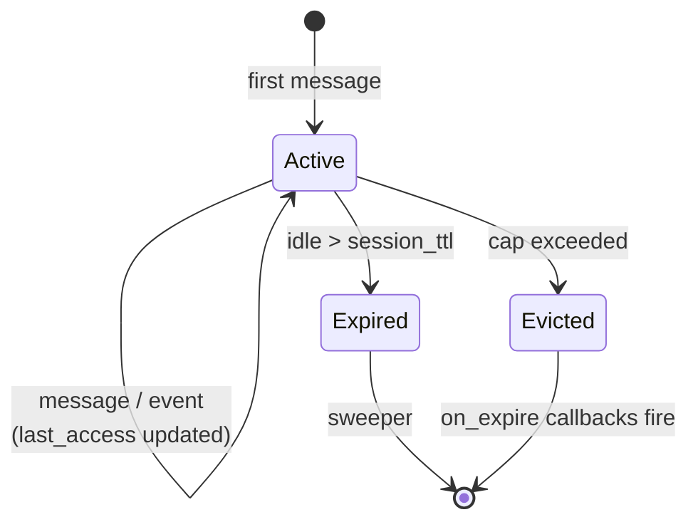
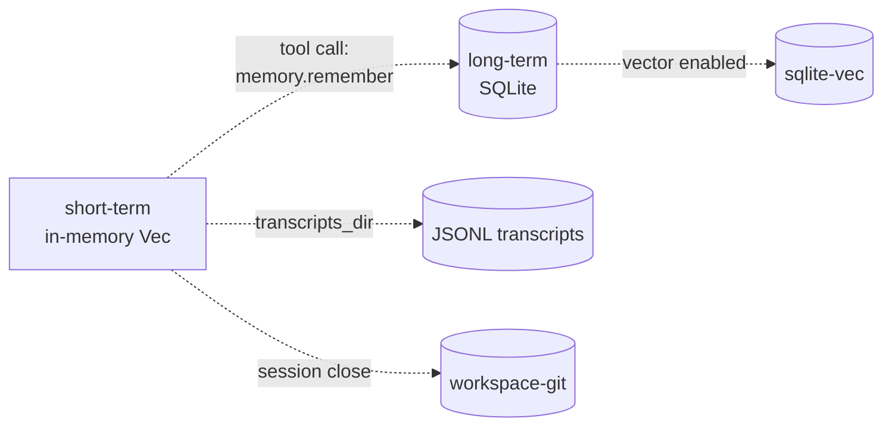

# Short-term memory

Per-session conversational buffer held entirely in memory. Tracks the
turns of the ongoing conversation so the LLM has context on every
completion request.

Source: `crates/core/src/session/` (types.rs, manager.rs) — the
`Session` struct owns the short-term buffer.

## What lives in a session

Each `Session` stores:

| Field | Type | Purpose |
|-------|------|---------|
| `history` | `Vec<Interaction>` | FIFO of turns (role + content + timestamp) |
| `context` | `serde_json::Value` | Free-form JSON blob for per-session state |
| `last_access` | timestamp | Used by TTL sweeper and cap eviction |

An `Interaction` is `{role: User | Assistant | Tool, content, timestamp}`.

## Sliding window — `max_history_turns`

```yaml
short_term:
  max_history_turns: 50
```

Hard cap, sliding FIFO. When `history.len() > max_history_turns`, the
oldest entry is removed on the next push:

```mermaid
flowchart LR
    MSG[new turn] --> PUSH[history.push]
    PUSH --> CHECK{len > max?}
    CHECK -->|no| DONE[done]
    CHECK -->|yes| DROP[history.remove(0)]
    DROP --> DONE
```

Old content is **lost, not promoted**. If you need long-term
persistence, the agent must explicitly call the `memory` tool with
action `remember`. See [Long-term memory](./long-term.md).

## Session cap and eviction

```yaml
short_term:
  max_sessions: 10000
```

Soft cap across the whole process. On overflow, the **oldest-idle**
session (lowest `last_access`) is evicted to make room. Eviction
fires the `on_expire` callbacks — used by `workspace-git` to
checkpoint before tearing down the session.

`max_sessions: 0` disables the cap (unbounded). Leave it at the default
unless you have a specific reason — the cap is DoS protection against
a spammer rotating `chat_id`s.

## TTL sweeper

```yaml
short_term:
  session_ttl: 24h
```

Sessions expire after `session_ttl` of inactivity. The sweeper runs
every `ttl / 4` (so every 6 h with the default 24 h TTL) and drops
expired sessions.



Expiry also fires `on_expire` — good place to hook session-close
commits to a workspace-git repo.

## Relationship to other memory layers



STM does **not** auto-promote to LTM. Promotion happens via:

- Explicit `memory.remember` tool call from the agent
- Dream sweeps (Phase 10.6) that scan recall-event signals and
  promote hot memories
- Session-close commits to workspace-git if enabled

## Gotchas

- **Lost turns are gone.** Once a turn falls off the sliding window
  it is not recoverable. If it mattered, save it to LTM before the
  next turn.
- **`max_sessions: 0` has no DoS guard.** Only do this in
  single-tenant setups where you control the sender id space.
- **`last_access` updates on any access.** That includes heartbeat
  ticks if they read the session — effectively keeping a session
  alive past its TTL as long as the agent is alive.
