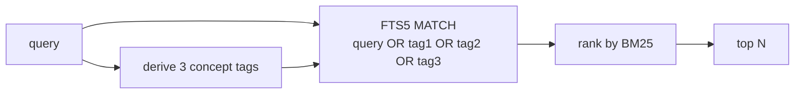
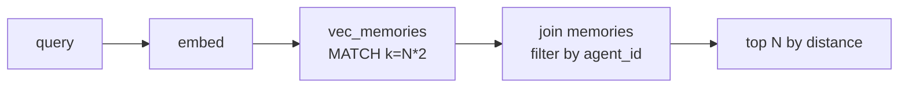
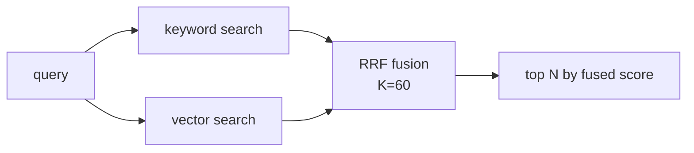

# Vector search

Optional semantic memory via **sqlite-vec** — a virtual table inside
the same SQLite file used for long-term memory. No separate service,
no extra process, no migration.

Source: `crates/memory/src/vector.rs`,
`crates/memory/src/embedding/`.

## Turning it on

```yaml
vector:
  enabled: true
  backend: sqlite-vec
  default_recall_mode: hybrid
  embedding:
    provider: http
    base_url: https://api.openai.com/v1
    model: text-embedding-3-small
    api_key: ${OPENAI_API_KEY}
    dimensions: 1536
    timeout_secs: 30
```

Dimension **must match** the model output:

| Model | Dimensions |
|-------|------------|
| `text-embedding-3-small` | 1536 |
| `text-embedding-3-large` | 3072 |
| `nomic-embed-text` | 768 |
| Gemini `text-embedding-004` | 768 |

A mismatch aborts startup with an explicit error. If you already have
vectors at a different dimension, you must delete the DB (or the
vector table) and rebuild the index.

## Storage

```sql
CREATE VIRTUAL TABLE vec_memories USING vec0(
  memory_id TEXT PRIMARY KEY,
  embedding FLOAT[<dimensions>]
);
```

The virtual table lives in the same SQLite file as `memories`. A join
on `memory_id` brings you back the content and tags.

## Embedding provider

```rust
trait EmbeddingProvider {
    fn dimension(&self) -> usize;
    async fn embed(&self, texts: &[String]) -> Result<Vec<Vec<f32>>>;
}
```

Phase 5.4 ships one provider: **`http`** — any OpenAI-compatible
`/embeddings` endpoint. That covers OpenAI, Gemini (via its API),
Ollama, LM Studio, and self-hosted inference.

Local-only providers (fastembed, candle) are intentional follow-ups —
the HTTP provider is enough to unblock everything downstream.

## Recall modes

Set the default in `memory.yaml` and override per tool call with the
`mode` argument.

### `keyword` — FTS5 + concept expansion



- Fast, no embedding cost
- Misses semantic neighbors that don't share vocabulary
- The extra concept tags are auto-derived from the query and help
  narrow down concept matches

### `vector` — nearest-neighbor



- Catches paraphrases and cross-vocabulary matches
- Embedding request on every call — watch costs and latency
- Falls back to `keyword` on provider error (via `hybrid`) — not on
  pure `vector` mode, where errors surface

### `hybrid` — Reciprocal Rank Fusion

The default recommendation. Runs both keyword and vector, then fuses
ranks with the RRF formula `1 / (K + rank + 1)` where `K = 60`:



Vector errors degrade gracefully to keyword-only without raising.

## Tool interaction

The `memory` tool takes an optional `mode` param:

```json
{
  "action": "recall",
  "query": "what's the client's address?",
  "limit": 5,
  "mode": "hybrid"
}
```

If omitted, `default_recall_mode` is used.

## Cost and latency profile

| Mode | Per recall |
|------|-----------|
| `keyword` | 1 SQL query, no LLM call |
| `vector` | 1 embedding HTTP call + 1 SQL query |
| `hybrid` | 1 embedding HTTP call + 2 SQL queries + fusion |

For high-throughput agents that recall on every turn, start with
`keyword` and upgrade to `hybrid` only where you see miss rate
matter.

## Gotchas

- **Changing embedding model = full reindex.** The dimension check
  catches the obvious case, but even same-dimension model swaps
  produce semantically different vectors; the old index becomes
  stale.
- **`sqlite3_auto_extension` registers once per process.** Not a
  problem in production, but test suites that instantiate multiple
  SQLite connections across tests may hit edge cases.
- **Vector returns distance, not similarity.** Lower is closer.
  Hybrid fusion normalizes across both, so callers don't see this
  directly unless they bypass the tool.
