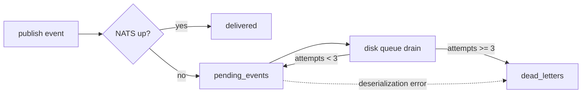

# Dead-letter queue operations

The DLQ is where events end up when they exhaust their retry budget
or fail to deserialize at all. The runtime never silently drops an
event — if it can't be delivered, it lands here for an operator to
inspect or replay.

Source: `crates/broker/src/disk_queue.rs`, `src/main.rs`
(`agent dlq ...` subcommands).

## When items land there



- **3 attempts** (`DEFAULT_MAX_ATTEMPTS`) without success → row moves
  to `dead_letters`
- **Unparseable payload** → moves immediately (a poison pill is not
  worth retrying)
- **Circuit-breaker-open** on publish counts as an attempt — if the
  breaker stays open, the queue will eventually flush into DLQ

See [Fault tolerance](../architecture/fault-tolerance.md#disk-queue)
for the full retry flow.

## The `DeadLetter` row

```rust
struct DeadLetter {
    id: String,          // UUID
    topic: String,       // NATS subject
    payload: String,     // JSON event body
    failed_at: i64,      // unix timestamp (ms)
    reason: String,      // error text
}
```

Storage: SQLite table `dead_letters` in the broker DB (typically
`./data/queue/broker.db`).

## CLI

```
agent dlq list              # list up to 1000 entries
agent dlq replay <id>       # move one entry back to pending_events
agent dlq purge             # delete every entry
```

### `list` output

Columns: `id | topic | failed_at | reason`. Plain text, one entry per
line, suitable for `grep` / `awk` piping.

```
2f9c2e4a-...  plugin.inbound.whatsapp  2026-04-24T17:22:13Z  circuit breaker open
b1a3a9f5-...  plugin.outbound.telegram 2026-04-24T17:23:01Z  deserialization error: unexpected field `...`
```

### `replay`

Moves the row back to `pending_events` with `attempts = 0`:

```
$ agent dlq replay 2f9c2e4a-...
replayed 2f9c2e4a-... → pending_events (next daemon drain will retry it)
```

The retry happens on the next `drain()` cycle of the running agent —
`replay` itself does not attempt delivery. That way a running agent
in a different shell picks it up; a stopped agent leaves the event
safely in `pending_events` for its next startup.

### `purge`

Destructive. Drops every row in `dead_letters`:

```
$ agent dlq purge
purged 42 dead-letter entries
```

Use with care — there is no per-topic filter. If you need a scoped
purge, inspect with `list`, selectively `replay` what you want to
keep, then `purge` the rest.

## Exit codes

| Code | Meaning |
|------|---------|
| 0 | Success |
| 1 | Failure (event not found for replay, DB access error, etc.) |

## Common workflows

### Post-outage triage

```bash
# See what piled up during the NATS outage
agent dlq list | wc -l

# Spot-check
agent dlq list | head
agent dlq list | awk '{print $2}' | sort | uniq -c

# If reasons look transient (circuit open, timeouts):
agent dlq list | awk '{print $1}' | while read id; do
  agent dlq replay "$id"
done
```

### Poison-pill cleanup

If `reason` mentions deserialization errors, the payload is malformed
— no amount of retry will help. Collect the offenders, fix the
producer side, then:

```bash
agent dlq list | grep deserialization | awk '{print $1}' > /tmp/poison.txt
# ... verify they're truly poison ...
agent dlq purge
```

### Preview without modifying

The CLI has no `--dry-run` flag today. Use `agent dlq list` to preview
first; the DB rows are stable until you explicitly `replay` or
`purge`.

## Monitoring

There is no dedicated DLQ metric yet. Approximations:

- A spike in `circuit_breaker_state{breaker="nats"} == 1` time
  strongly predicts DLQ growth — alert on it.
- Consider wrapping `agent dlq list | wc -l` in a cron job that
  pushes the count to Prometheus via the textfile collector if you
  want a direct gauge.

## Gotchas

- **`replay` doesn't wake a stopped agent.** If no agent is running
  against the same data directory, the row just moves back to
  `pending_events` and waits for the next startup drain.
- **No replay deduplication.** Replaying an event that was already
  successfully delivered later will deliver it again. If your
  consumer isn't idempotent, spot-check downstream state before
  replaying.
- **`purge` is global.** Scope it with `list | replay` selectively
  if you need to preserve a subset.
