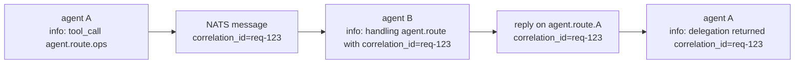

# Logging

`tracing` under the hood. Human-readable in dev, JSON in production,
always to stderr (stdout is reserved for wire protocols like MCP
JSON-RPC).

Source: `src/main.rs::init_tracing`.

## Quick reference

| Env var | Default | Meaning |
|---------|---------|---------|
| `RUST_LOG` | `info` | `EnvFilter` syntax (`agent_core=debug,async_nats=warn,*=info`) |
| `AGENT_LOG_FORMAT` | `pretty` (`json` in `AGENT_ENV=production`) | `pretty` \| `compact` \| `json` |
| `AGENT_ENV` | unset | Set to `production` to default to JSON logs |

## Levels

Pick the lowest verbosity that still surfaces the signal you care about:

| Level | Use |
|-------|-----|
| `error` | Unrecoverable — operator action needed |
| `warn` | Degraded but running (circuit open, retry budget burning) |
| `info` | Lifecycle (startup, shutdown, reconnects) |
| `debug` | Per-turn detail (tool invoked, session created) |
| `trace` | Per-event firehose — only when chasing a bug |

## Log formats

### `pretty` (dev default)

Coloured, multi-line. Good at the terminal, bad in log pipelines.

```
2026-04-24T17:22:13Z  INFO agent::runtime: agent runtime ready
    at src/main.rs:1243
    in agent_boot with agent="ana"
```

### `compact`

One line per event. Middle ground.

```
2026-04-24T17:22:13Z INFO agent="ana" agent runtime ready
```

### `json`

Structured. One JSON object per line. Default when `AGENT_ENV=production`.

```json
{"ts_unix_ms":1714000000000,"level":"INFO","target":"agent::runtime","thread_id":"ThreadId(3)","file":"src/main.rs","line":1243,"spans":[{"name":"agent_boot","agent":"ana"}],"message":"agent runtime ready"}
```

Every entry carries:

- `ts_unix_ms` — milliseconds since epoch (stable for ingestion)
- `level`, `target`
- `thread_id`, `file`, `line` — for pinpointing
- `spans` — span hierarchy with attached fields
- Any structured fields passed via `tracing::info!(agent = %id, ...)`

## Correlating across agents

Cross-agent work lands on `agent.route.<target_id>` with a
`correlation_id`. In logs, the correlation id shows up as a field on
every event that happened inside a delegation span.



Grep logs by `correlation_id` to see the whole fan-out+in as a single
thread.

## Structured-field conventions

Convention for fields that show up across the codebase:

| Field | Where |
|-------|-------|
| `agent` | Any log tied to a specific agent runtime |
| `session` | Any log inside a session context (usually UUID) |
| `extension` (or `ext`) | Any log from extension runtimes |
| `tool` | Any tool invocation log |
| `provider`, `model` | LLM client logs |
| `correlation_id` | Delegation-related logs |
| `topic` | Broker publish/subscribe logs |

When adding new code, reuse these names — log pipelines can count on
them.

## Where stdout goes

`stdout` is reserved for:

- **MCP server mode** (`agent mcp serve`) — JSON-RPC traffic
- **CLI subcommands that return data** (`agent ext list --json`,
  `agent flow show --json`, `agent dlq list`)

Everything else, including normal log output, goes to **stderr**.
Don't pipe `agent … 2>&1 | jq` unless you know the subcommand never
writes non-JSON to stdout.

## Practical setups

### Local dev

```bash
export RUST_LOG=agent=debug,agent_core=debug,info
cargo run --bin agent -- --config ./config
```

### Production (Docker)

```yaml
services:
  agent:
    environment:
      AGENT_ENV: production
      RUST_LOG: info,async_nats=warn
```

Everything lands on stderr → container runtime picks it up → your
log pipeline ingests JSON directly.

### Chasing a specific agent

```bash
export RUST_LOG=agent=info
# then grep by field
docker compose logs agent | jq 'select(.spans[].agent == "ana")'
```

## Gotchas

- **`tracing` is compile-time filtered.** If you grep logs for a
  debug-level event and see nothing, verify `RUST_LOG` covers the
  module.
- **JSON mode drops ANSI colors.** Rightly so — but don't pipe it
  through a TTY colorizer and then be confused by escape sequences.
- **`stderr` ordering isn't guaranteed against `stdout`.** Never
  assume a log line printed right after a `println!` happens in log
  order — pipes buffer independently.
