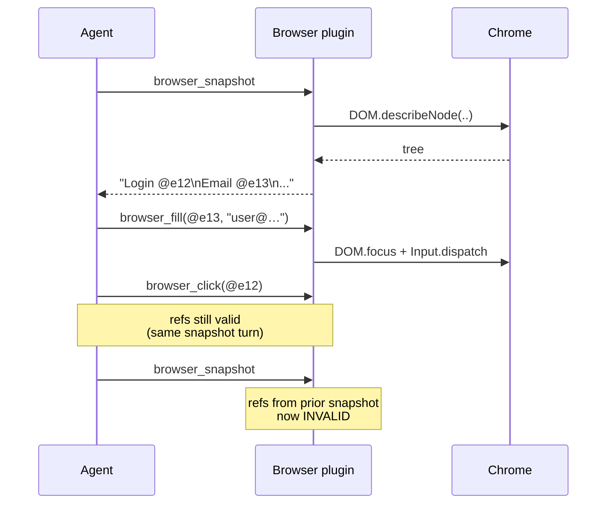

# Browser (Chrome DevTools Protocol)

Drives a real Chrome/Chromium instance via CDP. Agents can navigate,
click, fill, screenshot, and run JS — with stable element refs that
work across DOM mutations within a single turn.

Source: `crates/plugins/browser/`.

## Topics

| Direction | Subject | Notes |
|-----------|---------|-------|
| Outbound | `plugin.outbound.browser` | Tool invocations |
| Events | `plugin.events.browser.<method_suffix>` | Mirrored CDP notifications |

Browser is an **outbound-only** plugin — there is no unsolicited
inbound event from a web page to the agent.

## Config

```yaml
# config/plugins/browser.yaml
browser:
  headless: false
  executable: ""                     # empty → search PATH
  cdp_url: ""                        # empty → launch new Chrome
  user_data_dir: ./data/browser/profile
  window_width: 1280
  window_height: 800
  connect_timeout_ms: 10000
  command_timeout_ms: 15000
```

| Field | Default | Purpose |
|-------|---------|---------|
| `headless` | `false` | Launch Chrome without a UI. |
| `executable` | `""` | Chrome binary path. Empty = search `PATH`. |
| `cdp_url` | `""` | Connect to an existing Chrome DevTools server (e.g. `http://127.0.0.1:9222`). Empty = launch a new instance. |
| `user_data_dir` | `./data/browser/profile` | Chrome profile cache. Keeps cookies, logins. |
| `window_width` / `window_height` | `1280` / `800` | Viewport. |
| `connect_timeout_ms` | `10000` | How long to wait for Chrome startup / remote connect. |
| `command_timeout_ms` | `15000` | Per-CDP-command execution timeout. |

## Auth

None. CDP is an unauthenticated protocol — use `cdp_url` only with a
loopback / firewalled Chrome.

## Tools exposed to the LLM

| Tool | Purpose |
|------|---------|
| `browser_navigate` | Load URL and wait for `load` event. |
| `browser_click` | Click by element ref (`@e12`) or CSS selector. |
| `browser_fill` | Type into input / textarea / contenteditable. Replaces content. |
| `browser_screenshot` | Base64 PNG of the viewport. |
| `browser_evaluate` | Run JS, return value as JSON. |
| `browser_snapshot` | Text DOM tree with stable element refs. |
| `browser_scroll_to` | Scroll a target element into view. |
| `browser_current_url` | Current page URL. |
| `browser_wait_for` | Poll for an element to appear. |
| `browser_go_back` / `browser_go_forward` | Navigation history. |
| `browser_press_key` | Keyboard events. |

All tools are prefixed `browser_*` for glob filtering in
`allowed_tools`.

## Element refs

`browser_snapshot` emits a text tree where every actionable element
has a ref like `@e12`. Those refs are **stable within the snapshot
turn** but invalidated by any subsequent DOM mutation:



Rule: take a snapshot, act on refs from that snapshot, take a new
snapshot before acting again.

## Gotchas

- **`browser_fill` replaces content.** No append mode. To add text to
  existing content, read the current value first (via `evaluate`)
  then send the merged string.
- **Connecting to an existing Chrome (`cdp_url`) skips the profile
  setup.** Any login state is whatever that Chrome already has.
- **Element refs expire on DOM mutation.** The plugin does not
  auto-refresh — refs from a stale snapshot will error or misfire.
- **Headless sites break.** Some sites detect headless Chrome and
  behave differently. Use `headless: false` for those.
