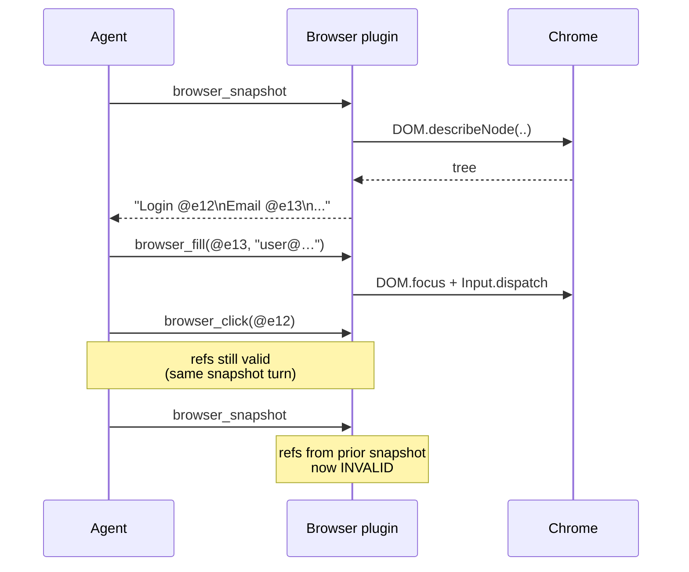

# Browser (Chrome DevTools Protocol)

Drives a real Chrome/Chromium instance via CDP. Agents can navigate,
click, fill, screenshot, and run JS — with stable element refs that
work across DOM mutations within a single turn.

> **Phase 81.17.c (2026-05-07).** The browser plugin now ships as a
> standalone subprocess (`nexo-rs-plugin-browser`), loaded by the daemon
> via discovery + auto-subprocess fallback (Phase 81.17.b). The 12
> `browser_*` tools route through 81.29 `RemoteToolHandler` over
> JSON-RPC stdio. The in-tree `crates/plugins/browser/` source stays in
> the workspace dormant for one migration window; deletion is tracked
> in follow-up `81.17.c.in-tree-removal`.

Source-of-truth: standalone repo
[`github.com/lordmacu/nexo-plugin-browser`](https://github.com/lordmacu/nexo-plugin-browser)
(local: `/home/familia/chat/nexo-rs-plugin-browser/`). In-tree mirror at
`crates/plugins/browser/` is dormant; the daemon does NOT instantiate it
in-process anymore.

## Out-of-tree subprocess install

```bash
cd /path/to/nexo-rs-plugin-browser
cargo build --release

# Copy binary + manifest into a discovery search path.
mkdir -p ~/.local/share/nexo/plugins/browser
cp target/release/nexo-plugin-browser ~/.local/share/nexo/plugins/browser/
cp nexo-plugin.toml                   ~/.local/share/nexo/plugins/browser/
```

In `plugins.yaml`:

```yaml
plugins:
  discovery:
    search_paths:
      - ~/.local/share/nexo/plugins
```

The discovery walker picks up the manifest on next boot;
auto-subprocess fallback spawns the binary; tool handlers register
in the agent's scoped registry via `RemoteToolHandler`. ENV vars
flow from `cfg.plugins.browser` YAML via the daemon's
`seed_browser_subprocess_env` helper.

The standalone repo's
[README](https://github.com/lordmacu/nexo-plugin-browser#readme) covers
ENV var reference, sandbox notes, and the latency budget.

## Topics

| Direction | Subject | Notes |
|-----------|---------|-------|
| Outbound | `plugin.outbound.browser` | Tool invocations |
| Events | `plugin.events.browser.<method_suffix>` | Mirrored CDP notifications |

Browser is an **outbound-only** plugin — there is no unsolicited
inbound event from a web page to the agent.

## Config

Two shapes accepted: a single map (0.2.x back-compat — keeps the
legacy per-`agent_id` profile fan-out from Phase 81.17.c.multi-profile)
**or** a sequence of maps (0.3.0+ declared multi-instance — operator
names each session, every instance has its own Chrome process +
`user_data_dir`).

### Single-map (legacy)

```yaml
# config/plugins/browser.yaml
browser:
  headless: false
  executable: ""                     # empty → search PATH
  cdp_url: ""                        # empty → launch new Chrome
  user_data_dir: ./data/browser/profile
  window_width: 1280
  window_height: 800
  connect_timeout_ms: 10000
  command_timeout_ms: 15000
  args: []                           # extra CLI flags for Chrome
```

### Multi-instance (0.3.0+)

```yaml
# config/plugins/browser.yaml
browser:
  - instance: marketing
    headless: false
    user_data_dir: ""               # empty → ${state_dir}/instances/marketing/
    allow_agents: [ana]             # empty = accept any agent
  - instance: research
    headless: true
    allow_agents: [juan, marketing]
```

Every `browser_*` tool gains an optional `instance: string` argument.
Resolution:

1. Explicit `instance` matches a declared label → routes there.
2. No `instance` + exactly 1 declared instance → uses it (compat shim).
3. No `instance` + 0 declared instances → falls back to the legacy
   per-`agent_id` profile path.
4. No `instance` + N>1 declared instances → `ArgumentInvalid` (the
   caller must name an instance).

Pairing flow: the dashboard surfaces each declared instance with its
`.nexo-paired` sentinel status. Operator clicks "open Chrome" via the
admin RPC `nexo/admin/browser/launch_visible`, logs in to the sites
manually, then "mark paired" persists the sentinel so the wizard
flips green. The runtime `headless: true → false` toggle on
`launch_visible` is a deferred follow-up
(`browser.launch_visible.runtime`).

Cost: ~200-500 MB RAM per declared Chrome instance. Single-instance
shared-profile mode stays available via the legacy single-map shape
or a 1-element array.

| Field | Default | Purpose |
|-------|---------|---------|
| `headless` | `false` | Launch Chrome without a UI. |
| `executable` | `""` | Chrome binary path. Empty = search `PATH`. |
| `cdp_url` | `""` | Connect to an existing Chrome DevTools server (e.g. `http://127.0.0.1:9222`). Empty = launch a new instance. |
| `user_data_dir` | `./data/browser/profile` | Chrome profile cache. Keeps cookies, logins. |
| `window_width` / `window_height` | `1280` / `800` | Viewport. |
| `connect_timeout_ms` | `10000` | How long to wait for Chrome startup / remote connect. |
| `command_timeout_ms` | `15000` | Per-CDP-command execution timeout. |
| `args` | `[]` | Extra CLI flags forwarded verbatim to the spawned Chrome. Ignored when `cdp_url` is set. Later args win — use this to override built-in flags when a restricted environment needs it (e.g. `--no-sandbox` on Termux). |

## Auth

None. CDP is an unauthenticated protocol — use `cdp_url` only with a
loopback / firewalled Chrome.

## Tools exposed to the LLM

| Tool | Purpose |
|------|---------|
| `browser_navigate` | Load URL and wait for `load` event. |
| `browser_click` | Click by element ref (`@e12`) or CSS selector. |
| `browser_fill` | Type into input / textarea / contenteditable. Replaces content. |
| `browser_screenshot` | Base64 PNG of the viewport. |
| `browser_evaluate` | Run JS, return value as JSON. |
| `browser_snapshot` | Text DOM tree with stable element refs. |
| `browser_scroll_to` | Scroll a target element into view. |
| `browser_current_url` | Current page URL. |
| `browser_wait_for` | Poll for an element to appear. |
| `browser_go_back` / `browser_go_forward` | Navigation history. |
| `browser_press_key` | Keyboard events. |

All tools are prefixed `browser_*` for glob filtering in
`allowed_tools`.

## Element refs

`browser_snapshot` emits a text tree where every actionable element
has a ref like `@e12`. Those refs are **stable within the snapshot
turn** but invalidated by any subsequent DOM mutation:


```mermaid
sequenceDiagram
    participant A as Agent
    participant B as Browser plugin
    participant C as Chrome

    A->>B: browser_snapshot
    B->>C: DOM.describeNode(..)
    C-->>B: tree
    B-->>A: "Login @e12\nEmail @e13\n..."
    A->>B: browser_fill(@e13, "user@…")
    B->>C: DOM.focus + Input.dispatch
    A->>B: browser_click(@e12)
    Note over A,B: refs still valid<br/>(same snapshot turn)
    A->>B: browser_snapshot
    Note over B: refs from prior snapshot<br/>now INVALID
```

Rule: take a snapshot, act on refs from that snapshot, take a new
snapshot before acting again.

## Gotchas

- **`browser_fill` replaces content.** No append mode. To add text to
  existing content, read the current value first (via `evaluate`)
  then send the merged string.
- **Connecting to an existing Chrome (`cdp_url`) skips the profile
  setup.** Any login state is whatever that Chrome already has.
- **Element refs expire on DOM mutation.** The plugin does not
  auto-refresh — refs from a stale snapshot will error or misfire.
- **Headless sites break.** Some sites detect headless Chrome and
  behave differently. Use `headless: false` for those.
