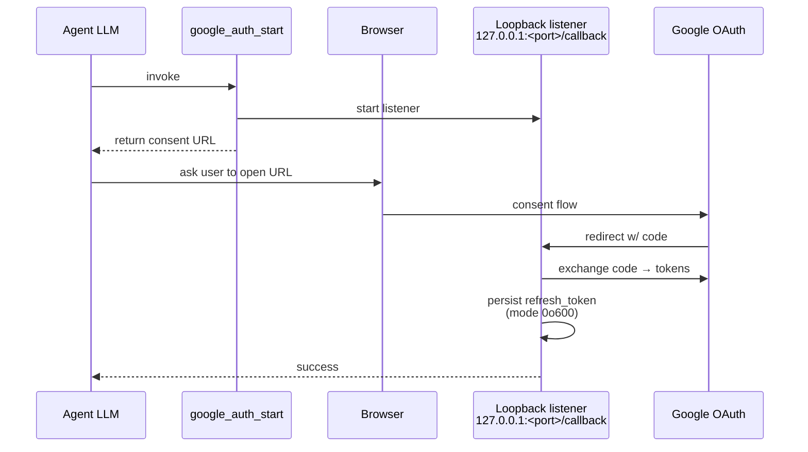

# Google (OAuth, Gmail, Calendar, Drive) + gmail-poller

Two related subsystems:

- **`google` plugin** — per-agent OAuth client plus a generic
  `google_call` tool that lets an agent hit any Google API the
  granted scopes allow
- **`gmail-poller` plugin** — cron-style scheduler that polls Gmail,
  matches subjects/bodies with regex, and dispatches results to any
  outbound topic (WhatsApp, Telegram, another agent)

Sources: `crates/plugins/google/` and `crates/plugins/gmail-poller/`.

## `google` — per-agent OAuth

### Config

Two shapes supported:

**Preferred (Phase 17)** — declare accounts in a dedicated store and
bind them from the agent via [`credentials.google`](../config/credentials.md):

```yaml
# config/plugins/google-auth.yaml
google_auth:
  accounts:
    - id: ana@gmail.com
      agent_id: ana                     # 1:1; gauntlet enforces the binding
      client_id_path:     ./secrets/google/ana_client_id.txt
      client_secret_path: ./secrets/google/ana_client_secret.txt
      token_path:         ./secrets/google/ana_token.json
      scopes:
        - https://www.googleapis.com/auth/gmail.modify
```

Gmail-poller picks these up automatically; agents see `google_*` tools
when the store has an entry matching their `agent_id`.

**Legacy inline** (still works, logs a migration warn):

```yaml
# agents.yaml
google_auth:
  client_id: ${GOOGLE_CLIENT_ID}
  client_secret: ${file:./secrets/google_secret.txt}
  scopes:
    - gmail.readonly
    - gmail.send
    - calendar
    - drive.file
  token_file: ./data/workspace/ana/google_token.json
  redirect_port: 17653
```

| Field | Default | Purpose |
|-------|---------|---------|
| `client_id` / `client_secret` | — | OAuth app creds from Google Cloud Console. |
| `scopes` | — | OAuth scopes. Short-form (`gmail.readonly`) auto-expanded to full URL. |
| `token_file` | `google_tokens.json` | Persistent refresh-token JSON. Relative paths resolve from workspace. |
| `redirect_port` | `8765` | Loopback callback port. Must match the "Authorized redirect URI" in the OAuth client. |

### Pairing flow



The wizard wraps this as a one-shot step, but runtime tools expose
the same primitives for re-auth.

### Device-code flow (headless setup)

`agent setup google` offers a second consent path that does not
require a local browser — useful for servers, CI, and SSH-only
environments. The wizard:

1. POSTs to `oauth2.googleapis.com/device/code` with the account's
   `client_id` and scopes.
2. Prints a 6-character `user_code` + a `verification_url` to the
   terminal.
3. Polls `oauth2.googleapis.com/token` (default every 5 s) until
   the operator approves on **any** device.
4. Persists the resulting refresh_token at `token_path` with
   mode `0o600`.

```
╭─ Device-code OAuth ───────────────────────────────────────
│  Open in any browser:          https://www.google.com/device
│  Code to enter:                HBQM-WLNF
│  (valid for 1800s)
╰───────────────────────────────────────────────────────────

Waiting for approval...
✔ Tokens persisted at ./secrets/ana_google_token.json.
```

The Google Cloud Console OAuth client must be type **"TVs and
Limited Input devices"** for this flow — Desktop/Web clients reject
device-code with `client_type_disabled`.

### Lazy-refresh of `client_id` / `client_secret`

`GoogleAuthClient.config` is `ArcSwap<GoogleAuthConfig>`. Every
network call (`exchange_code`, `request_device_code`,
`poll_device_token`, `refresh_token`) first invokes
`refresh_secrets_if_changed`, which compares mtime on
`client_id_path` and `client_secret_path` and re-reads them when
they advance. Rotating the secret files (e.g. quarterly key
rotation in Google Cloud Console) takes effect on the **next**
tool call without a daemon restart.

Steady-state cost: one `fs::metadata` call per outbound request.
Audit trail (target `credentials.audit`):

```
INFO event="google_secrets_refreshed" \
  google_*: re-read client_id/client_secret after on-disk rotation
```

### Tools exposed

| Tool | Purpose |
|------|---------|
| `google_auth_start` | Start OAuth, return the consent URL. |
| `google_auth_status` | Report `{authenticated, expires_in_secs, has_refresh, scopes}`. Safe to poll. |
| `google_call` | Generic `{method, url, body?}` against any `*.googleapis.com` endpoint. Auto-refreshes access token. |
| `google_auth_revoke` | Revoke the refresh token; forces full re-auth. |

### Supported APIs

Anything under `*.googleapis.com` that the granted scopes permit.
Common call shapes:

- **Gmail v1** — `https://gmail.googleapis.com/gmail/v1/users/me/messages?q=is:unread`
- **Calendar v3** — `https://www.googleapis.com/calendar/v3/calendars/primary/events`
- **Drive v3** — `https://www.googleapis.com/drive/v3/files?q=mimeType='application/pdf'`
- **Sheets v4** — `https://sheets.googleapis.com/v4/spreadsheets/<id>/values/A1:D10`

### Gotchas

- **401 means the refresh token was revoked.** Re-auth via
  `google_auth_start`.
- **403 means a scope wasn't granted.** Add the scope, revoke, re-auth.
- **Token file leaks → revoke immediately.** The file holds a
  refresh token with the granted scopes.

## `gmail-poller` — cron-style Gmail bridge

Poll Gmail, extract fields via regex, render a template, dispatch to
any outbound topic. Multi-account, allowlisted by sender substring,
rate-limited per dispatch.

### Config

```yaml
# config/plugins/gmail-poller.yaml
gmail_poller:
  enabled: true
  interval_secs: 60
  accounts:
    - id: default
      agent_id: ana           # Phase 17 — binds the account to an agent; defaults to `id` when omitted
      token_path: ./data/workspace/ana/google_token.json
      client_id_path: ./secrets/google_client_id.txt
      client_secret_path: ./secrets/google_client_secret.txt
  jobs:
    - name: lead_forward
      account: default
      query: "is:unread subject:(lead OR interesado)"
      newer_than: 1d
      interval_secs: 120
      forward_to_subject: plugin.outbound.whatsapp.default
      forward_to: "573000000000@s.whatsapp.net"
      extract:
        name: "Nombre:\\s*(.+)"
        phone: "Tel:\\s*(\\+?\\d+)"
      require_fields: [name, phone]
      message_template: |
        New lead 🚨
        {name} — {phone}
        Subject: {subject}
        {snippet}
      mark_read_on_dispatch: true
      max_per_tick: 20
      dispatch_delay_ms: 1000
      sender_allowlist: ["@mycompany.com", "partners@"]
```

### Per-job fields

| Field | Default | Purpose |
|-------|---------|---------|
| `name` | — (required) | Job id. |
| `account` | `"default"` | Which OAuth account to use. |
| `query` | — (required) | Gmail search (`is:unread`, etc.). |
| `newer_than` | — | Gmail `newer_than:` suffix (`1d`, `2h`) — avoids back-filling. |
| `interval_secs` | root interval | Override per-job poll cadence. |
| `forward_to_subject` | — | Broker topic to publish dispatched message. |
| `forward_to` | — | Recipient passed through (JID, chat id, phone). |
| `extract` | `{}` | Named regex groups applied to the email body. First group wins. |
| `require_fields` | `[]` | Skip dispatch if any listed extracted field is empty. |
| `message_template` | — (required) | Template with `{field}`, `{subject}`, `{snippet}` placeholders. |
| `mark_read_on_dispatch` | `true` | Mark the thread as read after successful dispatch. |
| `dispatch_delay_ms` | `1000` | Sleep between multi-match dispatches. |
| `max_per_tick` | `20` | Hard cap per poll cycle. |
| `sender_allowlist` | `[]` | Substring/domain filter on `From:` header. Empty = accept all. |

### Event shape

```json
{
  "to": "<forward_to>",
  "kind": "text",
  "text": "<rendered message_template>",
  "subject": "<email subject>",
  "<extract key>": "<captured group>"
}
```

Published to `<forward_to_subject>`.

### Error backoff

Sustained errors are backed off: `[0, 0, 0, 30, 60, 120, 300]` seconds
(caps at 300). Transient failures don't stop the poll loop.

### Gotchas

- **Gmail API only — no IMAP.** This plugin is Google-specific. For
  generic IMAP triage, use a custom extension.
- **`sender_allowlist` is substring, not regex.** Simpler to read,
  simpler to get wrong. Quote boundary characters explicitly.
- **`extract` regex must compile.** Invalid regex fails the whole
  job at boot with an error naming the field.

## See also

- [Setup wizard — Google OAuth](../getting-started/setup-wizard.md#google-oauth)
- [Config — agents.yaml (per-agent `google_auth`)](../config/agents.md#google-auth-per-agent-oauth)
