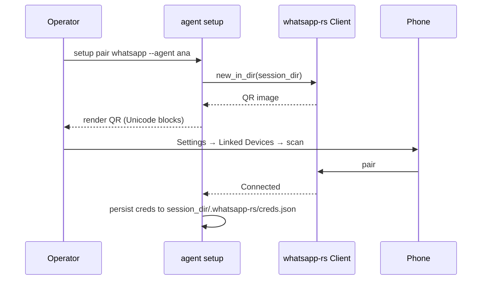

# WhatsApp

End-to-end WhatsApp channel: Signal Protocol pairing, inbound
message bridge, outbound send/reply/reaction/media tools, optional
voice transcription.

Source: `crates/plugins/whatsapp/` (thin wrapper over the
`whatsapp-rs` crate).

## Topics

| Direction | Subject | Notes |
|-----------|---------|-------|
| Inbound | `plugin.inbound.whatsapp` | Legacy single-account |
| Inbound | `plugin.inbound.whatsapp.<instance>` | Multi-account routing |
| Outbound | `plugin.outbound.whatsapp` | Legacy single-account |
| Outbound | `plugin.outbound.whatsapp.<instance>` | Multi-account routing |

During pairing the plugin also publishes `qr` lifecycle events on the
inbound topic so the wizard can render the QR.

## Config

```yaml
# config/plugins/whatsapp.yaml
whatsapp:
  enabled: true
  session_dir: ""            # empty → per-agent default
  media_dir: ./data/media/whatsapp
  instance: default
  acl:
    allow_list: []           # empty + empty env = open ACL
    from_env: WA_AGENT_ALLOW
  behavior:
    ignore_chat_meta: true
    ignore_from_me: true
    ignore_groups: false
  bridge:
    response_timeout_ms: 30000
    on_timeout: noop         # noop | apology_text
  transcriber:
    enabled: false
    skill: whisper
  public_tunnel:
    enabled: false
    only_until_paired: true
```

Key fields:

| Field | Default | Purpose |
|-------|---------|---------|
| `session_dir` | per-agent | Signal Protocol state. Each account needs its own dir. |
| `instance` | `None` | Label for multi-account routing. Unlabelled keeps the legacy bare topic. |
| `allow_agents` | `[]` | Agents permitted to publish from this instance. Empty = accept any agent holding a resolver handle. Defense-in-depth for the per-agent [`credentials`](../config/credentials.md) binding. |
| `acl.allow_list` | `[]` | Bare JIDs allowed to reach the agent. Empty **+** empty env = open. |
| `behavior.ignore_chat_meta` | `true` | Skip muted / archived / locked chats on the phone. |
| `behavior.ignore_from_me` | `true` | Drop the agent's own replies to prevent loops. |
| `behavior.ignore_groups` | `false` | Skip group chats entirely when `true`. |
| `bridge.response_timeout_ms` | `30000` | Per-message handler deadline. |
| `bridge.on_timeout` | `noop` | `noop` (no reply) or `apology_text`. |
| `transcriber.enabled` | `false` | Voice → text via `skill`. |
| `public_tunnel.enabled` | `false` | Expose `/whatsapp/pair` through a Cloudflare tunnel. |
| `public_tunnel.only_until_paired` | `true` | Tear down the tunnel after `Connected`. |

## Pairing

Pairing is **setup-time only**. The runtime refuses to start without
paired credentials.



- Credentials at `<session_dir>/.whatsapp-rs/creds.json`
- Daemon-collision check at `<session_dir>/.whatsapp-rs/daemon.json`
  blocks a second process on the same account
- Multi-account via `Client::new_in_dir()` — no XDG_DATA_HOME mutation
- Credential expiry mid-run (401 loop) → operator must re-pair; no
  runtime QR fallback

## Tools exposed to the LLM

| Tool | Signature | Notes |
|------|-----------|-------|
| `whatsapp_send_message` | `(to, text)` | Send to arbitrary JID. |
| `whatsapp_send_reply` | `(chat, reply_to_msg_id, text)` | Quote a specific inbound message. |
| `whatsapp_send_reaction` | `(chat, msg_id, emoji)` | Emoji tap-back. |
| `whatsapp_send_media` | `(to, file_path, caption?, mime?)` | File attachment. |

All tools honor the per-binding `outbound_allowlist.whatsapp` —
empty list = unrestricted, populated = hard allowlist.

## Event shapes

Inbound payloads (on `plugin.inbound.whatsapp[.<instance>]`):

```json
// message
{
  "kind": "message",
  "from": "573000000000@s.whatsapp.net",
  "chat": "573000000000@s.whatsapp.net",
  "text": "hi",
  "reply_to": null,
  "is_group": false,
  "timestamp": 1714000000,
  "msg_id": "3EB0..."
}

// media_received
{
  "kind": "media_received",
  "from": "...",
  "chat": "...",
  "msg_id": "...",
  "local_path": "./data/media/whatsapp/abc.jpg",
  "mime": "image/jpeg",
  "caption": null
}

// qr  (pairing only)
{"kind": "qr", "ascii": "...", "png_base64": "...", "expires_at": ...}

// lifecycle
{"kind": "connected" | "disconnected" | "reconnecting" | "credentials_expired"}

// observability
{"kind": "bridge_timeout", "msg_id": "...", "waited_ms": 30000}
```

## Gotchas

- **Shared `session_dir` across agents = cross-delivery.** Each agent
  should point at its own `<workspace>/whatsapp/default`. The wizard
  does this automatically; manual configs need care.
- **`ignore_chat_meta: true` silently skips muted/archived chats.**
  If a user archives a chat on the phone, the agent never sees it
  again until they unarchive.
- **Credential expiry is irreversible without re-pair.** `whatsapp-rs`
  will loop on 401. Watch for `credentials_expired` lifecycle events
  and alert.

See [Setup wizard — WhatsApp pairing](../getting-started/setup-wizard.md#whatsapp-pairing).
