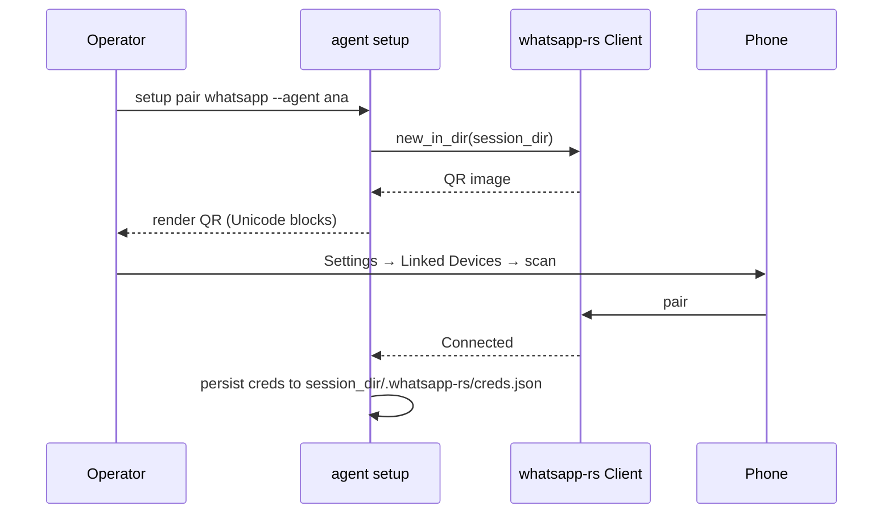

# WhatsApp

End-to-end WhatsApp channel: Signal Protocol pairing, inbound
message bridge, outbound send/reply/reaction/media tools, optional
voice transcription.

Source: standalone repo at
[`nexo-rs-plugin-whatsapp`](https://github.com/lordmacu/nexo-plugin-whatsapp)
(extracted from `crates/plugins/whatsapp/` per Phase 81.19.a;
see [`PHASES.md`](https://github.com/lordmacu/nexo-rs/blob/main/PHASES.md#phase-8119a-plugin-whatsapp-standalone-repo-extraction-shape-b-)
for the migration notes). The crate ships as a `lib + bin`
Shape B package: the lib re-exports `WhatsappPlugin` for an
Android embedded host tomorrow, the bin is the subprocess
entrypoint the daemon spawns per `cfg.plugins.whatsapp` entry
(Phase 81.18.b.2). Internally the plugin wraps the `wa-agent`
(a.k.a. `whatsapp-rs`) crate for Signal Protocol session
lifecycle, QR pairing and the Bot API surface.

## Install (Phase 81.18.b.2 — operator action required)

The daemon stopped constructing `WhatsappPlugin` in-tree as of
Phase 81.18.b.2; it spawns the standalone subprocess binary
per cfg entry. Operators with `cfg.plugins.whatsapp` populated
**must** install the binary and surface its directory through
`plugins.discovery.search_paths` before starting the daemon, or
the discovery walker logs a clear warning and the plugin never
boots:

```bash
# Build + install from source
cargo install --git https://github.com/lordmacu/nexo-plugin-whatsapp \
    --tag v0.1.2

# Or download a release tarball (linux-x64 / macos-arm64) from
#   https://github.com/lordmacu/nexo-plugin-whatsapp/releases
```

Then in `agents.yaml`:

```yaml
plugins:
  discovery:
    search_paths:
      - ~/.cargo/bin   # or wherever you installed the binary
```

Each `cfg.plugins.whatsapp[]` entry maps to one subprocess; per-
instance state (`session_dir` Signal Protocol creds, `media_dir`,
`instance` topic suffix, `bridge.response_timeout_ms`,
`acl.allow_list`) is seeded into the child via
`NEXO_PLUGIN_WHATSAPP_*` env vars at spawn time. Multi-account
operators get true process isolation — one bot's
`creds.json` corruption can't take down the others.

The admin RPC `/whatsapp/<instance>/pair*` HTTP endpoints keep
working: a daemon-side broker subscriber
(`spawn_whatsapp_pairing_state_subscriber`) listens on
`plugin.inbound.whatsapp.>` and mirrors the subprocess's
`Connected` / `Disconnected` / `Reconnecting` / `Qr` events
into a daemon-owned `PairingState` per instance.

### Known limitation (Phase 81.20.c follow-up)

Subprocess whatsapp instances do **not** currently surface
`AgentEventKind::PeerTyping` events on the SSE live transcript
stream. The daemon's `AgentEventEmitter` Arc doesn't cross the
process boundary; bridging typing events through the broker
ships in follow-up `81.20.c.typing-presence-rpc`. Inbound
message routing, outbound dispatch, pairing UI, and reconnect
telemetry are unaffected.

## Topics

| Direction | Subject | Notes |
|-----------|---------|-------|
| Inbound | `plugin.inbound.whatsapp` | Legacy single-account |
| Inbound | `plugin.inbound.whatsapp.<instance>` | Multi-account routing |
| Outbound | `plugin.outbound.whatsapp` | Legacy single-account |
| Outbound | `plugin.outbound.whatsapp.<instance>` | Multi-account routing |

During pairing the plugin also publishes `qr` lifecycle events on the
inbound topic so the wizard can render the QR.

## Config

```yaml
# config/plugins/whatsapp.yaml
whatsapp:
  enabled: true
  session_dir: ""            # empty → per-agent default
  media_dir: ./data/media/whatsapp
  instance: default
  acl:
    allow_list: []           # empty + empty env = open ACL
    from_env: WA_AGENT_ALLOW
  behavior:
    ignore_chat_meta: true
    ignore_from_me: true
    ignore_groups: false
  bridge:
    response_timeout_ms: 30000
    on_timeout: noop         # noop | apology_text
  transcriber:
    enabled: false
    skill: whisper
  public_tunnel:
    enabled: false
    only_until_paired: true
```

Key fields:

| Field | Default | Purpose |
|-------|---------|---------|
| `session_dir` | per-agent | Signal Protocol state. Each account needs its own dir. |
| `instance` | `None` | Label for multi-account routing. Unlabelled keeps the legacy bare topic. |
| `allow_agents` | `[]` | Agents permitted to publish from this instance. Empty = accept any agent holding a resolver handle. Defense-in-depth for the per-agent [`credentials`](../config/credentials.md) binding. |
| `acl.allow_list` | `[]` | Bare JIDs allowed to reach the agent. Empty **+** empty env = open. |
| `behavior.ignore_chat_meta` | `true` | Skip muted / archived / locked chats on the phone. |
| `behavior.ignore_from_me` | `true` | Drop the agent's own replies to prevent loops. |
| `behavior.ignore_groups` | `false` | Skip group chats entirely when `true`. |
| `bridge.response_timeout_ms` | `30000` | Per-message handler deadline. |
| `bridge.on_timeout` | `noop` | `noop` (no reply) or `apology_text`. |
| `transcriber.enabled` | `false` | Voice → text via `skill`. |
| `public_tunnel.enabled` | `false` | Expose `/whatsapp/pair` through a Cloudflare tunnel. |
| `public_tunnel.only_until_paired` | `true` | Tear down the tunnel after `Connected`. |

## Pairing

Pairing is **setup-time only**. The runtime refuses to start without
paired credentials.


```mermaid
sequenceDiagram
    participant U as Operator
    participant W as agent setup
    participant WA as whatsapp-rs Client
    participant P as Phone

    U->>W: setup pair whatsapp --agent ana
    W->>WA: new_in_dir(session_dir)
    WA-->>W: QR image
    W-->>U: render QR (Unicode blocks)
    U->>P: Settings → Linked Devices → scan
    P->>WA: pair
    WA-->>W: Connected
    W->>W: persist creds to session_dir/.whatsapp-rs/creds.json
```

- Credentials at `<session_dir>/.whatsapp-rs/creds.json`
- Daemon-collision check at `<session_dir>/.whatsapp-rs/daemon.json`
  blocks a second process on the same account
- Multi-account via `Client::new_in_dir()` — no XDG_DATA_HOME mutation
- Credential expiry mid-run (401 loop) → operator must re-pair; no
  runtime QR fallback

## Tools exposed to the LLM

| Tool | Signature | Notes |
|------|-----------|-------|
| `whatsapp_send_message` | `(to, text)` | Send to arbitrary JID. |
| `whatsapp_send_reply` | `(chat, reply_to_msg_id, text)` | Quote a specific inbound message. |
| `whatsapp_send_reaction` | `(chat, msg_id, emoji)` | Emoji tap-back. |
| `whatsapp_send_media` | `(to, file_path, caption?, mime?)` | File attachment. |

All tools honor the per-binding `outbound_allowlist.whatsapp` —
empty list = unrestricted, populated = hard allowlist.

## Event shapes

Inbound payloads (on `plugin.inbound.whatsapp[.<instance>]`):

```json
// message
{
  "kind": "message",
  "from": "573000000000@s.whatsapp.net",
  "chat": "573000000000@s.whatsapp.net",
  "text": "hi",
  "reply_to": null,
  "is_group": false,
  "timestamp": 1714000000,
  "msg_id": "3EB0..."
}

// media_received
{
  "kind": "media_received",
  "from": "...",
  "chat": "...",
  "msg_id": "...",
  "local_path": "./data/media/whatsapp/abc.jpg",
  "mime": "image/jpeg",
  "caption": null
}

// qr  (pairing only)
{"kind": "qr", "ascii": "...", "png_base64": "...", "expires_at": ...}

// lifecycle
{"kind": "connected" | "disconnected" | "reconnecting" | "credentials_expired"}

// observability
{"kind": "bridge_timeout", "msg_id": "...", "waited_ms": 30000}
```

## Presence indicators

While the agent prepares a reply, the WhatsApp plugin pulses the
`<chatstate>` stanza on the peer phone so the user sees a live
"escribiendo…" / "grabando audio…" indicator instead of dead
silence. The wire shape matches what WhatsApp Web emits natively:

```xml
<!-- text reply (default) -->
<chatstate to="JID"><composing/></chatstate>

<!-- voice note about to be sent -->
<chatstate to="JID"><composing media="audio"/></chatstate>

<!-- pulse stops -->
<chatstate to="JID"><paused/></chatstate>
```

The plugin switches the `media` attr automatically based on the
outbound `OutboundReplyKind`:

- **Text reply** → `<composing/>` for the LLM round-trip; pauses
  before the message lands.
- **Voice note (PTT)** → `<composing/>` while the LLM thinks,
  flips to `<composing media="audio"/>` ~250 ms before the
  upload + ack so the peer client has time to repaint
  "grabando audio…", then pauses.
- **Image / video / document** → not media-flagged in v1
  (queued as follow-up).

Proactive voice notes (microapp-driven, no inbound trigger) get
the same recording-presence wrap via the outbound dispatcher,
so the indicator is consistent regardless of who initiated the
send.

### `typing_mode` knob

Plugin-instance YAML override. Default reproduces the historic
behaviour.

```yaml
whatsapp:
  enabled: true
  session_dir: ...
  typing_mode: instant   # default; see table below
```

| Value      | v1 behaviour                                                                                          |
|------------|-------------------------------------------------------------------------------------------------------|
| `instant`  | Heartbeat starts the moment the handler is invoked. Recommended default.                              |
| `thinking` | Documented for parity with future reasoning-stream support; v1 falls back to `instant` + warn-log.    |
| `message`  | Documented for parity with future first-text-delta support; v1 falls back to `instant` + warn-log.    |
| `never`    | Skips the heartbeat entirely. Use when the bot should stay invisible (no presence cycling at all).    |

Unknown values warn-degrade to `instant` rather than failing
boot, so a YAML typo cannot wedge the daemon.

The keepalive cadence (10 s), TTL safety cap (60 s) and
consecutive-failure circuit breaker (2 strikes) are not exposed
as YAML knobs in v1 — the defaults are what every agent wants.
Crate consumers that need other values can pass a
`PresenceHeartbeatConfig` through
`Session::chat_presence_heartbeat_with` directly.

### Old-client compatibility

Pre-2021 WhatsApp clients ignore the `media` attribute and paint
"escribiendo…" regardless. That's a degradation but harmless: the
voice note still arrives; only the indicator lies. Affects
<0.5 % of installs.

## Idioma del agente y voz (locale BCP-47)

The agent's `language` field accepts a full BCP-47 locale —
`es-AR`, `es-ES`, `es-US`, `en-GB`, `pt-BR`, etc. — and the
runtime honours both the language and the region for three
things on every turn:

1. **Per-locale system addendum** locks the LLM into the
   regional register: voseo for `es-AR` (`vos`, `tenés`,
   `podés`), tuteo + castellano vocab for `es-ES`
   (`vosotros`, `vale`, `coger`), Spanglish-aware for `es-US`
   (loanwords like `email`/`parking` not auto-translated),
   British spelling + vocab for `en-GB`, etc. Operators
   shipping `language: "es"` (no region) get a Latam-neutral
   tuteo template.

2. **Voice-mode SSML tutorial** — when voice mode is toggled
   for the conversation, the marker tutorial appended to the
   system prompt uses the locale's native register (so the
   examples don't teach the LLM a dialect it shouldn't speak).

3. **Default Edge voice** — when the per-conversation
   `voice_id` is the install-wide default, the picker resolves
   a region-matched voice:

   | Locale  | Voice                  |
   |---------|------------------------|
   | `es-AR` | `es-AR-ElenaNeural`    |
   | `es-MX` | `es-MX-DaliaNeural`    |
   | `es-ES` | `es-ES-ElviraNeural`   |
   | `es-CO` | `es-CO-SalomeNeural`   |
   | `es-PE` | `es-PE-CamilaNeural`   |
   | `es-CL` | `es-CL-CatalinaNeural` |
   | `es-US` | `es-US-PalomaNeural`   |
   | `en-US` | `en-US-AriaNeural`     |
   | `en-GB` | `en-GB-SoniaNeural`    |
   | `en-AU` | `en-AU-NatashaNeural`  |
   | `en-CA` | `en-CA-ClaraNeural`    |
   | `pt-BR` | `pt-BR-FranciscaNeural`|
   | `pt-PT` | `pt-PT-RaquelNeural`   |
   | `fr-FR` | `fr-FR-DeniseNeural`   |
   | `fr-CA` | `fr-CA-SylvieNeural`   |
   | `it-IT` | `it-IT-ElsaNeural`     |
   | `de-DE` | `de-DE-KatjaNeural`    |
   | `ja-JP` | `ja-JP-NanamiNeural`   |
   | `zh-CN` | `zh-CN-XiaoxiaoNeural` |

   Language-only locales fall back to the canonical region
   (`es` → `es-MX`, `en` → `en-US`, `pt` → `pt-BR`, …).
   Operators with a manually-picked `voice_id` keep their
   choice; the picker only fires when the stored voice is the
   install default.

The supported locale set is closed (lives in
`nexo_microapp_sdk::Locale`); unsupported strings (`klingon`,
`es-419`, `zh-Hant`) are rejected by the admin RPC with
`invalid_locale` so a YAML typo cannot reach the daemon.

### Behaviour change — `language: "es"` agents

Before this change, `language: "es"` agents inherited an
Argentine voseo flavour from the legacy voice-mode addendum
constant. The new behaviour routes `language: "es"` to the
**Latam-neutral** template (tuteo, no voseo). Operators who
want the previous Argentine flavour set `language: "es-AR"`
explicitly.

## Gotchas

- **Shared `session_dir` across agents = cross-delivery.** Each agent
  should point at its own `<workspace>/whatsapp/default`. The wizard
  does this automatically; manual configs need care.
- **`ignore_chat_meta: true` silently skips muted/archived chats.**
  If a user archives a chat on the phone, the agent never sees it
  again until they unarchive.
- **Credential expiry is irreversible without re-pair.** `whatsapp-rs`
  will loop on 401. Watch for `credentials_expired` lifecycle events
  and alert.

See [Setup wizard — WhatsApp pairing](../getting-started/setup-wizard.md#whatsapp-pairing).
