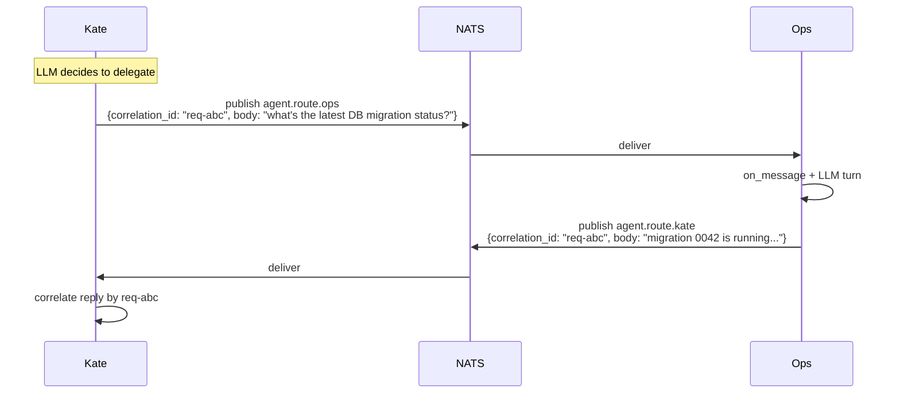

# Agent-to-agent delegation

Route work from one agent to another using `agent.route.<target_id>`
with a correlation id. Typical shapes:

- Kate delegates research to `ops` and waits for the reply
- Ana fans out lead data to `crm-bot`, `ticket-bot`, and `logger`
- A supervisor agent orchestrates specialist subagents

## Prerequisites

- Two agents configured in `config/agents.yaml` (and/or `agents.d/`)
- NATS running
- Either agent can be the caller or callee; the topology is
  symmetric

## Agent config

```yaml
agents:
  - id: kate
    model: { provider: minimax, model: MiniMax-M2.5 }
    plugins: [telegram]
    inbound_bindings: [{ plugin: telegram }]
    allowed_delegates: [ops, crm-bot]
    description: "Personal assistant; delegates research to ops."

  - id: ops
    model: { provider: minimax, model: MiniMax-M2.5 }
    accept_delegates_from: [kate]
    description: "Operations agent; answers factual questions about systems."
```

Key fields:

- `allowed_delegates` (on the caller) — globs of peer ids this agent
  may route to. Empty = no restriction.
- `accept_delegates_from` (on the callee) — inverse gate. Empty = no
  restriction.
- `description` — injected into both sides' `# PEERS` block so the
  LLM knows who can do what.

Both gates are glob lists and can be set on either side or both.

## Wire shape



Correlation ids are caller-chosen strings. The callee echoes the id
back on the reply; the caller uses it to match replies to requests
(especially for fan-out + reassemble patterns).

## Using the `delegate` tool

The runtime exposes a `delegate` tool whenever `allowed_delegates` is
non-empty. LLM call shape:

```json
{
  "name": "delegate",
  "args": {
    "to": "ops",
    "body": "what's the latest DB migration status?"
  }
}
```

The runtime:

1. Generates a fresh `correlation_id`
2. Publishes to `agent.route.ops` with that id
3. Waits (bounded) for the reply on `agent.route.kate`
4. Returns the body as the tool result

Timeouts and retry policy match the broker defaults — the circuit
breaker on the target topic protects against an unreachable callee.

## Fan-out

To fan out to multiple peers, the LLM can issue several `delegate`
calls in one turn. The runtime issues each with a unique
correlation_id and gathers the replies in parallel.

## Guardrails

- **Self-delegation is rejected** at the manager level.
- **Unknown target id** → tool returns an error result, no broker
  traffic.
- **`allowed_delegates` empty + no constraint** means the agent can
  delegate to any peer — prefer an explicit list in production.

## Observability

Every delegation emits two log lines (dispatch + reply) with
structured fields:

```json
{"agent": "kate", "target": "ops", "correlation_id": "...", "event": "delegate_dispatch"}
{"agent": "kate", "target": "ops", "correlation_id": "...", "event": "delegate_reply", "latency_ms": 1342}
```

Filter on `correlation_id` to trace a single delegation end to end.

## Cross-links

- [Event bus — agent-to-agent routing](../architecture/event-bus.md#agent-to-agent-routing)
- [Config — agents.yaml (delegation fields)](../config/agents.md#agent-to-agent-delegation)
