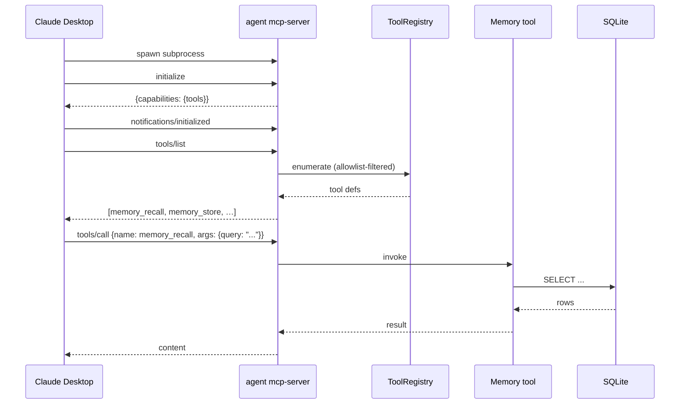

# MCP server from Claude Desktop

Expose nexo-rs tools (memory, Gmail, WhatsApp send, browser, etc.)
to the Anthropic desktop app so your agent-sandboxed capabilities
show up inside Claude conversations.

Same technique works for Cursor, Zed, and anything else that speaks
MCP — the config shape is identical.

## Prerequisites

- Built `agent` binary at a known path (e.g. `/usr/local/bin/agent`)
- A working `config/` directory (reuse the one your daemon normally
  uses, or point at a dedicated one)
- Anthropic API key (or OAuth bundle) configured for the agent

## 1. Enable the MCP server

`config/mcp_server.yaml`:

```yaml
enabled: true
name: nexo
allowlist:
  - memory_*           # recall + store + history
  - forge_memory_checkpoint
  - google_*           # if you paired Google OAuth
  - browser_*          # if you want Claude to drive Chrome
expose_proxies: false  # hide ext_* and mcp_* from the IDE
auth_token_env: ""     # leave empty for local spawn; set if tunneling
```

Pick the **smallest** allowlist that covers what you want the IDE to
do. Each glob is power you're handing the IDE user.

## 2. Wire Claude Desktop

Edit `~/Library/Application Support/Claude/claude_desktop_config.json`
(macOS) or `%APPDATA%\Claude\claude_desktop_config.json` (Windows):

```json
{
  "mcpServers": {
    "nexo": {
      "command": "/usr/local/bin/agent",
      "args": ["mcp-server", "--config", "/srv/nexo-rs/config"],
      "env": {
        "RUST_LOG": "info",
        "AGENT_LOG_FORMAT": "json"
      }
    }
  }
}
```

Restart Claude Desktop. The `nexo` block should appear in the tool
picker; pick tools from it the same way you pick built-ins.

## 3. Verify

Ask Claude: "use the nexo tool `my_stats` and show me the output."

If it works, Claude calls `agent mcp-server` as a subprocess, which
emits JSON-RPC over stdin/stdout. Logs hit Claude's app-level log
file plus stderr of the spawned agent (configurable via
`AGENT_LOG_FORMAT=json`).

## Wire shape



## Recipes within the recipe

### Recall my cross-session memory from Claude

Allowlist:

```yaml
allowlist:
  - memory_recall
  - memory_history
```

Now inside a Claude conversation: "recall what I told you about
Luis's address last week." Claude calls `memory_recall` on your
agent's SQLite — Claude itself has no persistent memory; this is how
you give it one.

### Post to WhatsApp from Claude

Allowlist:

```yaml
allowlist:
  - whatsapp_send_message
```

**⚠ Be careful.** This gives whoever sits at the IDE the ability to
send WhatsApp messages from your paired account. Only enable if you
trust the IDE user as much as you'd trust the agent.

### Read-only Gmail from Claude

Allowlist:

```yaml
allowlist:
  - google_auth_status
  - google_call
```

Pair with `GOOGLE_ALLOW_SEND=` (unset) to keep the `google_call`
tool read-only.

## Auth token

If you expose the MCP server over a tunnel (not a local spawn), set
`auth_token_env` to guard the `initialize` call:

```yaml
auth_token_env: NEXO_MCP_TOKEN
```

Then set `NEXO_MCP_TOKEN` in the agent's env and have the client
send it on initialize. Clients that don't present the token are
rejected.

## Gotchas

- **`expose_proxies: true` transitively exposes every upstream MCP
  server.** If the agent already consumes a Gmail MCP server, turning
  this on lets Claude reach through — usually not what you want.
- **Allowlist globs match whole tool names.** `memory_*` is OK;
  `mem*` is not — enumerate with `agent ext list` and real tool names
  before wiring globs.
- **Rate limits still apply.** `whatsapp_send_message` through this
  path counts against the same WhatsApp rate bucket as the agent's
  own uses.

## Cross-links

- [MCP — agent as server](../mcp/server.md)
- [MCP — introduction](../mcp/introduction.md)
- [CLI reference — `mcp-server`](../cli/reference.md#mcp-server)
