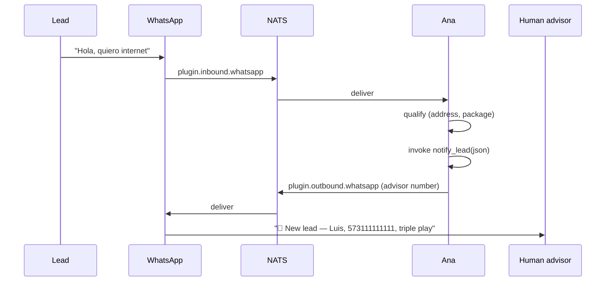

# WhatsApp sales agent

Build a drop-in agent that handles a sales line on WhatsApp:

- Greets the lead with the right operator (ETB / Claro / generic)
- Qualifies via a short scripted flow (address, package, budget)
- Notifies a human on hot leads, narrows the tool surface so the LLM
  only ever sees the lead-notification tool

This is the production shape of the shipped `ana` agent.

## Prerequisites

- `agent` built (`cargo build --release`)
- NATS running (`docker run -p 4222:4222 nats:2.10-alpine`)
- A MiniMax M2.5 key
- A phone with WhatsApp ready to scan a QR

## 1. Provide the LLM key

```bash
export MINIMAX_API_KEY=...
export MINIMAX_GROUP_ID=...
```

## 2. Create a gitignored agent file

`config/agents.d/ana.yaml` is gitignored; put the business-sensitive
content there.

```yaml
agents:
  - id: ana
    model:
      provider: minimax
      model: MiniMax-M2.5
    plugins: [whatsapp]
    inbound_bindings:
      - plugin: whatsapp
    allowed_tools:
      - notify_lead                        # only this tool is visible
    outbound_allowlist:
      whatsapp:
        - "573000000000@s.whatsapp.net"    # human advisor's WA
    workspace: ./data/workspace/ana
    workspace_git:
      enabled: true
    heartbeat:
      enabled: false
    system_prompt: |
      Eres Ana, asesora comercial de ETB y Claro. Ayudas a los clientes
      a elegir el mejor plan de internet, TV y telefonía.

      Al recibir el primer mensaje:
      - Si contiene "etb" → flujo ETB directo
      - Si contiene "claro" → flujo Claro directo
      - En otro caso pregunta cuál operador.

      Captura: nombre, dirección, estrato, preferencia (solo internet /
      internet+TV / triple play).

      Cuando el lead esté listo invoca `notify_lead` con un JSON que
      contenga: {name, phone, address, operator, package, notes}. No
      intentes llamar a nadie más — esa es tu única herramienta.
```

## 3. Pair WhatsApp for this agent

```bash
./target/release/agent setup whatsapp
```

The wizard creates `./data/workspace/ana/whatsapp/default/`, flips
`config/plugins/whatsapp.yaml::whatsapp.session_dir` to point at it,
and renders a QR. Scan from the WhatsApp app.

## 4. Ship the `notify_lead` tool as an extension

Copy the Rust template and rename:

```bash
cp -r extensions/template-rust extensions/notify-lead
cd extensions/notify-lead
```

Edit `plugin.toml`:

```toml
[plugin]
id = "notify-lead"
version = "0.1.0"

[capabilities]
tools = ["notify_lead"]

[transport]
type = "stdio"
command = "./target/release/notify-lead"
```

Implement `tools/notify_lead` in `src/main.rs` — it should publish
to `plugin.outbound.whatsapp.default` with a recipient = the human
advisor number you listed in `outbound_allowlist`.

Build and install:

```bash
cargo build --release
cd ../..
./target/release/agent ext install ./extensions/notify-lead --link --enable
./target/release/agent ext doctor --runtime
```

## 5. Run

```bash
./target/release/agent --config ./config
```

## Flow diagram



## Why this shape works

- **`allowed_tools: [notify_lead]`** prevents the LLM from hallucinating
  other actions — the model literally cannot see other tools.
- **`outbound_allowlist.whatsapp`** is defense-in-depth: even if the
  LLM crafts a send to an unexpected number, the runtime rejects it.
- **`workspace_git.enabled: true`** lets you audit what Ana remembered
  over time via `memory_history` — useful for reviewing tough calls.
- **Gitignored `agents.d/ana.yaml`** keeps tarifarios and business
  content out of the public repo.

## Testing

- Open WhatsApp on a second phone and send "hola, ETB"
- Watch `agent status ana` for session activity
- Watch `docker compose logs agent | jq 'select(.agent == "ana")'`
  for turn-by-turn reasoning

## Cross-links

- [Plugins — WhatsApp](../plugins/whatsapp.md)
- [Config — agents.yaml](../config/agents.md)
- [Extensions — templates](../extensions/templates.md)
