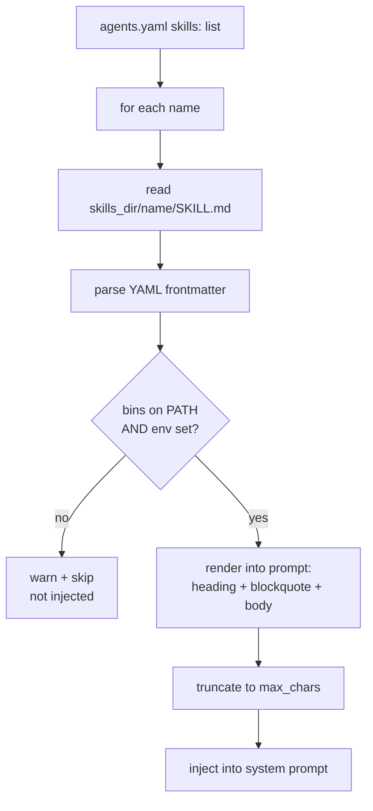

# Skills catalog

nexo-rs uses **"skill"** to mean two different things. Both are
covered on this page; gating semantics for each live in
[Gating by env / bins](./gating.md).

1. **Extension skills** — shipped under `extensions/` in the repo,
   discovered and spawned like any other stdio extension. 22 of them
   landed in Phase 13.
2. **Local skills** — markdown files under an agent's `skills_dir/`
   that get **injected into the system prompt** at turn start.

The two overlap in name but not in mechanism:

| | Extension skill | Local skill |
|-|-----------------|-------------|
| Where it lives | `extensions/<id>/` with `plugin.toml` | `skills/<name>/SKILL.md` |
| How it's loaded | Extension discovery → stdio spawn | `SkillLoader` at turn time |
| What it produces | Tools in `ToolRegistry` | Text injected into the prompt |
| Gating | Warn + continue, tools still registered | Warn + **skip entirely** |

## Extension skills (Phase 13)

All shipped as stdio extensions written in Rust. `_common` is a shared
Rust library (circuit-breaker primitives), not an extension itself.

### Core utilities

| Id | Purpose | Requires |
|----|---------|----------|
| `weather` | Current + forecast via Open-Meteo (no auth). | — |
| `openstreetmap` | Forward / reverse geocoding via Nominatim. | — |
| `wikipedia` | Article search + summaries. | — |
| `fetch-url` | HTTP GET / POST with SSRF guard, retries, circuit breaker. | — |
| `rss` | Fetch & parse RSS / Atom / JSON feeds. | — |
| `dns-tools` | A/AAAA/MX/TXT/NS/SOA/SRV + reverse + whois. | — |
| `endpoint-check` | HTTP probe (status + latency) + TLS cert inspection. | — |
| `pdf-extract` | Extract text from PDFs. | — |
| `translate` | LibreTranslate self-hosted or DeepL API. | — |
| `summarize` | Chat-based text/file summary via OpenAI-compat endpoint. | — |
| `openai-whisper` | Audio transcription via OpenAI-compat `/audio/transcriptions`. | — |

### Search & knowledge

| Id | Purpose | Requires |
|----|---------|----------|
| `brave-search` | Web search. | env `BRAVE_SEARCH_API_KEY` |
| `goplaces` | Google Places text search + details. | — |
| `wolfram-alpha` | Computational queries (short + full pods). | env `WOLFRAM_APP_ID` |

### Infra & ops

| Id | Purpose | Requires | Write-gate |
|----|---------|----------|-----------|
| `github` | REST API: PRs, checks, issues. | env `GITHUB_TOKEN` | — |
| `cloudflare` | DNS, zones, cache purge. | env `CLOUDFLARE_API_TOKEN` | — |
| `docker-api` | `ps`, `inspect`, `logs`, `stats`, `start`, `stop`, `restart`. | bin `docker` | env `DOCKER_API_ALLOW_WRITE` |
| `proxmox` | Proxmox VE: nodes, VMs, containers, lifecycle. | env `PROXMOX_TOKEN` | env `PROXMOX_ALLOW_WRITE`, env `PROXMOX_INSECURE_TLS` for self-signed certs |
| `onepassword` | 1Password secrets metadata; reveal gated. | bin `op`, env `OP_SERVICE_ACCOUNT_TOKEN` | env `OP_ALLOW_REVEAL` |
| `ssh-exec` | Remote command execution with host allowlist. | bin `ssh`, `scp` | host allowlist in config |
| `tmux-remote` | Drive tmux sessions (create, send keys, capture, kill). | bin `tmux` | — |

### Media & content

| Id | Purpose | Requires |
|----|---------|----------|
| `msedge-tts` | Text-to-speech via Edge Read Aloud. | — |
| `rtsp-snapshot` | Frames / clips from RTSP or HTTP camera streams. | bin `ffmpeg` |
| `video-frames` | Extract frames + audio from videos. | bin `ffmpeg`, `ffprobe` |
| `tesseract-ocr` | OCR with language packs + PSM modes. | bin `tesseract` |
| `yt-dlp` | Download video / audio / metadata. | bin `yt-dlp` |
| `spotify` | Now-playing, search, play, pause, skip. | env `SPOTIFY_ACCESS_TOKEN` |

### Google (phase 13.18)

Single `google` extension covering **32 tools** across Gmail,
Calendar, Tasks, Drive, People, and Photos. Uses OAuth refresh-token
flow. Writes gated by five independent env flags:

- `GOOGLE_ALLOW_SEND` — Gmail send
- `GOOGLE_ALLOW_CALENDAR_WRITE`
- `GOOGLE_ALLOW_DRIVE_WRITE`
- `GOOGLE_ALLOW_TASKS_WRITE`
- `GOOGLE_ALLOW_PEOPLE_WRITE`

See [Plugins — Google](../plugins/google.md) for the OAuth setup and
the generic `google_call` tool that fronts the extension.

### LLM providers (phase 13.19)

`anthropic` and `gemini` are **native LLM clients** living under
`crates/llm/`, not extensions. See
[LLM providers](../llm/minimax.md) and children.

### Templates

| Id | Purpose | Language |
|----|---------|----------|
| `template-rust` | Copy-and-edit skeleton (`ping`, `add`). | Rust |
| `template-python` | stdlib-only skeleton. | Python |

See [Extensions — Templates](../extensions/templates.md).

## Local skills

Local skills are markdown files loaded by `SkillLoader` and injected
into the system prompt at turn time. Defined in the agent config:

```yaml
# agents.yaml
agents:
  - id: kate
    skills_dir: ./skills
    skills:
      - weather
      - github
      - summarize
      - google-auth
```

Each entry resolves to `<skills_dir>/<name>/SKILL.md`:

```markdown
---
name: "Weather"
description: "Current conditions and forecasts"
requires:
  bins: ["curl"]
  env: ["WEATHER_API_KEY"]
max_chars: 5000
---
# Weather skill

Call `weather_forecast(city)` to get a 3-day forecast.
Use metric units. Default to the user's locale when unspecified.
```

Bundled local skills currently shipped in this repo:

| Id | Purpose |
|----|---------|
| `loop` | Bounded auto-iteration: run a prompt up to `max_iters` until `until_predicate` matches (`regex`, `exit`, or `judge`). |
| `stuck` | Bounded auto-debug for repeated `cargo build` / `cargo test` failures via `failing_command`, `max_rounds`, `focus_pattern`, and evidence-first diagnosis. |
| `simplify` | Bounded code simplification for a file/hunk via `target`, `scope`, `max_passes`, `preserve_behavior` (dead code, redundant guards, duplication, naming). |
| `verify` | Bounded acceptance verification via `acceptance_criterion`, `candidate_commands`, `max_rounds`, `judge_mode` (command evidence + explicit judge decision). |
| `skillify` | Capture a repeatable workflow and convert it into a reusable local `SKILL.md` with explicit inputs, steps, guardrails, and output contract. |
| `remember` | Memory-hygiene review flow: classify/promote/dedupe/conflict-resolve memory artifacts before applying any changes. |
| `update-config` | Safe config-edit skill for Nexo: map behavior changes to `config/*.yaml`, apply read-before-write merges, and surface hot-reload vs restart requirements. |

`loop` can be attached from setup wizard like any other skill (`nexo setup` →
`Configurar agente` → `Skills`) because it is registered in the setup skill
catalog and requires no secrets.

`stuck` is also attachable from setup wizard and requires no secrets.

`simplify` is also attachable from setup wizard and requires no secrets.

`verify` is also attachable from setup wizard and requires no secrets.

`skillify` is also attachable from setup wizard and requires no secrets.

`remember` is also attachable from setup wizard and requires no secrets.

`update-config` is also attachable from setup wizard and requires no secrets.

### Loading flow



### Why local skills skip-on-miss (vs extensions warn-and-continue)

A **local skill** is a text instruction to the LLM describing a
capability. If the backing bin/env isn't available the tool will
fail — but worse, the LLM was told the capability exists and will
repeatedly try to use it. Skipping the skill prevents lying to the
model.

An **extension** is a registered tool. If the LLM invokes it and the
backing bin is missing, the tool returns an error — the LLM observes
and adapts. Warn-and-continue is fine.

See [Gating](./gating.md) for the full semantics.

## How to pick

- Need the LLM to **know how** to do something (usage pattern, style
  rules, examples)? → local skill.
- Need the LLM to **do** something (make a call, return data)? →
  extension skill.
- Both? → ship the extension and write a local skill next to it that
  explains when to use it.
