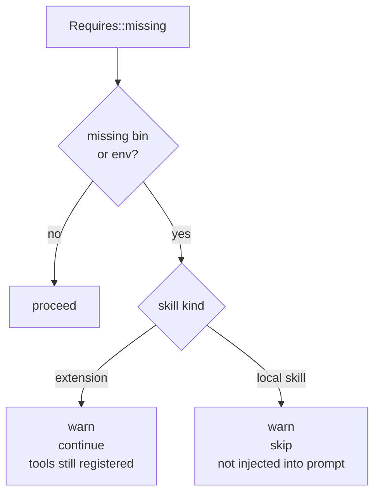

# Gating by env / bins

Both kinds of skills (extension skills under `extensions/` and local
skills under `skills_dir`) declare what they need to work. The
runtime checks those preconditions at load time and reacts
differently depending on skill kind.

## The declaration

Both kinds use the same shape. For an **extension**, it lives in
`plugin.toml`:

```toml
[requires]
bins = ["ffmpeg", "ffprobe"]
env  = ["OPENAI_API_KEY"]
```

For a **local skill** it lives in the YAML frontmatter of `SKILL.md`:

```yaml
---
name: "Whisper transcription"
requires:
  bins: ["ffmpeg"]
  env: ["OPENAI_API_KEY"]
---
```

Check semantics (source: `crates/extensions/src/manifest.rs`
`Requires::missing()`, `crates/core/src/agent/skills.rs`):

- **bins** — each name looked up on `$PATH`. On Windows also
  `<bin>.exe`.
- **env** — each name must be set **and** non-empty.

## Two reactions, one mechanism



| Skill kind | On missing preconditions |
|------------|--------------------------|
| **Extension** | Warn log, **still spawn + register tools**. A subsequent tool call will fail visibly when the bin/env is absent. |
| **Local skill** | Warn log, **do not inject into the system prompt**. The LLM never hears the skill existed. |

### Why the difference

A **local skill** is a description the LLM reads and internalizes —
"you have a transcription skill, call `whisper_transcribe`." If the
backing binary is missing, the tool call will fail. But the LLM was
told the capability exists, so it will keep trying. Not injecting
the skill prevents promising capabilities that can't be delivered.

An **extension tool** is observable: the LLM calls it, gets a
concrete error back ("command `tesseract` not found on PATH"), and
can adapt in the same turn. Warn-and-continue is the friendlier
behavior — the operator sees the warning and can fix the config
without the agent crash-looping.

## Where this is logged

Both kinds emit the same structured warn log fields:

```
WARN skill=weather missing_bins=[] missing_env=[WEATHER_API_KEY]
     "skill disabled: required env vars unset or empty"
```

```
WARN extension=docker-api missing_bins=[docker] missing_env=[]
     "extension preflight: declared requires not satisfied (continuing anyway)"
```

Filter on `missing_env` or `missing_bins` to alert proactively.

## Pre-deploy verification

Use the CLI:

```bash
agent ext doctor --runtime
```

This runs `Requires::missing()` for every discovered extension,
**and** with `--runtime` actually spawns each stdio extension to run
the handshake. Nothing is left to chance.

For local skills, a failing agent turn logs all skipped skills — a
dry run against the smallest scripted input gives you the same
signal without needing a separate command.

## Reserved env for secrets

Extensions receive a filtered copy of the host's env. Names matching
the secret-like patterns below are **stripped** before spawn
(`crates/extensions/src/runtime/stdio.rs`):

- Suffixes: `_TOKEN`, `_KEY`, `_SECRET`, `_PASSWORD`, `_PASSWD`,
  `_PWD`, `_CREDENTIAL`, `_CREDENTIALS`, `_PAT`, `_AUTH`, `_APIKEY`,
  `_BEARER`, `_SESSION`
- Substrings: `PASSWORD`, `SECRET`, `CREDENTIAL`, `PRIVATE_KEY`

**Declaring an env in `requires.env` whitelists it past the
blocklist.** That's the only supported way for an extension to
receive a secret env var. Gating and whitelisting come from the same
field — preconditions you declare travel alongside the value you
want.

## Write-gating in practice

Some shipped extensions gate destructive operations behind dedicated
flags — separate from `requires.env`:

| Extension | Write gate env var |
|-----------|-------------------|
| `docker-api` | `DOCKER_API_ALLOW_WRITE` |
| `proxmox` | `PROXMOX_ALLOW_WRITE` |
| `onepassword` | `OP_ALLOW_REVEAL` (reveal vs metadata-only) |
| `google` | `GOOGLE_ALLOW_SEND`, `GOOGLE_ALLOW_CALENDAR_WRITE`, `GOOGLE_ALLOW_DRIVE_WRITE`, `GOOGLE_ALLOW_TASKS_WRITE`, `GOOGLE_ALLOW_PEOPLE_WRITE` |

These are **not** handled by the generic gating layer — the
extension reads them itself and refuses destructive methods when
unset. Good pattern to adopt when your own extension wraps an API
with destructive endpoints.

## Gotchas

- **Empty env counts as missing.** `EXAMPLE_KEY=` is treated the same
  as `EXAMPLE_KEY` unset. This is intentional — empty strings rarely
  mean "use the default" for a secret.
- **`requires.bins` checks `$PATH` at discovery.** A binary installed
  after the agent starts won't be picked up until restart — or until
  you run `agent ext doctor --runtime` as a secondary gate.
- **Local-skill skip is silent to the LLM.** If you expected a skill
  to be present and you don't see it in the system prompt, check the
  warn logs for the skip reason before debugging agent behavior.
