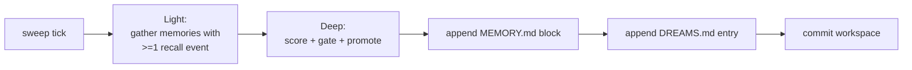

# Dreaming

"Dreaming" is a scheduled offline sweep that consolidates an agent's
memory. It reads recall signals, scores each memory that was recently
surfaced, promotes the strongest ones into MEMORY.md, and commits the
workspace-git repo.

Source: `crates/core/src/agent/dreaming.rs`.

## When it runs

```yaml
# agents.yaml
agents:
  - id: kate
    heartbeat:
      enabled: true
      interval: 30s
    dreaming:
      enabled: false
      interval_secs: 86400        # 24 h
      min_score: 0.35
      min_recall_count: 3
      min_unique_queries: 2
      max_promotions_per_sweep: 20
      weights:
        frequency: 0.24
        relevance: 0.30
        recency: 0.15
        diversity: 0.15
        consolidation: 0.10
```

Dreaming is **heartbeat-driven**: it ticks inside the heartbeat loop
and actually sweeps when `interval_secs` has elapsed since the last
sweep. Disable the heartbeat and dreaming stops firing.

Default `interval_secs: 86400` (24 hours). Run nightly or tune down
for high-throughput agents.

## Three phases (Light / REM / Deep)

Conceptually borrowed from the OpenClaw design, nexo-rs ships **Light
→ Deep**:



(REM — thematic summarization with an LLM — is intentionally deferred.)

## Scoring

For each candidate memory:

```
score = w.frequency × frequency
      + w.relevance × relevance
      + w.recency   × recency
      + w.diversity × diversity
      + w.consolidation × consolidation
```

Where the signals come from
[recall_events](./memory.md#recall-signals-phase-105).

**Consolidation** is a modest bias toward memories that recurred in
diverse queries over multiple days — taking the memory from "hit
once" to "actually load-bearing."

## Gates

A candidate is promoted only if **all** of these hold:

| Gate | Default | Meaning |
|------|---------|---------|
| `recall_count >= min_recall_count` | 3 | Surfaced at least 3 times |
| `unique_days >= 1` | 1 | Not all hits on the same day |
| `distinct_queries >= min_unique_queries` | 2 | More than one query style hit it |
| `score >= min_score` | 0.35 | Weighted composite over the threshold |
| `!is_promoted(memory_id)` | — | Not already promoted in a prior sweep |

Up to `max_promotions_per_sweep` (default 20) promoted per run;
ordered by descending score.

## Outputs

### `MEMORY.md` append

```markdown
## Dreamed 2026-04-24 03:00 UTC

- Luis lives in Bogota and prefers Spanish _(score=0.42, hits=5, days=3)_
- Kate should default to short WhatsApp replies _(score=0.38, hits=4, days=2)_
```

Only memories promoted **this sweep** appear in the block.

### `DREAMS.md` diary

A longer-form diary entry the agent can read back in
`my_stats().last_dream_ts` context. One per sweep.

### Side effects

- `memory_promotions` row per promoted memory (prevents double-promote
  across sweeps)
- `concept_tags` backfilled on older memories that were created before
  the tagging pipeline landed
- `workspace_git.commit_all("promote", <body with delta>)` captures
  the full change

## Idempotency

Re-running a sweep during the same interval is a no-op:

- Promotions consult `memory_promotions` before writing
- MEMORY.md is appended to, not rewritten
- Git commit returns cleanly with `skipped: true` when the tree is
  unchanged

You can safely call a manual "dream now" during a stuck session
(currently via restart with a lowered `interval_secs`) without
corrupting state.

## Safety rails

- **Shutdown cancellation.** Dream sweeps run under a cancellation
  token tied to the shutdown sequence. Partial sweeps don't leave
  inconsistent state — the atomic trio (DB row + MEMORY.md append
  + git commit) runs after all candidates are scored and gated.
- **Heartbeat-only.** Dreaming never fires from a user message turn,
  so a long sweep cannot block a user response.
- **Read-mostly.** Sweep reads from `recall_events`; the only writes
  are `memory_promotions`, MEMORY.md append, DREAMS.md append, and
  git commit. Existing memory rows are untouched except for
  tag backfill.

## What dreaming is **not**

- Not a summarizer. It does not rewrite content.
- Not a deduplicator. Two similar memories remain two memories; the
  recall layer will simply surface both and let the LLM pick.
- Not an LLM call. The whole sweep is deterministic — no model
  inference, no per-sweep cost.

## Tuning

| Situation | Change |
|-----------|--------|
| Memories stay too cold to promote | Lower `min_score` (e.g. 0.25) |
| Too many noise promotions | Raise `min_recall_count` to 5 |
| MEMORY.md grows too fast | Lower `max_promotions_per_sweep` |
| Very chatty agent | Increase `interval_secs` — 24 h is already safe |

## Observability

Every sweep emits a summary log line with:

- candidates scanned
- candidates promoted
- skipped (already promoted)
- score range of the promoted set
- workspace-git commit OID (or "clean tree")

Wire it into Prometheus via log scraping if you want time-series
counters — no dedicated metric is exposed yet.

## Gotchas

- **Turning dreaming on with `min_score` default produces a long
  first sweep.** If the agent has been running for weeks without
  dreaming, there are a lot of candidates. Expect the first sweep
  to promote near the cap and subsequent sweeps to tail off.
- **Concept-tag backfill is O(candidates).** Large backlogs will
  show first-sweep latency proportional to the candidate count.
  Not a bug — run the first sweep in a maintenance window if the
  backlog is large.
- **`interval_secs` is measured from last completed sweep.** A
  failed sweep does not reset the clock — a retry will fire on the
  next heartbeat tick regardless.
