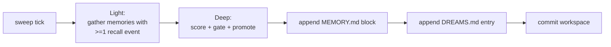

# Dreaming

"Dreaming" is a scheduled offline sweep that consolidates an agent's
memory. It reads recall signals, scores each memory that was recently
surfaced, promotes the strongest ones into MEMORY.md, and commits the
workspace-git repo.

Source: `crates/core/src/agent/dreaming.rs`.

## When it runs

```yaml
# agents.yaml
agents:
  - id: kate
    heartbeat:
      enabled: true
      interval: 30s
    dreaming:
      enabled: false
      interval_secs: 86400        # 24 h
      min_score: 0.35
      min_recall_count: 3
      min_unique_queries: 2
      max_promotions_per_sweep: 20
      weights:
        frequency: 0.24
        relevance: 0.30
        recency: 0.15
        diversity: 0.15
        consolidation: 0.10
```

Dreaming is **heartbeat-driven**: it ticks inside the heartbeat loop
and actually sweeps when `interval_secs` has elapsed since the last
sweep. Disable the heartbeat and dreaming stops firing.

Default `interval_secs: 86400` (24 hours). Run nightly or tune down
for high-throughput agents.

## Three phases (Light / REM / Deep)

Conceptually borrowed from the OpenClaw design, nexo-rs ships **Light
→ Deep**:



(REM — thematic summarization with an LLM — is intentionally deferred.)

## Scoring

For each candidate memory:

```
score = w.frequency × frequency
      + w.relevance × relevance
      + w.recency   × recency
      + w.diversity × diversity
      + w.consolidation × consolidation
```

Where the signals come from
[recall_events](./memory.md#recall-signals-phase-105).

**Consolidation** is a modest bias toward memories that recurred in
diverse queries over multiple days — taking the memory from "hit
once" to "actually load-bearing."

## Gates

A candidate is promoted only if **all** of these hold:

| Gate | Default | Meaning |
|------|---------|---------|
| `recall_count >= min_recall_count` | 3 | Surfaced at least 3 times |
| `unique_days >= 1` | 1 | Not all hits on the same day |
| `distinct_queries >= min_unique_queries` | 2 | More than one query style hit it |
| `score >= min_score` | 0.35 | Weighted composite over the threshold |
| `!is_promoted(memory_id)` | — | Not already promoted in a prior sweep |

Up to `max_promotions_per_sweep` (default 20) promoted per run;
ordered by descending score.

## Outputs

### `MEMORY.md` append

```markdown
## Dreamed 2026-04-24 03:00 UTC

- Luis lives in Bogota and prefers Spanish _(score=0.42, hits=5, days=3)_
- Kate should default to short WhatsApp replies _(score=0.38, hits=4, days=2)_
```

Only memories promoted **this sweep** appear in the block.

### `DREAMS.md` diary

A longer-form diary entry the agent can read back in
`my_stats().last_dream_ts` context. One per sweep.

### Side effects

- `memory_promotions` row per promoted memory (prevents double-promote
  across sweeps)
- `concept_tags` backfilled on older memories that were created before
  the tagging pipeline landed
- `workspace_git.commit_all("promote", <body with delta>)` captures
  the full change

## Idempotency

Re-running a sweep during the same interval is a no-op:

- Promotions consult `memory_promotions` before writing
- MEMORY.md is appended to, not rewritten
- Git commit returns cleanly with `skipped: true` when the tree is
  unchanged

You can safely call a manual "dream now" during a stuck session
(currently via restart with a lowered `interval_secs`) without
corrupting state.

## Safety rails

- **Shutdown cancellation.** Dream sweeps run under a cancellation
  token tied to the shutdown sequence. Partial sweeps don't leave
  inconsistent state — the atomic trio (DB row + MEMORY.md append
  + git commit) runs after all candidates are scored and gated.
- **Heartbeat-only.** Dreaming never fires from a user message turn,
  so a long sweep cannot block a user response.
- **Read-mostly.** Sweep reads from `recall_events`; the only writes
  are `memory_promotions`, MEMORY.md append, DREAMS.md append, and
  git commit. Existing memory rows are untouched except for
  tag backfill.

## What dreaming is **not**

- Not a summarizer. It does not rewrite content.
- Not a deduplicator. Two similar memories remain two memories; the
  recall layer will simply surface both and let the LLM pick.
- Not an LLM call. The whole sweep is deterministic — no model
  inference, no per-sweep cost.

## Tuning

| Situation | Change |
|-----------|--------|
| Memories stay too cold to promote | Lower `min_score` (e.g. 0.25) |
| Too many noise promotions | Raise `min_recall_count` to 5 |
| MEMORY.md grows too fast | Lower `max_promotions_per_sweep` |
| Very chatty agent | Increase `interval_secs` — 24 h is already safe |

## Observability

Every sweep emits a summary log line with:

- candidates scanned
- candidates promoted
- skipped (already promoted)
- score range of the promoted set
- workspace-git commit OID (or "clean tree")

Wire it into Prometheus via log scraping if you want time-series
counters — no dedicated metric is exposed yet.

## Gotchas

- **Turning dreaming on with `min_score` default produces a long
  first sweep.** If the agent has been running for weeks without
  dreaming, there are a lot of candidates. Expect the first sweep
  to promote near the cap and subsequent sweeps to tail off.
- **Concept-tag backfill is O(candidates).** Large backlogs will
  show first-sweep latency proportional to the candidate count.
  Not a bug — run the first sweep in a maintenance window if the
  backlog is large.
- **`interval_secs` is measured from last completed sweep.** A
  failed sweep does not reset the clock — a retry will fire on the
  next heartbeat tick regardless.

---

## Two-tier consolidation: light + deep (Phase 80.1)

Everything above describes the **light pass** — a deterministic
scoring sweep that runs on the heartbeat. Phase 80.1 adds a
**deep pass**: a forked subagent that periodically scans transcripts
and rewrites the memory directory in-depth. The two pillars
complement each other.

| Dimension     | Light pass (scoring) | Deep pass (fork) |
|---------------|----------------------|------------------|
| Crate         | `crates/core/src/agent/dreaming.rs` | `crates/dream/` |
| Cadence       | Every heartbeat tick | Every 24 h, ≥ 5 transcripts |
| Cost          | ~1 SQLite query + ranking | A forked LLM goal, up to 30 turns |
| Writes        | Append to `MEMORY.md` | Rewrite top-level `*.md` files in memory_dir |
| Failure mode  | Returns empty `DreamReport` | Fails the audit row, rolls back the lock |
| Coordination  | Defers when deep pass holds the lock | Acquires lock for the duration of the fork |
| Reference     | Phase 10.6 (existing) | Phase 80.1 (this) |

You can run either alone or both together. Both alone are
production-safe; both together share the same `memory_dir` and the
deep pass briefly suspends the light pass while it runs (see
**Coordination** below).

---

## Deep pass via fork (Phase 80.1)

The deep pass spawns a forked subagent — a fresh `ChatRequest` with
`skip_transcript: true` and a 4-phase consolidation prompt — to
rewrite memory under a constrained tool whitelist.

### Gates (cheapest first)

A turn fires the fork only when **all** of these hold:

1. `kairos_active == false` (KAIROS uses a disk skill, skip to avoid double-fire).
2. `is_remote_mode() == false`.
3. `is_auto_memory_enabled() == true`.
4. `auto_dream.enabled == true` (per-binding YAML).
5. **Time gate**: `hours_since(last_consolidated_at) ≥ min_hours` (default 24 h).
6. **Scan throttle**: bail if a scan ran in the last 10 min.
7. **Session gate**: `≥ min_sessions` transcripts touched since last fork (default 5).
8. **Lock acquire**: `try_acquire_consolidation_lock()` succeeds.

If any gate rejects, the runner returns `RunOutcome::Skipped { gate }`
without firing.

### ConsolidationLock

The lock file lives at `<memory_dir>/.consolidate-lock`. Single
instance per binding (one fork at a time). Properties:

- **mtime IS `lastConsolidatedAt`** — one `stat()` per turn is
  cheaper than reading a separate state file.
- Body is the holder's PID. The lock is **stale** if the PID is dead
  OR `now - mtime ≥ holder_stale` (default 1 h).
- **No heartbeat**. If a fork legitimately runs longer than 1 h,
  raise `holder_stale`.
- `try_acquire`: write our PID, re-read; if matches → acquired.
- `rollback(prior_mtime)`: rewind mtime to pre-acquire. `prior == 0` → unlink.

The path is canonicalized at construction so a later symlink swap
cannot redirect the lock target.

### 4-phase consolidation prompt

The forked subagent runs through:

1. **Orient** — read existing `MEMORY.md`, top-level `*.md` files,
   recent transcripts.
2. **Gather** — extract candidate facts, decisions, patterns from the
   sessions since the last consolidation.
3. **Consolidate** — rewrite the memory files, merging duplicates,
   refining wording.
4. **Prune** — drop stale entries, keep the index lean.

See `crates/dream/src/consolidation_prompt.rs` for the full prompt template.

### AutoMemFilter (Phase 80.20)

The fork only sees memory-safe tools:

- `FileRead`, `Glob`, `Grep`, `REPL` — unrestricted.
- `Bash` — only when `bash_security::is_read_only` returns true
  (~45 read-only utilities: `ls`, `find`, `grep`, `cat`, `stat`,
  `wc`, `head`, `tail`, ...).
- `FileEdit`, `FileWrite` — only when the path resolves under the
  agent's canonical `memory_dir`. Paths outside trigger a
  structured denial.

Provider-agnostic — the filter runs at the dispatch layer, not the
LLM provider layer.

### Post-fork escape audit

After a fork completes, the runner re-scans for any FileEdit/Write
that landed outside `memory_dir` (e.g. via a Bash redirect that
slipped through). If found, the outcome flips to
`RunOutcome::EscapeAudit { run_id, escapes, prior_mtime }` and the
audit row is updated. This is defense-in-depth on top of
`AutoMemFilter`.

### Cap

`MAX_TURNS = 30`. Server-side enforced. The fork is bounded; if the
prompt explodes, the cap closes the run with `RunOutcome::TimedOut`.

---

## Coordination: skip pattern (Phase 80.1.e)

When **both** passes are enabled, the light pass checks the
consolidation lock at the start of `run_sweep`. If a live PID is
holding the lock, the light pass skips entirely:

```rust
if let Some(probe) = &self.consolidation_probe {
    if probe.is_live_holder() {
        return Ok(DreamReport {
            deferred_for_fork: true,
            candidates_considered: 0,
            promoted: vec![],
            ..
        });
    }
}
```

The light pass logs:

```
INFO dreaming agent_id=kate dream sweep deferred — autoDream fork holds consolidation lock
```

**Trade-off**: a memory that would have been promoted during the
fork window is deferred to the next turn. Memories that score high
still score high next turn — recoverable. The cost is at most one
turn of latency vs the complexity of a buffer pattern (which we
considered and rejected).

The pattern is mutually-exclusive-per-turn: when one writer is
active, the other defers entirely. Recoverable on the next turn.

If the light pass runs without the deep pass enabled, the probe is
`None` and the skip arm never fires — original behaviour preserved.

---

## Audit trail

Two artifacts let you reconstruct what every fork did:

### SQLite `dream_runs` table (Phase 80.18)

`<state_root>/dream_runs.db` carries one row per fork run:

| Column                | Type   | Notes |
|-----------------------|--------|-------|
| `id`                  | UUID   | Primary key, also the `run_id` echoed to git commits |
| `goal_id`             | UUID   | The driver-loop goal that triggered the fork |
| `status`              | enum   | `Running` → `Completed` / `Failed` / `Killed` / `LostOnRestart` |
| `phase`               | enum   | `Starting` → `Updating` (flips on first FileEdit) |
| `sessions_reviewing`  | int    | Count of transcripts the fork looked at |
| `prior_mtime_ms`      | int?   | Lock mtime before acquire (for rollback). `Some(0)` is distinct from `None`. |
| `files_touched`       | JSON   | Array of `PathBuf` — paths the fork wrote to (deduplicated) |
| `turns`               | JSON   | Last `MAX_TURNS = 30` assistant turns. Trimmed server-side. |
| `started_at`          | TS     | When the fork acquired the lock |
| `ended_at`            | TS?    | When the run reached terminal status |
| `fork_label`          | string | `auto_dream`, `away_summary`, `eval`, ... |
| `fork_run_id`         | UUID?  | Optional pointer to `nexo_fork::ForkHandle::run_id` |

Defenses: server-side `MAX_TURNS = 30` cap, tail clamped at
`TAIL_HARD_CAP = 1000`, idempotent insert on `(goal_id, started_at)`.

### Git commits (Phase 80.1.g)

When `workspace_git.enabled = true` for the binding, every successful
fork that touched files lands a commit:

```
auto_dream: 3 file(s) consolidated

audit_run_id: 7a3b2f00-deaf-cafe-beef-001122334455

- MEMORY.md
- decisions/2026-04.md
- followups.md
```

Cross-link from `git log` back to the SQLite row:

```bash
$ git -C <workspace> log --grep "auto_dream" --pretty=oneline
<oid> auto_dream: 3 file(s) consolidated
$ nexo agent dream status 7a3b2f00-deaf-cafe-beef-001122334455
```

The Phase 77.7 secret guard runs transparently before each commit —
a fork that somehow wrote a credential lands `Err`, the warning is
logged, and the audit row stays intact (the audit row is the source
of truth; the commit is bonus forensics).

---

## Operator CLI: `nexo agent dream` (Phase 80.1.d)

Three sub-commands. None require a running daemon — they read the
SQLite store directly. Read paths use a read-only pool; `kill` uses
a read-write pool plus a filesystem lock-file rewind.

### `tail` — list recent runs

```bash
$ nexo agent dream tail
# Dream Runs (db: /home/.../state/dream_runs.db)

| ID       | Goal     | Status    | Phase    | Sessions | Files | Started             | Ended               | Label      |
|----------|----------|-----------|----------|----------|-------|---------------------|---------------------|------------|
| 7a3b2f00 | b91c2d3a | Completed | Updating | 5        | 3     | 2026-04-30T10:12:01 | 2026-04-30T10:13:45 | auto_dream |
| f88e1100 | b91c2d3a | Failed    | Starting | 7        | 0     | 2026-04-30T08:00:01 | 2026-04-30T08:00:42 | auto_dream |

2 rows shown (last 20).
```

Filter by goal, change page size, or get JSON for scripting:

```bash
$ nexo agent dream tail --goal=b91c2d3a-... --n=5
$ nexo agent dream tail --json | jq '.[] | select(.status == "Failed") | .id'
```

Empty / missing DB returns a friendly message and exit 0:

```
$ nexo agent dream tail
(no dream runs recorded yet — db not found at /home/.../state/dream_runs.db)
```

### `status` — single run detail

```bash
$ nexo agent dream status 7a3b2f00-deaf-cafe-beef-001122334455
# Dream Run 7a3b2f00-deaf-cafe-beef-001122334455

- **goal_id**: b91c2d3a-...
- **status**: Completed
- **phase**: Updating
- **sessions_reviewing**: 5
- **fork_label**: auto_dream
- **started_at**: 2026-04-30T10:12:01Z
- **ended_at**: 2026-04-30T10:13:45Z
- **prior_mtime_ms**: 1745939518000

## Files touched (3):
- MEMORY.md
- decisions/2026-04.md
- followups.md
```

### `kill` — abort a running fork

```bash
$ nexo agent dream kill 7a3b2f00-... --force --memory-dir=/path/to/memory
[dream-kill] run_id=7a3b2f00-... status was Running, transitioning to Killed
[dream-kill] lock rollback: prior_mtime=1745939518000 → memory_dir=/path/to/memory
[dream-kill] done
```

Without `--force` on a Running row, the command warns and exits 2:

```
[dream-kill] run_id=7a3b2f00-... is still Running. Pass --force to abort.
```

Without `--memory-dir`, status flips but the lock is NOT rewound —
the next fork tick may see the stale mtime as if a consolidation
just completed:

```
[dream-kill] WARN: status flipped but lock not rolled back. Pass --memory-dir <path> next time to rewind the consolidation lock.
```

Already-terminal rows are no-op:

```
[dream-kill] run_id=7a3b2f00-... already in terminal state Completed; nothing to do
```

### Database path resolution

The CLI resolves the dream-runs DB in three tiers:

1. `--db <path>` (explicit override, beats everything).
2. `NEXO_STATE_ROOT` env → `<state_root>/dream_runs.db`.
3. XDG default `~/.local/share/nexo/state/dream_runs.db`.

The YAML tier is intentionally absent — `agents.state_root` is not
a config field today (state_root flows into `BootDeps` directly per
Phase 80.1.b.b.b). Set `NEXO_STATE_ROOT` to align the CLI with your
daemon's actual data dir.

---

## LLM tool: `dream_now` (Phase 80.1.c)

When enabled, the agent itself can force a memory consolidation
mid-turn:

```json
{
  "name": "dream_now",
  "description": "Force a memory consolidation pass now, bypassing time/session gates. Use when you've just learned a lot and want it consolidated into long-term memory before continuing.",
  "parameters": {
    "type": "object",
    "properties": {
      "reason": {
        "type": "string",
        "description": "Optional human-readable reason recorded in the audit row."
      }
    },
    "additionalProperties": false
  }
}
```

The tool returns a structured envelope across all six `RunOutcome`
variants:

```json
{
  "outcome": "completed",
  "run_id": "7a3b2f00-deaf-cafe-beef-001122334455",
  "files_touched": ["MEMORY.md"],
  "duration_ms": 12450,
  "reason": "user just locked in 4 architectural decisions"
}
```

Other outcomes: `skipped` (with `gate` field), `lock_blocked`
(another fork in progress), `errored`, `timed_out`, `escape_audit`.

### Capability gate (Phase 80.1.c.b)

Two layers must both allow the tool for it to register on a
binding's surface:

1. **Host-level**: operator must `export NEXO_DREAM_NOW_ENABLED=true`.
   Default is deny — without the env var, `register_dream_now_tool`
   short-circuits with `tracing::info!("dream_now: host-level
   capability gate closed; tool not registered")`.
2. **Per-binding**: Phase 16 `allowed_tools: ["dream_now", ...]`
   must include the tool name on the binding's allowlist.

Verify with:

```bash
$ nexo setup doctor capabilities
# ... capability table ...
| dream | NEXO_DREAM_NOW_ENABLED | enabled  | Medium | Allow the LLM to force a memory-consolidation pass via the `dream_now` tool. ... |
```

The capability listing is provider-agnostic. Same gate semantics
under Anthropic, MiniMax, OpenAI, Gemini, DeepSeek, xAI, Mistral.

---

## Configuration (Phase 80.1)

```yaml
# agents.yaml
agents:
  - id: kate
    workspace_git:
      enabled: true        # required for auto_dream → git commits (Phase 80.1.g)
      author_name: "kate"
      author_email: "kate@nexo.local"
    dreaming:
      enabled: true
      interval_secs: 86400
      # ... existing scoring-sweep config from sections above
    auto_dream:
      enabled: true
      min_hours: 24h
      min_sessions: 5
      scan_interval: 10min
      holder_stale: 1h
      fork_timeout: 5min
      memory_dir: null     # null = default <workspace>/.nexo-memory/<agent_id>
```

Boot logging confirms wiring:

```
INFO boot.auto_dream agent=kate auto_dream runner registered git_checkpoint_wired=true
```

Setting `auto_dream.enabled = false` (or omitting the block
entirely) disables the deep pass — the light pass keeps running
under `dreaming.enabled = true`. Setting `dreaming.enabled = false`
turns off the light pass but leaves the deep pass independent.

---

## See also

- **Phase 10.9 git-backed memory** — `crates/core/src/agent/workspace_git.rs::MemoryGitRepo`
- **Phase 18 hot-reload** — `auto_dream` config changes apply without restart via `ArcSwap`
- **Phase 77.7 secret guard** — auto-applied to all git commits, blocks credentials before they land
- **Phase 80.18 audit row** — `crates/agent-registry/src/dream_run.rs`
- **Phase 80.20 AutoMemFilter** — `crates/fork/src/auto_mem_filter.rs`
