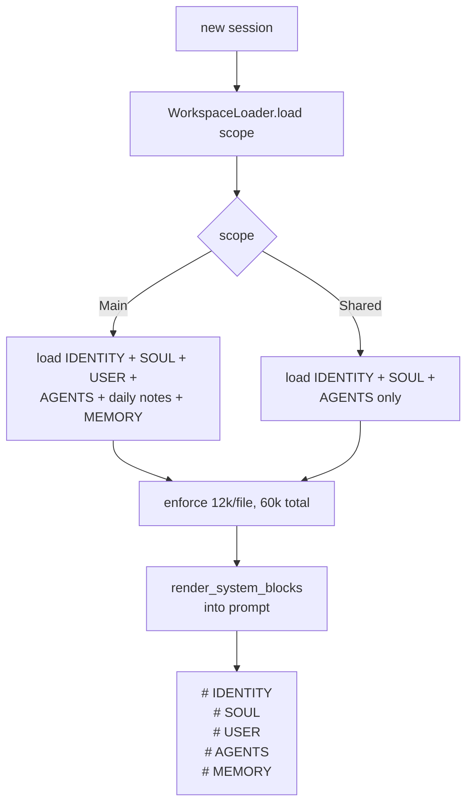

# Identity & workspace

Every agent has a **workspace directory** — a small set of markdown
files that describe who it is, what it knows, and how it's meant to
behave. The runtime loads those files at session start and injects
them into the system prompt. The agent reads them; some of them, the
agent also writes back to.

Source: `crates/core/src/agent/workspace.rs`,
`crates/core/src/agent/self_report.rs`.

## Workspace files

```
<workspace>/
├── IDENTITY.md        # 10.1 — persona facts (name, vibe, emoji)
├── SOUL.md            # 10.2 — prompt-like character document
├── USER.md            # who the human is (if single-user)
├── AGENTS.md          # peers this agent knows about
├── MEMORY.md          # 10.3 — self-curated facts index
├── DREAMS.md          # dreaming diary (10.6)
├── notes/             # per-day notes
└── .git/              # 10.9 — per-agent repo for forensics
```

Configured per agent:

```yaml
agents:
  - id: kate
    workspace: ./data/workspace/kate
    workspace_git:
      enabled: true
```

## IDENTITY.md (phase 10.1)

Short, structured. Five optional fields parsed from a markdown bullet
list:

```markdown
- **Name:** Kate
- **Creature:** octopus
- **Vibe:** warm but sharp
- **Emoji:** 🐙
- **Avatar:** https://.../kate.png
```

The parser:

- Silently skips template placeholders in parens (e.g.
  `_(pick something)_`) so the bootstrap template never leaks into
  the persona
- Produces an `AgentIdentity { name, creature, vibe, emoji, avatar }`
  struct, all fields `Option<String>`

Rendered into the system prompt as a single line:

```
# IDENTITY
name=Kate, emoji=🐙, vibe=warm but sharp
```

## SOUL.md (phase 10.2)

Free-form markdown. No parsing. Injected verbatim after the IDENTITY
block. This is where long-form character, operating principles, tone,
and hard rules live.

Loaded on every session start. **Main** and **shared** sessions both
see SOUL.md — the privacy boundary is MEMORY.md, not SOUL.md (shared
groups should never leak private memories, but the persona is fine
to surface).

## MEMORY.md (phase 10.3)

The agent's **self-curated index** of things it remembers. Markdown
sections with bullet lists — no special schema:

```markdown
## People

- Luis prefers Spanish but is fine switching to English.
- Ana uses a Samsung, not an iPhone.

## Dreamed 2026-04-23 03:00 UTC

- User's timezone is America/Bogota _(score=0.42, hits=5, days=3)_
- Prefers short replies on WhatsApp _(score=0.38, hits=4, days=2)_

## Open questions

- What phone carrier does Luis use?
```

Scope rules:

- Loaded **only** in main (DM-style) sessions. Group and broadcast
  sessions never see MEMORY.md — per-user facts must not leak into
  multi-user chats.
- Appended automatically by dreaming sweeps (Phase 10.6)
- Truncation: 12 000 chars per file cap (whole workspace total
  budget: 60 000 chars). Exceeding files get a `[truncated]` marker.

## USER.md and AGENTS.md

- **USER.md** — who this agent is talking to. Loaded in main
  sessions only.
- **AGENTS.md** — which peers this agent can delegate to. Pairs
  with `allowed_delegates` in [agents.yaml](../config/agents.md).

Both are free-form markdown read into the prompt.

## Transcripts (phase 10.4)

Per-session, append-only JSONL files in `transcripts_dir`:

```jsonl
{"type":"session","version":1,"id":"<uuid>","timestamp":"2026-04-24T...","agent_id":"kate","source_plugin":"telegram"}
{"type":"entry","timestamp":"...","role":"user","content":"hola","message_id":"...","source_plugin":"telegram","sender_id":"user123"}
{"type":"entry","timestamp":"...","role":"assistant","content":"hola Luis","source_plugin":""}
```

- One file per session at `<transcripts_dir>/<session_id>.jsonl`
- No time-based rotation (session close = file close)
- First line is a session header with metadata, every subsequent
  line is a turn

Transcripts are write-only from the runtime's point of view — they're
for replay, audit, and human review, not read-back into the prompt.

## Self-report tools (phase 10.8)

Three tools let the agent inspect its own state:

| Tool | Returns | Use |
|------|---------|-----|
| `who_am_i` | `{agent_id, model, workspace_dir, identity{…}, soul_excerpt}` | When asked "who are you?" |
| `what_do_i_know` | `{sections: [{heading, bullets}], truncated}` with optional filter | Search MEMORY.md by section name |
| `my_stats` | `{sessions_total, memories_stored, memories_promoted, last_dream_ts, recall_events_7d, top_concept_tags_7d, workspace_files_present}` | Meta-awareness |

All three return concise JSON designed for the LLM to consume in one
turn. Soul excerpt in `who_am_i` is truncated to 2 048 chars;
`what_do_i_know` caps at 6 144 bytes serialized with at most 10
bullets per section.

## Load flow



## Next

- [MEMORY.md](./memory.md) — write cadence and promotion rules
- [Dreaming](./dreaming.md) — how sleeps turn recall signals into
  MEMORY.md entries
