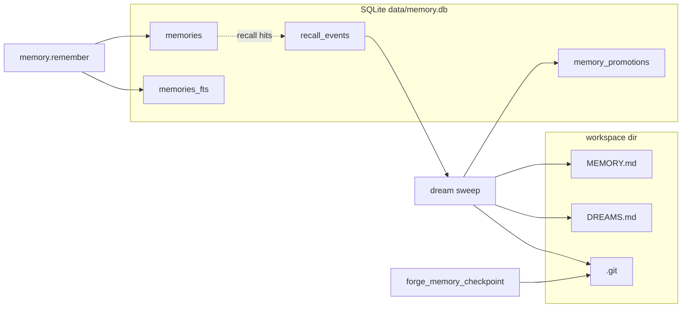
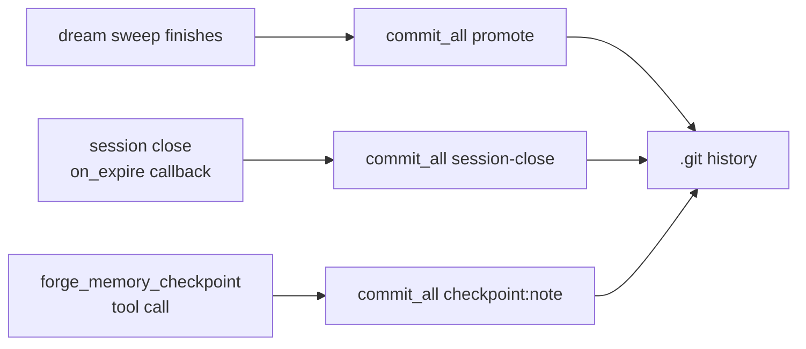

# MEMORY.md + recall signals + workspace-git

This page covers everything about how what the agent **knows** evolves
over time: the MEMORY.md index, the recall signals that drive
dreaming, how concept tags are derived, and how the workspace-git
repo captures a full audit history.

For the underlying storage mechanics (tables, queries, vector index),
see [Memory — long-term](../memory/long-term.md).

## What goes where



Three layers, each with a different update cadence:

| Layer | Write trigger | Consumer |
|-------|---------------|----------|
| `memories` table | Agent calls `memory.remember` | Next turn's `memory.recall` |
| `recall_events` table | Every `memory.recall` hit | Dream sweep (10.6) |
| `memory_promotions` table | Promotion during dream | Prevents double-promote across sweeps |
| `MEMORY.md` | Dream sweep (10.6) | Next session's system prompt (main scope only) |
| `DREAMS.md` | Dream sweep (10.6) | Historical diary for humans + `my_stats` |
| `.git` | Dream finish, session close, `forge_memory_checkpoint` | `memory_history` tool, post-mortem via `git log` |

## Recall signals (phase 10.5)

The `recall_events` table captures every hit of `memory.recall`:

```sql
CREATE TABLE recall_events (
  id         INTEGER PRIMARY KEY AUTOINCREMENT,
  agent_id   TEXT,
  memory_id  TEXT,
  query      TEXT,  -- the search string that surfaced this memory
  score      REAL,  -- relevance score from the recall call
  ts_ms      INTEGER
);
```

Aggregation over a per-memory window produces the signals struct
consumed by dreaming:

| Signal | Meaning |
|--------|---------|
| `frequency` | Log-normalized count of hits |
| `relevance` | Mean score across hits |
| `recency` | Exponential decay from last-hit timestamp |
| `diversity` | Distinct query strings, normalized (saturates at 5+) |
| `recall_count` | Raw hit count — used by gates |
| `unique_days` | Distinct UTC days the memory was surfaced |

Each weighted and summed into the score that drives promotion
(see [Dreaming](./dreaming.md)).

## Concept tags (phase 10.7)

Every memory row has a `concept_tags` JSON column populated at insert
time — **not** via TF-IDF but via a deterministic pipeline:

1. **Glossary match.** Hard-coded list of protected tech terms
   (multilingual) — `backup`, `openai`, `migration`, etc.
2. **Compound tokens.** Regex preserves file paths and identifiers
   (`src/main.rs`, `camelCaseNames`).
3. **Unicode word segmentation.** `UAX #29` word boundaries split
   the rest.
4. **Per-token rules:**
   - NFKC normalization + lowercase
   - 32-char max; 3-char min for Latin, 2-char min for CJK
   - Reject pure digits, ISO dates, and 100+ shared stop-words
     across English, Spanish, and path noise
   - Underscores converted to dashes

Output capped at **8 tags per memory**. Stored as JSON array on the
`memories` row; expanded into keyword recall searches as part of the
FTS5 `MATCH` query.

Dream sweeps **backfill** tags for older memories that were created
before the tagging pipeline existed.

## MEMORY.md write cadence

Dreaming sweeps append blocks:

```markdown
## Dreamed 2026-04-24 03:00 UTC

- Luis lives in Bogota and prefers Spanish _(score=0.42, hits=5, days=3)_
- Kate should default to short WhatsApp replies _(score=0.38, hits=4, days=2)_
```

- One block per sweep
- Promoted memories shown as bullets with score, hit count, unique days
- Existing sections preserved; the file is only ever **appended** to
  (manual editing by humans is fine — the dream sweep appends a new
  block rather than rewriting anything)

Privacy rules:

- MEMORY.md is injected into **main-scope sessions only**. Groups /
  broadcasts never see it.
- `transcripts_dir` is separate from workspace and is **not**
  committed to workspace-git by default.

## Workspace-git (phase 10.9)

When `workspace_git.enabled: true`, the agent's `workspace`
directory is a git repo. Commits happen automatically at three
moments:



Mechanics (`crates/core/src/agent/workspace_git.rs`):

- Staged: every non-ignored file (respects auto-generated
  `.gitignore`)
- Skipped: files larger than 1 MiB (`MAX_COMMIT_FILE_BYTES`)
- Idempotent: no-op commit when the tree is clean
- Author: `{agent_id} <agent@localhost>` (configurable via
  `workspace_git.author_name` / `author_email`)
- Auto `.gitignore` excludes `transcripts/`, `media/`, `*.tmp`,
  `*.swp`, `.DS_Store`
- No remote configured by default; operators add one if forensic
  archival matters

### Tools that touch git

| Tool | Purpose | Returns |
|------|---------|---------|
| `forge_memory_checkpoint(note)` | Commit right now with `checkpoint: <note>` subject | `{ok, oid(short), subject, skipped}` |
| `memory_history(limit?, include_diff?)` | `git log` of the last `limit` commits (max 100); optional unified diff oldest→HEAD | `{commits: [...], diff?}` |

Good uses of explicit checkpoints:

- Before a risky update sequence the agent is about to perform
- After receiving a non-obvious instruction from the user
- As bookends around a `taskflow` step boundary

## Gotchas

- **MEMORY.md can grow unbounded over years.** Workspace-git keeps
  the history; but the in-prompt view is truncated at 12 KB. Keep an
  eye on size, prune old `## Dreamed` blocks if they stop being
  useful.
- **Concept-tag derivation is deterministic per content.** Editing a
  memory's content in-place does not re-derive tags — the tags that
  were computed at insert stick. Re-insert to refresh.
- **`git log` replays tell the truth.** If you're debugging a
  surprising agent behavior, `memory_history --include-diff` is the
  fastest way to see what the agent wrote to itself and when.
