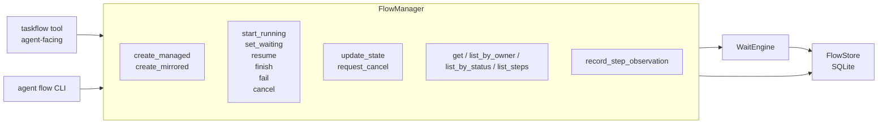
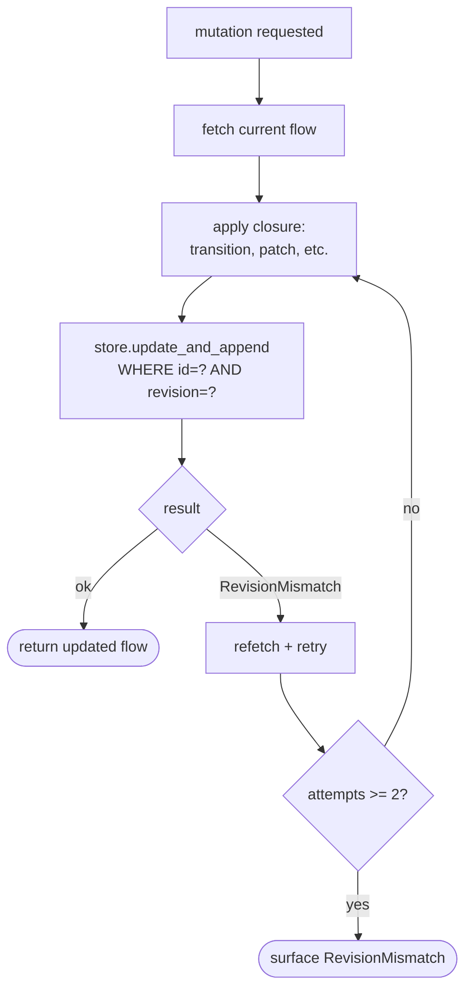
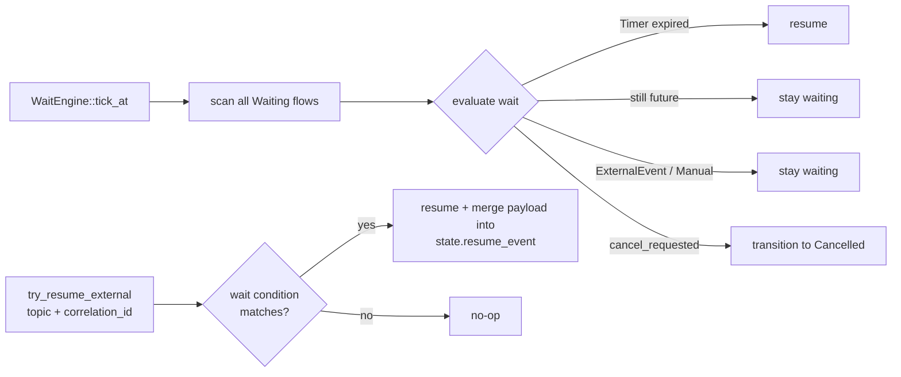

# FlowManager, tools, and CLI

`FlowManager` owns the mutation API for flows. It wraps the
`FlowStore` with revision-checked atomic updates, the agent-facing
`taskflow` tool, the `WaitEngine`, and the `agent flow` CLI.

Source: `crates/taskflow/src/manager.rs`,
`crates/taskflow/src/engine.rs`,
`crates/core/src/agent/taskflow_tool.rs`.

## Responsibilities



One manager per store — typically one per process. Same database
file can be opened by multiple managers safely as long as each goes
through the revision protocol.

## Optimistic concurrency

Every mutation follows this loop:



- `revision` is a monotonic integer on every flow
- Update runs `UPDATE ... WHERE id=? AND revision=?` — only one
  writer wins per revision
- Retry budget is **2 attempts** (1 fetch + 1 refetch); persistent
  conflict bubbles up to the caller
- Update and audit-event append happen inside a **single SQLite
  transaction** — crash mid-operation cannot produce a desync between
  state and audit trail

## WaitEngine

Broker-agnostic scheduler. Pull-based `tick()` advances any flow
whose wait condition has fired.



- `tick_at(now)` — a single scan. Returns a `TickReport` with
  counters: scanned, resumed, cancelled, still waiting, errors.
- `run(interval, shutdown_token)` — long-running loop; drive from
  heartbeat or a dedicated tokio task.
- `try_resume_external(flow_id, topic, correlation_id, payload)` —
  called by a NATS subscriber or the CLI when an external event
  arrives; matches against the flow's persisted `wait_json` and
  resumes if it fits.

Correlation ids are caller-chosen strings. Typical pattern: when a
flow delegates to another agent via `agent.route.<target_id>`,
include the flow's id or a fresh UUID as the correlation id, and
have the receiver echo it on reply.

## Agent-facing tool

Single `taskflow` tool with dispatch by `action`:

| Action | Params | Result |
|--------|--------|--------|
| `start` | `controller_id`, `goal`, optional `current_step` (default `"init"`), optional `state` | `{ok, flow}` — auto-transitions Created → Running |
| `status` | `flow_id` | `{ok, flow}` or `{ok:false, error:"not_found"}` |
| `advance` | `flow_id`, optional `patch`, optional `current_step` | `{ok, flow}` with merged state |
| `cancel` | `flow_id` | `{ok, flow}` |
| `list_mine` | — | `{ok, count, flows: [...]}` |

### Session tenancy

Every call derives `owner_session_key = "agent:<id>:session:<session_id>"`.
The manager rejects any mutation whose owner does not match the
flow's — "belongs to a different session" error. Cross-session
access from the LLM is not possible.

### Revision hidden from the LLM

The tool fetches the flow **before** every mutation and uses the
live revision internally. The LLM never sees or reasons about
revision numbers — fewer tokens, fewer mistakes.

## CLI

```
agent flow list          [--json]
agent flow show <id>     [--json]
agent flow cancel <id>
agent flow resume <id>
```

- `list` prints a table sorted by `updated_at DESC`
- `show` prints the flow plus every recorded step
- `cancel` calls `manager.cancel(id)`
- `resume` is a manual unblock for `Manual` or `ExternalEvent` waits
  — useful in ops / testing when an expected event never arrived

All commands honor `TASKFLOW_DB_PATH` (default `./data/taskflow.db`).

## End-to-end example

From `crates/taskflow/tests/e2e_test.rs`:

```rust
// 1. Create + run + park.
let f = manager.create_managed(input).await?;
let f = manager.start_running(f.id).await?;
let f = manager.set_waiting(f.id, json!({"kind": "manual"})).await?;

// 2. Process exits. Reopen the SAME database file from a fresh manager.
let reloaded = manager.get(f.id).await?.unwrap();
assert_eq!(reloaded.status, FlowStatus::Waiting);
assert_eq!(reloaded.state_json["verses_done"], 10);  // partial work survived

// 3. Resume picks up where we left off.
let resumed = manager.resume(reloaded.id, None).await?;
assert_eq!(resumed.status, FlowStatus::Running);
```

Shipped shape of `CreateManagedInput`:

```json
{
  "controller_id": "kate/inbox-triage",
  "goal": "triage inbox",
  "owner_session_key": "agent:kate:session:abc",
  "requester_origin": "user-1",
  "current_step": "classify",
  "state_json": { "messages": 10, "processed": 0 }
}
```

There is no YAML flow-definition format — flows are built in code
(or driven by the `taskflow` tool's `start` action).

## Garbage collection

`store.prune_terminal_flows(retain_days)` deletes flows whose
terminal state is older than the retention window. Wire this into a
scheduled job when your flows pile up — audit trails accumulate
forever otherwise.

## Gotchas

- **`state_json` is shallow-merged.** Nested updates require the
  caller to build the full replacement object for the key being
  changed.
- **`revision` conflicts retry only twice.** If two callers are
  fighting over a flow continuously, the second persistently
  surfaces `RevisionMismatch` — treat that as a signal that you
  should either serialize at a higher level, or have the loser
  retry at the app layer.
- **No flow-level mutex.** The DB-level `UNIQUE (flow_id, run_id)`
  on steps keeps step-observation races safe; revision checks keep
  mutation races safe. But two observers can read a flow
  simultaneously — don't rely on read-time consistency for
  decisions.
- **`wait_json` is cleared on resume.** If you need to remember the
  wait condition for audit purposes, the `flow_events` table has it.
