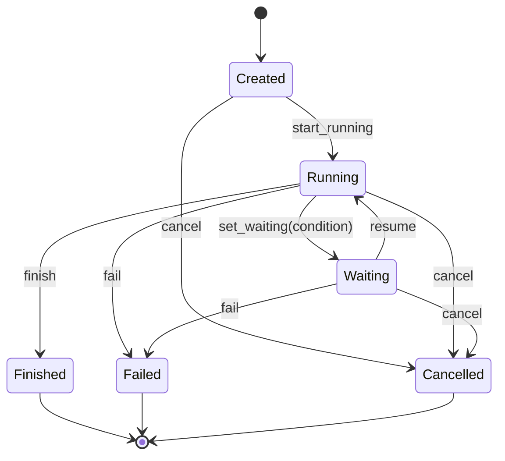

# TaskFlow model

TaskFlow is a **durable, multi-step flow runtime** that survives
process restarts and external waits. It's designed for work that
spans more LLM turns than a single conversation buffer can hold —
approvals, data pipelines, delegated subtasks, scheduled actions.

Source: `crates/taskflow/` (`types.rs`, `store.rs`, `engine.rs`).

## When to use it

Use TaskFlow when any of the following apply:

- A task needs to pause and resume later (hours, days)
- Multiple agents collaborate on one outcome
- You need a full audit trail of what happened and when
- You need recovery from a crash mid-task

If it's a one-shot turn, **don't** reach for TaskFlow — the runtime's
normal session buffer is enough.

## Flow shape

A flow is an opaque `state_json` (free-form JSON) plus metadata:

| Field | Purpose |
|-------|---------|
| `id` | UUID generated on creation. |
| `controller_id` | String label identifying the flow definition (e.g. `kate/inbox-triage`). |
| `goal` | Human-readable statement of intent. |
| `owner_session_key` | `agent:<id>:session:<session_id>` — hard tenancy gate. |
| `requester_origin` | Who asked (user id, external system id). |
| `current_step` | String label for the current phase (`"classify"`, `"await_approval"`, …). |
| `state_json` | Free-form JSON owned by the flow — the LLM mutates this over time. |
| `wait_json` | Current wait condition while `status = Waiting`. |
| `status` | See state machine below. |
| `cancel_requested` | Sticky flag that forces the next valid transition to `Cancelled`. |
| `revision` | Monotonic integer; increments on every update. Used for optimistic concurrency. |
| `created_at` / `updated_at` | Timestamps. |

`state_json` is **shallow-merged** on updates: a patch `{ "foo": 1 }`
replaces only the `foo` key, everything else is preserved.

## State machine



- **Terminal states:** `Finished`, `Failed`, `Cancelled`. No further
  transitions allowed.
- **Sticky cancel:** `cancel_requested = true` forces the next
  allowed transition to land on `Cancelled`. The flag survives
  restart and is idempotent — multiple cancel requests converge on
  the same outcome.

## Persistence

SQLite-backed via `sqlx`, pool size 5. Default path
`./data/taskflow.db`, override with `TASKFLOW_DB_PATH`.

### Tables

```sql
CREATE TABLE flows (
  id                  TEXT PRIMARY KEY,
  controller_id       TEXT,
  goal                TEXT,
  owner_session_key   TEXT,
  requester_origin    TEXT,
  current_step        TEXT,
  state_json          TEXT,
  wait_json           TEXT,
  status              TEXT,
  cancel_requested    BOOLEAN,
  revision            INTEGER,
  created_at          INTEGER,
  updated_at          INTEGER
);

CREATE TABLE flow_steps (
  id                  TEXT PRIMARY KEY,
  flow_id             TEXT NOT NULL,
  runtime             TEXT,              -- Managed | Mirrored
  child_session_key   TEXT,
  run_id              TEXT,
  task                TEXT,
  status              TEXT,
  result_json         TEXT,
  created_at          INTEGER,
  updated_at          INTEGER,
  UNIQUE (flow_id, run_id)
);

CREATE TABLE flow_events (
  id          INTEGER PRIMARY KEY AUTOINCREMENT,
  flow_id     TEXT NOT NULL,
  kind        TEXT,
  payload_json TEXT,
  at          INTEGER
);
```

- **`flows.revision`** drives optimistic concurrency (see
  [FlowManager](./manager.md)).
- **`flow_events`** is append-only — every transition leaves a trail.
- **`flow_steps.(flow_id, run_id)` UNIQUE** catches duplicate
  observations at the DB layer, not in a race-prone managerial check.

## Wait conditions

Persisted in `wait_json` while `status = Waiting`.

```rust
enum WaitCondition {
    Timer { at: DateTime<Utc> },                        // auto-resume at time
    ExternalEvent { topic: String, correlation_id: String }, // resume when matching event arrives
    Manual,                                              // resume only via explicit call
}
```

| Condition | Resumed by |
|-----------|-----------|
| `Timer` | `WaitEngine::tick()` when `now >= at` |
| `ExternalEvent` | `try_resume_external(flow_id, topic, correlation_id, payload)` |
| `Manual` | `FlowManager::resume(id, patch)` — typically via CLI or a deliberate LLM turn |

There is **no timeout built into the wait itself** — you timeout by
pairing any wait with a `Timer` fallback (e.g. fan out "wait for
approval OR 24 h elapsed") via orchestration in the flow's step
logic.

## Audit trail

Every transition writes a `flow_events` row with:

- `kind`: `created`, `started`, `waiting`, `resumed`, `finished`,
  `failed`, `cancelled`, `state_updated`, `step_observed`, ...
- `payload_json`: contextual data (wait condition, result, reason,
  step info)
- `at`: timestamp

The audit append happens **inside the same SQLite transaction** as
the state update — you can never see a flow state that doesn't have
a matching audit event, even after a crash mid-operation.

## Mirrored flows

Beyond **Managed** flows (owned by FlowManager), you can create
**Mirrored** flows that just observe externally-driven work:

- `create_mirrored(input)` inserts a flow already in `Running` state
- `record_step_observation(StepObservation)` upserts into
  `flow_steps` by `(flow_id, run_id)` — new observations merge with
  existing rows
- Emits `step_observed` audit events

Useful for tracking tasks executed elsewhere — a delegation to
another agent, a subprocess spawned out-of-band — while keeping one
unified audit surface.

## Next

- [FlowManager](./manager.md) — the mutation API, revision retry,
  and agent-facing tools
