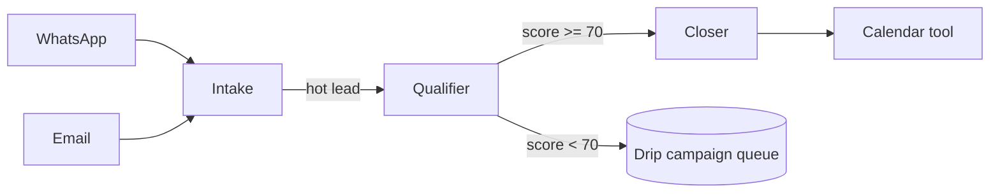

# What you can build

A non-exhaustive gallery of products people are shipping (or could
ship by next week) on top of nexo-rs. Each card links to the
recipe / template that gets you 80 % of the way.

If you're scanning to decide whether nexo-rs fits your use case,
read this page top-to-bottom. If something matches your shape,
follow the link.

---

## Channel agents

### WhatsApp sales agent — qualify leads + book demos

> ⏱ Build time · 1 afternoon · ⚙️ Layer · agent + WhatsApp plugin

Ana takes inbound WhatsApp messages, qualifies the prospect with a
tool that calls your CRM, and books a calendar slot. Persona prompt
+ 2 tools (`crm_lookup`, `calendar_book`) + a YAML — that's it.

```yaml
# config/agents.d/ana-sales.yaml
agents:
  - id: ana-sales
    persona_path: ./personas/ana-sales.md
    llm: minimax-m2.5
    channels:
      - whatsapp:sales-line
    tools: [crm_lookup, calendar_book, send_quote]
    memory: { long_term: true, vector: true }
```

→ [WhatsApp sales agent recipe](./recipes/whatsapp-sales-agent.md)
→ [WhatsApp plugin docs](./plugins/whatsapp.md)

---

### Email triage agent — auto-reply + escalate

> ⏱ Build time · 1 day · ⚙️ Layer · agent + email plugin + skill bundle

Sweeps Gmail every 5 minutes, classifies inbound messages
(invoice / support / spam / sales), auto-replies to the easy
buckets, escalates the rest to a human via Telegram with a
1-paragraph summary.

```yaml
agents:
  - id: triage-bot
    persona_path: ./personas/triage.md
    channels: [email:inbox, telegram:ops-team]
    skills: [classify-email, draft-reply, escalate-to-human]
```

→ [Email plugin docs](./plugins/email.md)
→ [Skill catalog](./skills/catalog.md)

---

### Customer support copilot — Telegram bot with KB + handoff

> ⏱ Build time · 2-3 days · ⚙️ Layer · agent + Telegram + vector memory + MCP

Telegram bot answers from your knowledge base (sqlite-vec). When
the LLM's confidence drops, it hands off to a human and posts the
transcript to your support channel.

```yaml
agents:
  - id: support-copilot
    persona_path: ./personas/support.md
    channels: [telegram:support-bot]
    memory:
      vector: true
      vector_collections: [kb-faqs, kb-troubleshooting]
    tools: [escalate_to_human, search_kb]
```

→ [Telegram plugin](./plugins/telegram.md)
→ [Vector search](./memory/vector.md)

---

## Multi-agent systems

### Multi-agent CRM — intake, qualifier, closer

> ⏱ Build time · 3-5 days · ⚙️ Layer · 3 agents + agent-to-agent delegation

Three coordinated agents over NATS:

- **Intake** picks up inbound on every channel, normalizes, hands off
- **Qualifier** scores the lead (BANT or your framework), tags
- **Closer** (only on hot leads) drafts proposal + books call

Communicate via `agent.route.<target_id>` topics with a
`correlation_id` to match responses.



→ [Agent-to-agent delegation](./recipes/agent-to-agent.md)
→ [Multi-agent coordination](./agents/multi-agent-coordination.md)

---

### Internal ops bot — Slack via MCP + AWS tools + cron

> ⏱ Build time · 1-2 days · ⚙️ Layer · agent + MCP + cron skills

A bot in your team's Slack (via MCP server) that answers
"what's broken in prod", schedules nightly DB snapshots, and posts
the daily cost report at 9 AM.

```yaml
agents:
  - id: ops-bot
    persona_path: ./personas/ops.md
    channels: [mcp:slack-team]
    tools: [aws_logs, aws_cost, db_snapshot]
    cron:
      - "0 9 * * *"  # daily cost report
      - "0 2 * * *"  # nightly DB snapshot
```

→ [MCP channels](./mcp/channels.md)
→ [Cron schedule tools](./architecture/cron-schedule.md)

---

## SaaS products

### WhatsApp meta-creator SaaS — clients build their own agents

> ⏱ Build time · 4-8 weeks · ⚙️ Layer · microapp + multi-tenant + WhatsApp Web UI

A SaaS where end-users sign up and build their own WhatsApp agent
through a WhatsApp-Web-style React UI. Each client gets isolated
state, their own agents, their own knowledge base. The framework
runs out of view; the microapp owns the UX.

```rust
// Provision a tenant from the microapp backend
admin.create_tenant(TenantSpec {
    id: "client-acme".into(),
    plan: "pro".into(),
    quotas: Quotas { agents: 10, llm_tokens_month: 5_000_000 },
}).await?;
```

→ [Microapps · getting started](./microapps/getting-started.md)
→ [`agent-creator` reference](./microapps/agent-creator.md)
→ [Multi-tenant SaaS](./extensions/multi-tenant-saas.md)

---

### Vertical SaaS — sales / support / marketing extension pack

> ⏱ Build time · 2-3 weeks · ⚙️ Layer · extension + multi-tenant

Bundle your domain expertise as an extension: 5 tools + 3 advisors
+ 8 skills + an MCP server adapter. Operators run
`nexo ext install ./your-pack` and your vertical lights up across
all their tenants.

→ [Extension manifest](./extensions/manifest.md)
→ [Extension templates](./extensions/templates.md)

---

## Specialized agents

### Browser scraping agent — URL → structured data

> ⏱ Build time · 1-2 days · ⚙️ Layer · agent + browser plugin

Receives URLs (via webhook / Telegram / API), uses the browser
plugin (Chrome DevTools Protocol) to render JS-heavy pages,
extracts structured data, publishes results back to a topic.
Useful for price monitoring, competitive intel, lead enrichment.

```yaml
agents:
  - id: scraper
    persona_path: ./personas/scraper.md
    channels: [webhook:scrape-requests]
    tools: [browser_navigate, browser_screenshot, browser_extract_text]
```

→ [Browser plugin](./plugins/browser.md)

---

### Lead notification poller — RSS / API → Telegram alert

> ⏱ Build time · half a day · ⚙️ Layer · poller + Telegram

A cron-style poller hits an external RSS feed / API every N
minutes, dedupes against state, and pings your sales team in
Telegram when something matches. Pure config — no LLM call needed
on the hot path.

```yaml
# config/pollers.yaml
pollers:
  - id: linkedin-jobs
    cron: "*/15 * * * *"
    url: "https://linkedin.example/.../feed.atom"
    filter:
      keyword: ["VP Sales", "Head of Growth"]
    publish: plugin.inbound.telegram.sales-alerts
```

→ [Build a poller module](./recipes/build-a-poller.md)
→ [Pollers config](./config/pollers.md)

---

### MCP server from Claude Desktop — expose your tools to Claude

> ⏱ Build time · 1 hour · ⚙️ Layer · agent as MCP server

Run nexo-rs as an MCP server. Claude Desktop (or any MCP client)
sees every tool / agent / skill you've configured as if they were
native. Build internal Claude integrations without writing TS.

→ [MCP server from Claude Desktop](./recipes/mcp-from-claude-desktop.md)
→ [Agent as MCP server](./mcp/server.md)

---

## Where to next

- Pick the closest match → follow its link → adapt to your data.
- Read the [Quickstart](./getting-started/quickstart.md) first if
  you don't already have a binary running.
- Browse the [Recipes](./recipes/index.md) section in the sidebar
  for end-to-end deploy walkthroughs.
- If you're building a SaaS, jump straight to
  [Microapps · getting started](./microapps/getting-started.md).
